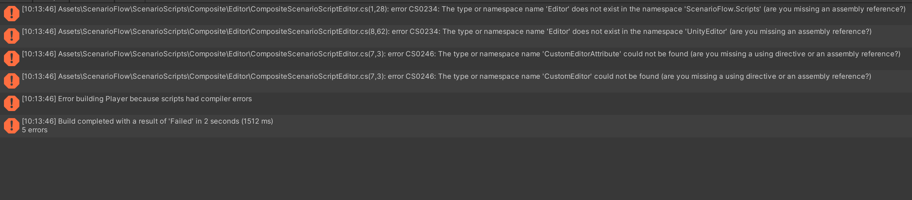

# Existing Bugs

## Error When Building Applications

### Problem

Building an application fails.



### Solution

This is due to lack of preprocessor directives. Enclose the whole of code in `ScenarioFlow/ScenarioScripts/Composite/Editor/CompositeScenarioScriptEditor.cs` in `#if UNITY_EDITOR` and `#endif` in order to fix the bug.

Before:

```cs
using ScenarioFlow.Scripts.Editor;
using System.Linq;
using UnityEditor;

namespace ScenarioFlow.Scripts.Composite.Editor
{
	[CustomEditor(typeof(CompositeScenarioScript))]
    public class CompositeScenarioScriptEditor : UnityEditor.Editor
    {
		public override void OnInspectorGUI()
		{
            // ...
		}
	}
}
```

After:

```cs
#if UNITY_EDITOR

using ScenarioFlow.Scripts.Editor;
using System.Linq;
using UnityEditor;

namespace ScenarioFlow.Scripts.Composite.Editor
{
	[CustomEditor(typeof(CompositeScenarioScript))]
    public class CompositeScenarioScriptEditor : UnityEditor.Editor
    {
		public override void OnInspectorGUI()
		{
            // ...
		}
	}
}

#endif
```

Build will succeed.


> [!NOTE]
> This bug will have been fixed in ScenarioFlow version 1.1.0.