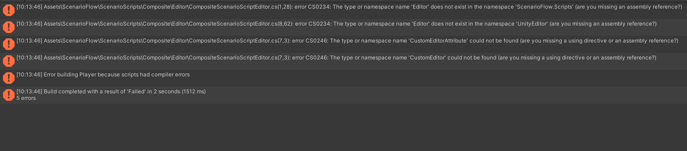
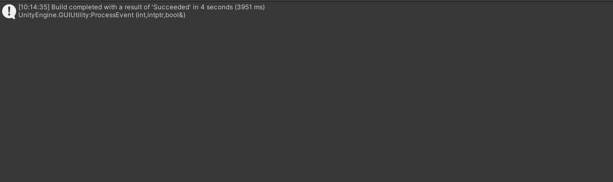

## 存在しているバグ

## アプリケーションビルド時のエラー

### 問題

アプリケーションのビルドが失敗します。



### 解決方法

これはプリプロセッサーディレクティブの不足によって発生します。バグを修正するために、`ScenarioFlow/ScenarioScripts/Composite/Editor/CompositeScenarioScriptEditor.cs`の中のコード全体を、`#if UNITY_EDITOR`と`#endif`で囲ってください。

修正前:

```cs
using ScenarioFlow.Scripts.Editor;
using System.Linq;
using UnityEditor;

namespace ScenarioFlow.Scripts.Composite.Editor
{
	[CustomEditor(typeof(CompositeScenarioScript))]
    public class CompositeScenarioScriptEditor : UnityEditor.Editor
    {
		public override void OnInspectorGUI()
		{
            // ...
		}
	}
}
```

修正後:

```cs
#if UNITY_EDITOR

using ScenarioFlow.Scripts.Editor;
using System.Linq;
using UnityEditor;

namespace ScenarioFlow.Scripts.Composite.Editor
{
	[CustomEditor(typeof(CompositeScenarioScript))]
    public class CompositeScenarioScriptEditor : UnityEditor.Editor
    {
		public override void OnInspectorGUI()
		{
            // ...
		}
	}
}

#endif
```

ビルドは成功します。



> [!NOTE]
> このバグは、ScenarioFlowの次のバージョンで修正される予定です。