# Localized SFText

## Table of Contents

- [Localized SFText](#localized-sftext)
  - [Table of Contents](#table-of-contents)
  - [Introduction](#introduction)
  - [Editor Settings](#editor-settings)
    - [How to Create](#how-to-create)
    - [Fundamental Concept](#fundamental-concept)
      - [Edition](#edition)
      - [Host/Guest Language](#hostguest-language)
      - [Language ID](#language-id)
    - [Functionality of Localized SFText](#functionality-of-localized-sftext)
      - [Edition Sychronization](#edition-sychronization)
      - [Localized SFText As a Scenario Script](#localized-sftext-as-a-scenario-script)
  - [SFText Grammar Extensions for Language Localization](#sftext-grammar-extensions-for-language-localization)
    - [Scope Annotation](#scope-annotation)
    - [Annotation Types](#annotation-types)
      - [Global/Local Annotation (Core Annotation)](#globallocal-annotation-core-annotation)
      - [Upward/Downward Chaining Annotation](#upwarddownward-chaining-annotation)
      - [Exceptinal Behavior of Dialogue Scope](#exceptinal-behavior-of-dialogue-scope)
  - [Synchronization](#synchronization)
    - [Summary of Synchronization Process](#summary-of-synchronization-process)
    - [Reliable Synchronization](#reliable-synchronization)
    - [Formatter Settings](#formatter-settings)
  - [Editing Using Visual Studio Code Commands](#editing-using-visual-studio-code-commands)
    - [Add Scope Annotations](#add-scope-annotations)
    - [Reallocate Scope IDs](#reallocate-scope-ids)
    - [Remove All Scope Annotations](#remove-all-scope-annotations)
    - [Switch Scope Locality, Chain Scope Upward/Downward](#switch-scope-locality-chain-scope-upwarddownward)
  - [Workflow in Language Localization with Localized SFText](#workflow-in-language-localization-with-localized-sftext)
    - [Step 1: The First Synchronization to Start Language Localization](#step-1-the-first-synchronization-to-start-language-localization)
    - [Step 2: Modify/Synchronize Editions](#step-2-modifysynchronize-editions)
      - [Case 1: Translation](#case-1-translation)
      - [Case 2: Adding New Chained Scopes](#case-2-adding-new-chained-scopes)
      - [Case 3: Adding New Core Scopes](#case-3-adding-new-core-scopes)
      - [Case 4: Modifying Existing Core Scopes](#case-4-modifying-existing-core-scopes)
    - [Summary](#summary)


## Introduction

Language localization is an extremely important process to let users play your game in their own languages. If you want provide your game to people all over the world, it is inevitable to prepare texts written in some languages in order to let the users play it comfortably and give them greater experiences.

Localized SFText is a kind of scenario script, which helps to make stories in multiple languages efficiently. It is composed of multiple SFTexts, each of which covers a specific language. Also, it enables to synchronize shared parts across all language versions. In other words, you only have to add or modify a text only once in a single SFText if it should be included in all of the language versions.

You don't have to learn a lot of things to use localized SFText for language localization because, again, it is just composed of SFTexts. But also, note that you have to understand some key points unique to this feature to avoid unintended result in the synchronization process.

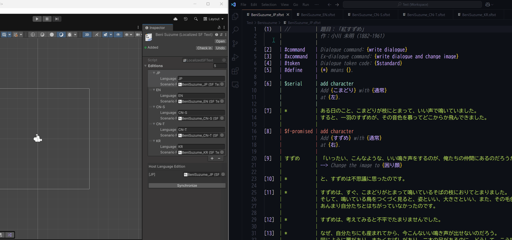

## Editor Settings

### How to Create

Right-click on the Project window in the Unity editor and select `Create/ScenarioFlow/LocalizedSFText` to create a new localized SFText.

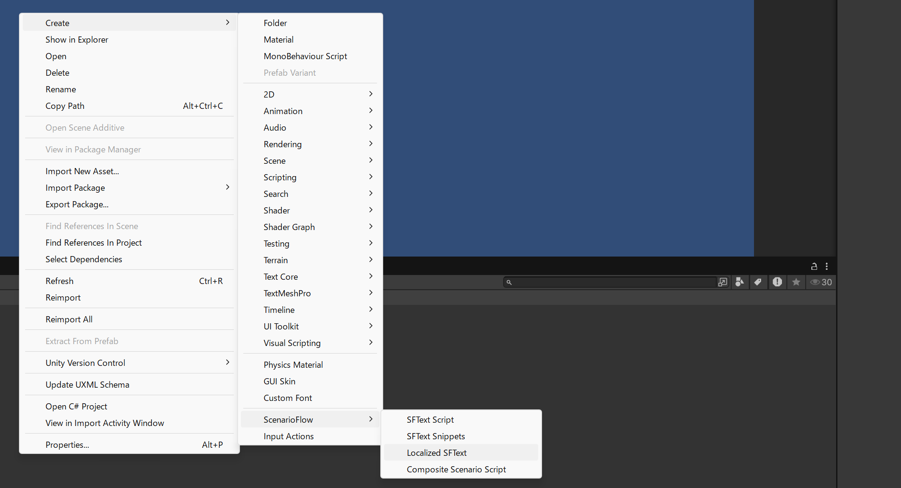

### Fundamental Concept

#### Edition

For a localized SFText, we register SFTexts written in different languages, each of which is called "**edition**". If we have two SFTexts written in English and Japanese, respectively, they are called "English edition" and "Japanese edition", respectively. We can register editions by asigning corresponding SFTexts to the `Editions` property of the Localized SFText.

For example, the localized SFText shown below has the five language editions, Japanese, English, simplified Chinese, traditional Chinese, and Korean.

<table>
  <tr>
    <td>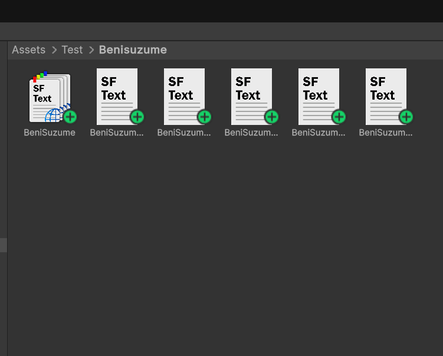</td>
    <td>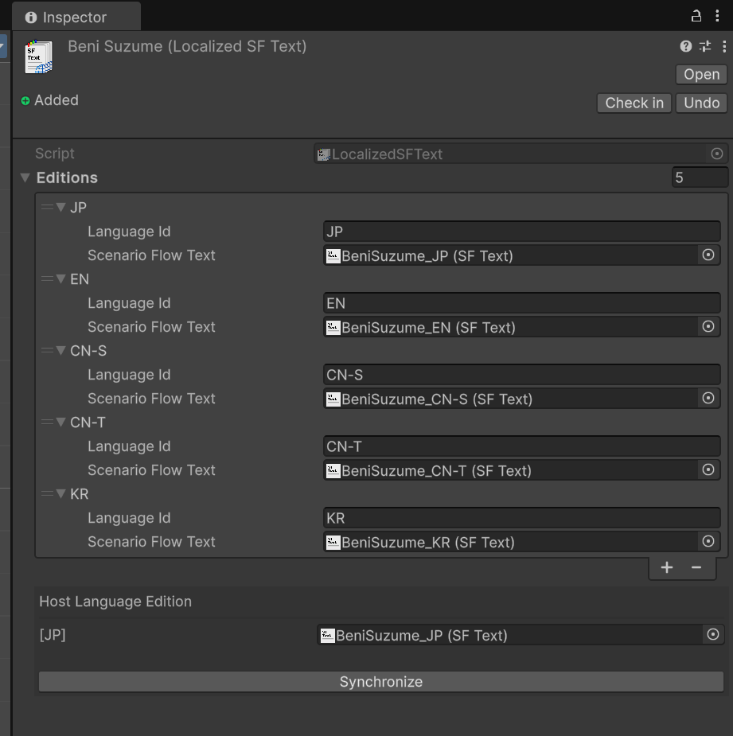</td>
  </tr>
</table>

#### Host/Guest Language

For all of the SFTexts registered with a localized SFText, the first one is recognized as the **host language** edition, and the others are recognized as the **guest language** editions. This difference (i.e., host or guest) affects the result of the synchronization process. 

In the example above, the host language edition is the Japanese one while the others are the guest language editions.

#### Language ID

You have to assign a language ID to each edition. Language IDs are used to identify which langauge each edition covers and to switch the edition to be used depending on the language settings. Language IDs (and corresponding SFTexts) must be unique.

In the example above, the five editions have their language IDs as follows:

+ Japanese edition: JP
+ English edition: EN
+ Simplified Chinese edition: CN-S
+ Traditional Chinese edition: CN-T
+ Korean: KR

### Functionality of Localized SFText

Localized SFText has the two functionalities as listed below:

+ Edition synchronization
+ Scenario script

#### Edition Sychronization

By clicking the `Synchronize` button on the Inspector window of a localized SFText, you can perform **synchronization** process. This process synchronizes all shared parts across all language editions, where the host language edition plays role as the baseline. The details will be shown later.

> [!NOTE]
> As mentioned above, the host language edition is treated as the baseline in the synchronization process. It means that the contents of the guest language editions can be modified based on the content of the host language edition as a result of the synchronization.
>
> Therefore, you should make a backup in case you get an unintended result if drastic modification due to the synchronization process is expected.

#### Localized SFText As a Scenario Script

A Localized SFText can be treated as a scenario script because it is implemented as the `LocalizedSFText` scriptable object that derives from the `ScenarioScript` abstract class. It has some SFTexts as different language editions, but you can switch which SFText (language edition) is used by assigning the target language ID to the `LanguageID` static property of the `LocalizedSFText` class.

```cs
using ScenarioFlow.Scripts;
using ScenarioFlow.Scripts.SFText.Localization;

IScenarioBookPublisher scenarioBookPublisher;
LocalizedSFText localizedSFText;
// Localized SFText can be used as a scenario script. (Actually, it is the desirable way)
ScenarioScript scenarioScript = localizedSFText;
// You have to assign the target language ID
LocalizedSFText.LanguageId = "JP";
// The edition whose language ID is "JP" will be used
ScenarioBook japaneseScenarioBook = scenarioBookPublisher.Publish(scenarioScript);
// You can switch the target language ID whenever you want
LocalizedSFText.LanguageId = "EN";
// The edition whose language ID is "EN" will be used
ScenarioBook englishScenarioBook = scenarioBookPublisher.Publish(scenarioScript);
```

> [!NOTE]
> This functionality is optional. It is totally fine to use only the synchronization functionality of localized SFText. You don't have to use localized SFTexts as scenario scripts to switch the target language editions but you can choose the most suitable way to proceed with language localization in your project.

## SFText Grammar Extensions for Language Localization

### Scope Annotation

Every line in an SFText is originally split into 3 areas, `scope declaration part (declarator part)`, `content description part`, and `comment description part`, by vertical bars. Now, you can split every line in an SFText into **4 areas** by vertical bars to add a **scope annotation**. The new area is called `scope annotation part`.

```
(scope annotation part) | (declarator part) | (content part) | (comment part)
```

Scope annotations specify how the scopes behave in the synchronization process. What types of scope annotations are available and how they behave in the synchronization will be explained later.

Note that every scope in an SFText must have its scope annotation to be registered as an edition in a localized SFText. Also, scope annotations must be placed at the start lines of scopes.

The grammar of annotated SFText is almost the same as that of non-annotated one. The clear difference is the presence of scope annotations, but other parts are completely the same.

### Annotation Types

There are 4 types of scope annotations as shown in the table below, each of which shows different behavior in the synchronization process. You have to understand the difference between these annotations and distinguish them appropriately to avoid unintended synchronization result.

| Name | Format | Summary |
| --- | --- | --- | 
| Global | [ID] | Declare the scope **as a shared content** |
| Local | (ID) | Declare the scope as **an edition-specific content** |
| Upward chaining | <↑> | Declare the scope as **an edition-specific content** and **bind it to the scope above** |
| Downward chaining | <↓> | Declare the scope **as an edition-specific content** and **bind it to the scope below** |

#### Global/Local Annotation (Core Annotation)

Global and local annotations, which are called core annotations, are specified for scopes that will be the backbone of an edition. Scopes that have a global annotation or local annotation are called global scopes and local scopes, respectively. 

You specify a global annotation for a scope if the scope content is shared across all language editions (i.e., the scope has the same content regardless of the langauge edition). On the other hand, you specify a local annotation if the scope has different content depending on the language edition.

Core scope can have its **scope ID** as a natural number. Scope IDs are used to identify which scopes are corresnponding to each other across all of language editions. If two scopes have the same scope ID and they are described in different language editions, they are recognized as corresponding scopes. Scope IDs must be unique in an edition, and every core scope must have its ID if the edition is a guest (i.e., it is allowed to specify no scope ID for a core scope in host editions).

In the synchronization process, the corresponding scopes in guest editions are overwritten with a scope in the host edition if the host scope has a global annotation; the scopes are not overwritten if the host scope is local. Also, more importantly, regardless of the scope locality (i.e., global or local), the synchronization process ensures that every language edition has the same scope structure. This scope structure means the number of **CORE** scopes and the order of **CORE** scopes in an SFText. In the synchronization, core scopes in guest editions are rearranged based on their scope IDs and the order of the corresponding scopes in the host edition. Core scopes that exist in the host edition but don't exist in guest editions are newly added at proper places in those guest editions. Core scopes that exist in guest editions but doen't exist in the host edition are removed from those guest editions.

#### Upward/Downward Chaining Annotation

As explained earlier, the synchronization process ensures that all language editions have the same scope structure using the host edition as the baseline. It means, for example, after the synchronization, every guest edition has a scope with a scope ID "1" if the host edition has a scope with a scope ID "1," and no guest edition has a scope with a scope ID "2" if the host edition does not have a scope with a scope ID "2."

Upward/downward chaining annotations are used to prevent scopes from changing the scope structure. Scopes that have an upward or downward chaining annotation are called upward chained scopes and downward chaineed scopes, respectively, and they are collectively called chained scopes.

 Upward/downward chained scopes are bound to the core scopes above/below, respectively. The chained scope is considered a parasitic scope, so that it doesn't change the scope structure of the edition (recall the definition of the scope structure). More specifically, these chaining annotations are useful when an edition has some unique contents that don't appear in any other languages. For example, you may want to declare chained scopes when you want to leave comments that work in only a specific language edition or some language-specific dialogue texts (or commands) are necessary.

Chained scopes in a host edition don't appear in other guest edition by the synchronization process. On the other hand, chained scopes in guest editions are removed by the synchronization if the corresponding core scopes no longer exist in the host edition. Also, chained scopes in guest editions can be rearranged following their core scopes.

#### Exceptinal Behavior of Dialogue Scope

Dialogue scopes with core annotations behave differently from other types of scopes in the synchronization. Specifically, dialogue scopes follows the two rules below:

+ The dialogue text part in a dialogue scope behaves like a local scope in the synchronization
+ The extra argument part in a dialogue scope switches its behavior in the synchronization depending on its annotation type

First, the dialogue text part in a dialogue scope is not affected by the host language edition in the synchronization, even if global annotation is specified for the scope. "Dialogue text part" includes all lines that have the dialogue text and speaker name.

Second, the extra argument part in a dialogue scope can be modified based on the host language edition as a result of the synchronization process if global annotation is specified, but if not, it will be never modified. "Extra argument part" includes all lines that have extra argument lines begining with "-->" in the dialogue scope.

Two examples are shown below. First, the dialogue text parts in the two scopes show "local" behavior. On the other hand, the two extra dialogue argument parts in those scopes behave differently. The first one shows "global" behavior because the first scope has a global annotation, however, the second one shows "local" behavior because the second scope has a local annotation.

```
[1] | Sheena | Hello!                | Dialogue text part (shows "local" behavior)
    |        | How are you doing?    | Dialogue text part
    |        | --> {Arg1} {Arg2}     | Extra argument part (shows "global" behavior)
    |        | --> {Arg3}            | Extra argument part
(2) | Rio    | Hello.                | Dialogue text part (shows "local" behavior)
    |        | Not bad.              | Dialogue text part
    |        | --> {Arg1} {Arg2}     | Extra argument part (shows "local" behavior)
    |        | --> {Arg3}            | Extra argument part
```

> [!TIP]
> You might think the dialogue scope behavior somewhat tricky. This little complicated behavior as explained above originates in the two contradictionary requirements of dialogue scope.
> 
> First, speaker names and dialogue texts must be always different depending on the language covered by each edition, therefore, these elements must have the "local" characteristic. However, at the same time, the extra arguments in the dialogue scopes should have the same values regardless of the language in most cases because such argument values are hardly language-specific, therefore, these elements should have "global" characteristic in most cases.
>
> Based on these requirements, dialogue text parts in dialogue scopes are designed to have the "local" characteristic regardless of their annotation types and extra argument parts are designed to have "variable" characteristic. The reason of the "variable" characteristic of the extra argument parts is that they should basically have the same values regardless of the language but they may sometimes require different values depending on the language.

## Synchronization

### Summary of Synchronization Process

What happens to language editions in a localized SFText due to the synchronization is summarized below:

+ Every global scope in every guest language edition is replaced with the corresponding global scope that has the same scope ID in the host edition
+ Every core scope in every guest language edition is removed if the corresponding scope that has the same scope ID does not exist in the host language edition
+ Every core scope in the host language edition is inserted at the proper place in every guest language edition that does not include the corresponding scope that has the same scope ID
+ Scopes in guest language editions are rearranged based on the scope order of the host language edition. Chained scopes are rearranged following their core scopes
+ Sequential scope IDs are reallocated to scopes in each language edition (including the host language edition)

Follow the rules below to avoid synchronization errors:

+ SFTexts registered as editions and their language IDs must be unique
+ Every scope in every edition must have its scope annotation
+ Scope IDs must be unique in an edition
+ Scope IDs must be asigned to all core scopes in all guest language editions
  + It is fine to omit scope IDs in host language editions. But note that a scope without scope ID in a host language edition means that that scope does not exist in any other guest language editions

### Reliable Synchronization

The synchronization functionality provided by localized SFText, which enables to synchronize all of shared contents across different language editions, is really useful for language localization, but at the same time, it is also potentially dangerous because the synchronization is a destructive process. Guest language editions may be unintentionally ruined as a result of the synchronization if scope annotations are not specified appropriately. Therefore, you need to follow the guidlines below in order to avoid such unfortunate situation.

+ In host language editions:
  + You should not make changes to scope IDs directly, but you can rely on the synchronization process to reallocate scope IDs
+ In guest language editions:
  + You must not touch existing scope IDs
  + You must not add new scopes or remove existing scopes with core annotation (adding/removing chained scopes is fine)

### Formatter Settings

The synchronization process not only synchronizes edition contents but also aligns the texts, which is the same process as the SFText formatter VSCode extension does. The format process in the synchronization distinguishes half-width characters and full-width characters for the alignment as well as the formatter in VSCode, so you may have to modify some settings for proper alignment.

You can open the formatter settings by selecting `Window/ScenarioFlow/Localized SFText Settings` on the top menu bar in Unity editor. The three items as shown below are the same as those of the formatter in VSCode. See [SFText Formatter](./SFText.md#sftext-formatter) for the details about those settings.

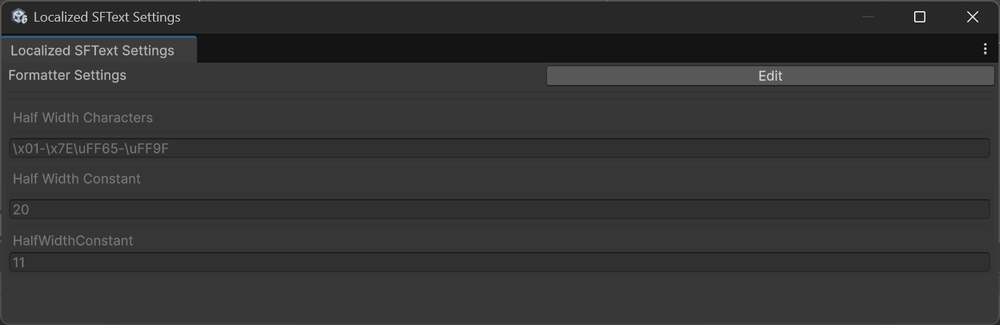

## Editing Using Visual Studio Code Commands

SFText Utility (ver. 1.1.0 or later) Visual Studio Code extention provides some commands to handle scope annotations. You don't have to edit scope annotations manually, but you can (and you should) rely on those commands to edit scope annotations efficiently.

The available commands are summarized below:

| Command | Shortcut Key (Windows) | Function |
| --- | --- | --- |
| Add Scope Annotations | - | Add a scope annotation to every scope that has no scope annotation |
| Reallocate Scope IDs | - | Reallocate sequential scope IDs to core scopes |
| Remove All Scope Annotations | - | Remove all scope annotation parts in the SFText |
| Switch Scope Locality | F4 | Switch the scope locality (global/local) |
| Chain Scope Upward | Ctrl+Shift+Up | Replace the scope annotation with a upward chaining annotation |
| Chain Scope Downward | Ctrl+Shift+Down | Replace the scope annotation with a downward chaining annotation |

### Add Scope Annotations

This command adds scope annotations to scopes that don't have scope annotations. This is used in two cases.

The first case is when you initialize a non-localized SFText as an edition. In this case, every line that has 3 areas will get the 4th area (i.e., scope annotation part) with a scope annotation.

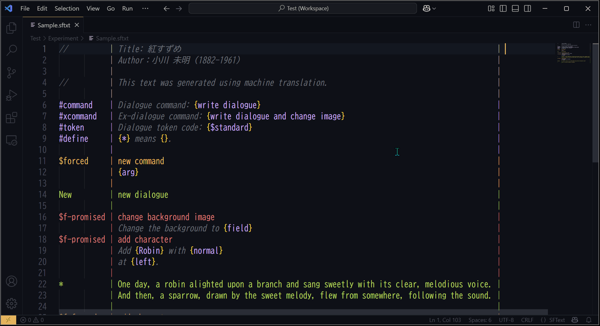

The second case is when you add some scopes in an existing edition. You can automatically add scope annotations to the added scopes.

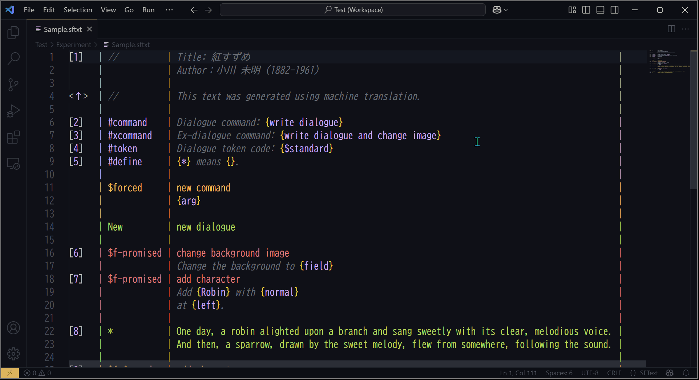

You can specify what types of scope annotations are assigned depending on the scope types with the settings. By default, global annotations are assigned to all types of scopes.

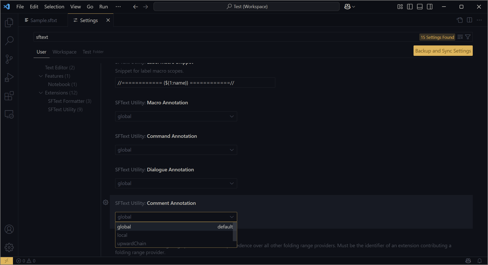

> [!NOTE]
> The `Add Scope Annotations` command provides "coarse" assignment of scope annotation. Use the other commands `Switch Scope Locality` and `Chain Scope Upward/Downward` for "fine" assignment.

### Reallocate Scope IDs

This command assigns sequential scope IDs to core scopes. Note that this process overwrites existing scope IDs but doesn't have an effect on upward/downward chained scopes.

Also, note that this command may be rarely used because scope IDs are assigned automatically by the synchronization process and you shouldn't assign them by yourself to keep the scope ID consistency. One possible case where this command is used is when you accidentally destroy some exisiting scope IDs and it is hard to recover them. In such a case, you may want to rely on this command to reassign scope IDs.

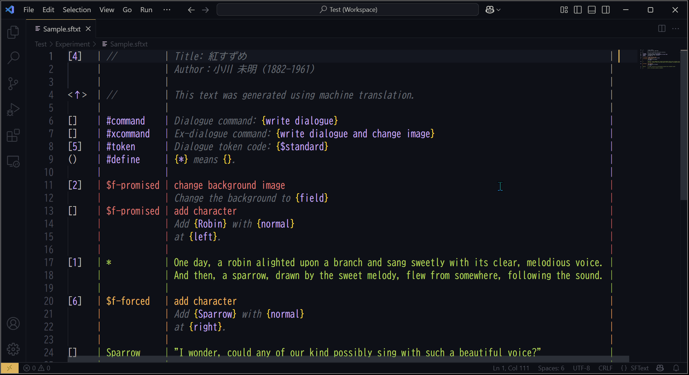

> [!NOTE]
> You should call the `Add Scope Annotations` command before calling the `Reallocate Scope IDs` command in order to ensure that every scope has its annotation. The `Reallocate Scope IDs` command ignores scopes without scope annotions.  

### Remove All Scope Annotations

This command removes all scope annotations in the SFText. You may want to use this command to reset an edition.

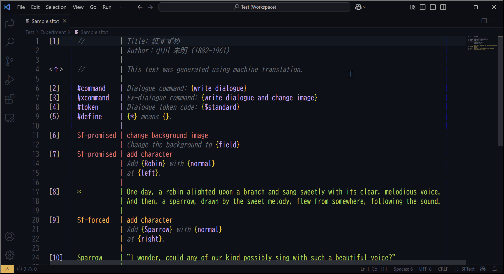

### Switch Scope Locality, Chain Scope Upward/Downward

You can change annotations at a scope granularity using these commands. These commands switch the scope annotation types of scopes in the selection. You can call these commands quickly using the shortcut keys (`F4` for `Swith Scope Locality`, and `Ctrl+Shift+Up/Down` for `Chain Scope Upward/Downward`, respectively).

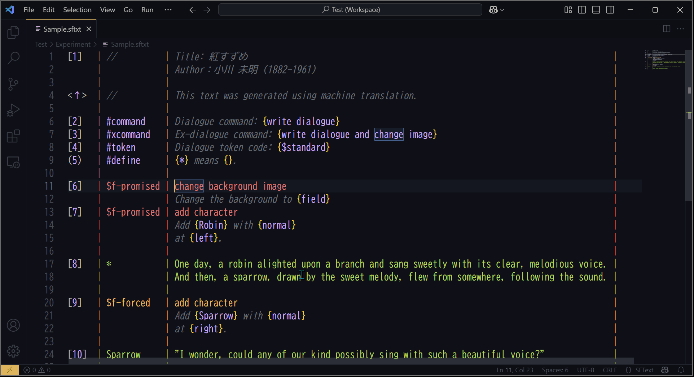

## Workflow in Language Localization with Localized SFText

In this section, we are going to see the standard workflow in language localization using localized SFText. We will begin with seeing the fundamental strategy briefly, and then try it with an example.

First of all, what we are going to do in the language localization with localized SFText is roughly the two things as shown below:

+ Make global changes to the host language edition, and then perform the synchronization to reflect the changes in other guest language editions
+ Make local changes to the target language edition directly

"Local" means the changes are required in a specific language edition but in any other language editions. "Global" means the same changes are equally required across all of the language editions. For example, modifying global scopes (that have global annotations) is global changes, while modifying local scopes (that have local annotations) is local changes. Also, adding/removing core scopes is global changes, and operations regarding chained scopes (that have upward/downward annotations) is local changes.

More specifically, we follow the steps below for the global changes:

1. Make changes to the host language edition
2. Add annotations by calling the VSCode command and modify them manually as needed
3. Synchronize the editions

Note that basically we don't modify scope IDs by ourselves but we can (and MUST) rely on the synchronization process to assign/re-assign scope IDs to scopes.

Then, let's try the language localization workflow using [*Beni-suzume*](https://www.aozora.gr.jp/cards/001475/card51065.html) as an example. *Beni-suzume* is a Japanese literature and available at [*Aozora-bunko*](https://www.aozora.gr.jp/) as a public domain.

Our goal is to understand how to start language localization and to understand the behavior of the synchronization process. Specifically, what we are going to do is:

+ Build an enviroment for language localization
+ Make some changes and try the synchronization

> [!NOTE]
> The entire texts are not shown here due to space limitations but some parts of them are shown. The full baseline texts (translated editions in the "case 1" below) are available [here](./Scripts/).

### Step 1: The First Synchronization to Start Language Localization

To prepare an environment for language localization with localized SFText, we begin with preparing a baseline language edition. We prepare it in Japanese in this case because the original text is written in Japanese.

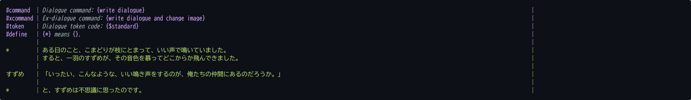

Note that we don't need to prepare a fully completed one including all required dialogue, macro, and command scopes, at this point. But we only need to prepare some dialogue scopes and essential macro scopes.

Then, we add scope annotations by calling the `Add Scope Annotations` command.

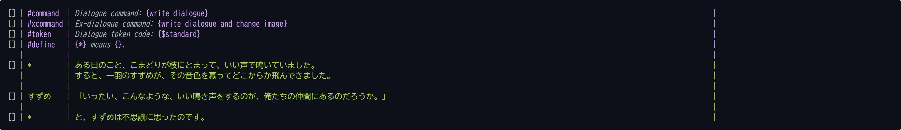


Next, we create the bases of other language editions. We create a localized SFText in the Unity editor, and then register reuqired language editions. In this example, we prepare English, simplified/traditional Chinese, and Korean editions as guest ones. Note that all of the language editions are empty except for the baseline one at this point.

<table>
  <tr>
    <td></td>
    <td></td>
  </tr>
</table>

Now, we execute the synchronization process by clicking the `Synchronize` button on the inspector window of the localized SFText. After the synchronization, we will find that the text of the host language edition (i.e., Japanese edition) is copied to all of the guest language editions.

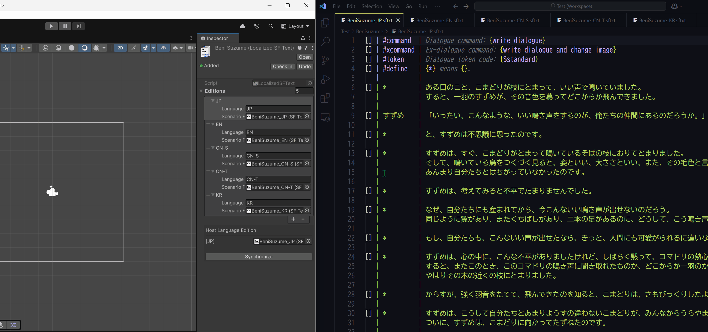

### Step 2: Modify/Synchronize Editions

#### Case 1: Translation

We are ready to proceed with the language localization. We are going to make some changes to the editions and execute the synchronization if necessary.

To begin with, we will translate the copied text written in the baseline language into the language that each edition covers by modifying each scope one by one as needed.

English:

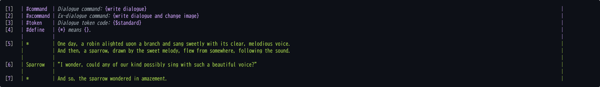

Simplified Chinese:


Traditional Chinese:

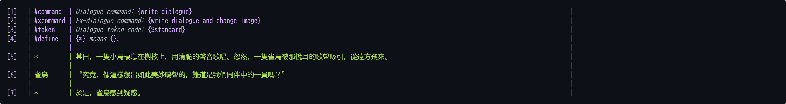

Korean:

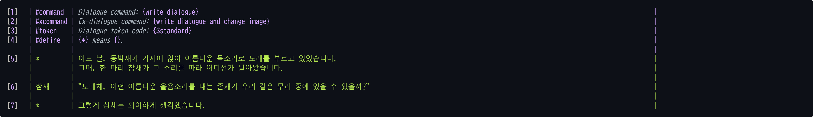

In this modification, we made only local changes to editions. Therefore, we don't need the synchronization process.

> [!NOTE]
> Recall that the dialogue text part in a dialogue scope definitely has "local" characteristic, even if the scope has a global annotation. The scope annotation for a dialogue scope affects only the locality of its extra argument part.

#### Case 2: Adding New Chained Scopes

Let's add some new chained scopes to some editions. We will add make changes to the English and Korean editions as follows:

English: 

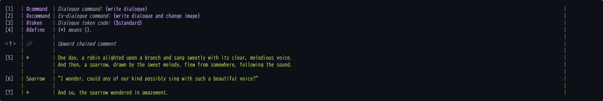

Korean:

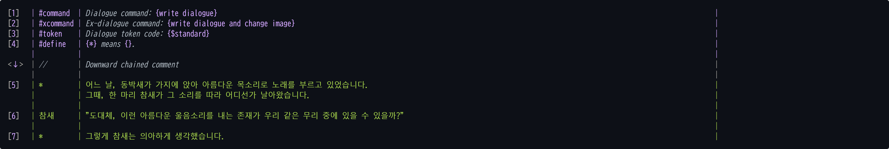

We added a upaward chained scope to the English edition while we added a downward chained scope to the Korean edition. Since these changes don't affect any other language editions, we don't have to synchronize the editions.

#### Case 3: Adding New Core Scopes

Next, we add some new global and local scopes. In this case, we are trying to add new scopes that should exist in all of the editions but currently don't. Therefore, this is gloabal editing that requires the synchronization.

First, we make required changes to the host language edition, which is, in this case, the Japanese edition.

Japanese:

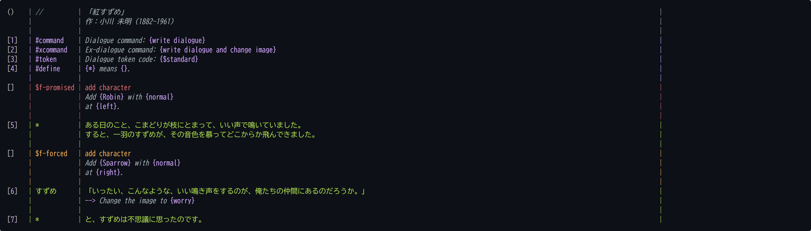

Note that we have to assign scope annotations to the new gloabl/local scopes, but we don't have to (and should not) assign scope IDs to them. Because otherwise it may destroy the consistency of the scope IDs across the editions. We can rely on the synchronization process for the scope ID assignment.

> [!TIP]
> It is totally fine to switch the host language edition. We can decide which language edition is the host regardless of the original text language. In this example, the original text language is Japanese, but we can start to use, for example, the English edition as the host language after the first synchronization, by rearranging the registration order of the editions with the localized SFText to set the target edition as the first item.
>
> Note that we shuold switch the host language after the synchronization process for the consistency.

After the editing, we perform the synchronization process by cliking the `Synchronize` button on the inspector window of the localized SFText.

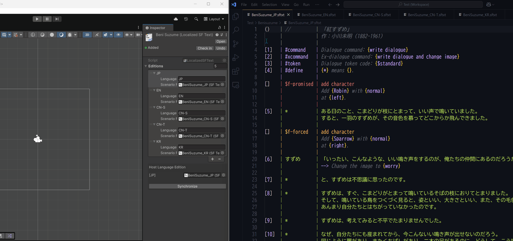

The synchronization will produce the results as follows:

Japanese:

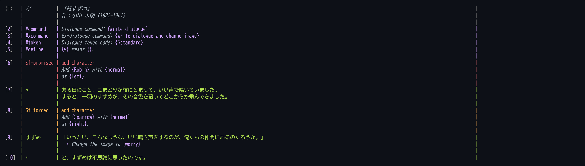

English:

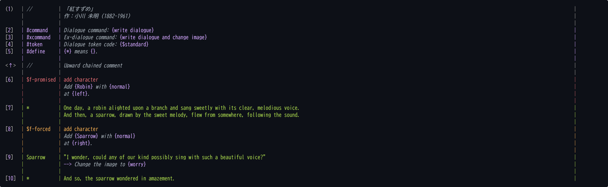

Simplified Chinese:

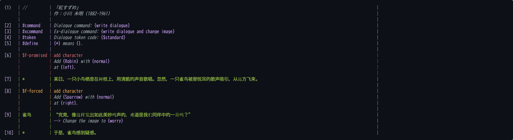

Traditional Chinese:

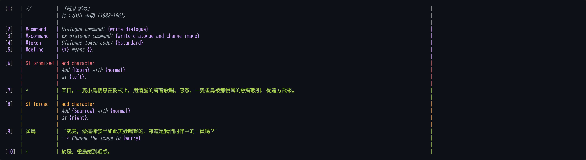

Korean:

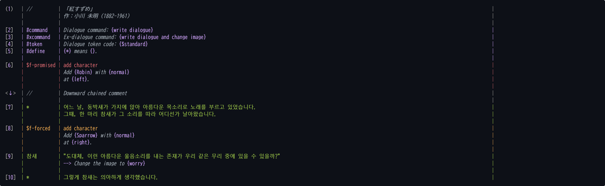

The points are:

+ Every scope got its new scope ID
+ The new scopes (including the new extra dialogue argument part) were added to the guest language editions

About the first point, this is the reason why we don't need to assign scope IDs manually. The synchronization process automatically assigns new scope IDs appropriately in its process.

About the second point, the most important point is the new command scope with scope ID 6 was inserted into the different places depending on the edition. It was inserted below the upward chained scope in the English edition while it was inserted above the downward chained scope in the Korean edition. These results clearly tell us the difference between upward chaining and downward chaining.

A chaining annotation ensures that any additional scopes are not inserted between the chained scope and the chaining target scope. More specifically, in the English edition, the upward chained comment scope is chained to the macro scope with scope ID 5, and hence any scopes will never inserted between those two scopes as a result of the synchronization. On the other hand, the downward comment scope is chained to the dialogue scope with scope ID 7 in the Korean edition, and hence any scopes will never inserted between those two scopes by the synchronization.

> [!TIP]
> In this case, we tried to add new core scopes. However, even in the case of removing exisiting core scopes, we can do that in the same manner. We remove the scopes from the host edition, and then execute the synchronization process in that case.

#### Case 4: Modifying Existing Core Scopes

In this case, we make changes to some existing core scopes in editions. Then, we need the synchronization after the modification because it includes globally influential changes.

First, we will modify some scopes as follows:

Japanese:


English:

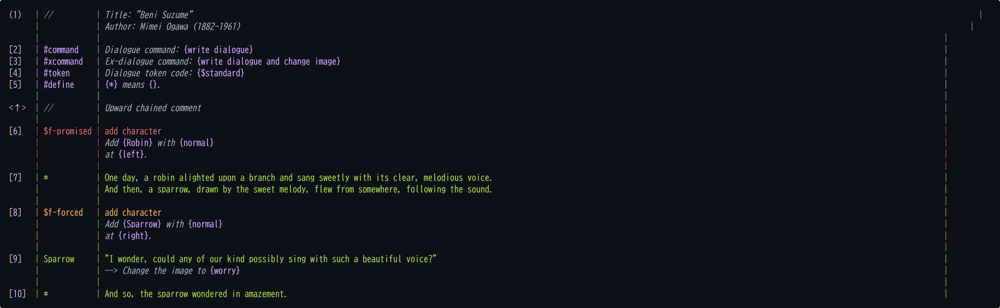

In Japanese edition, we modified the scopes with:

+ Scope ID 1 (Modify text)
+ Scope ID 5 (Add comment)
+ Scope ID 6 (Modify arguments)
+ Scope ID 8 (Modify arguments)
+ Scope ID 9 (Modify arguments)

In English edition, we modified the scopes with:

+ Scope ID 1 (Modify text)

Then, we synchronize the editions.


The result will be as follows:

Japanese:

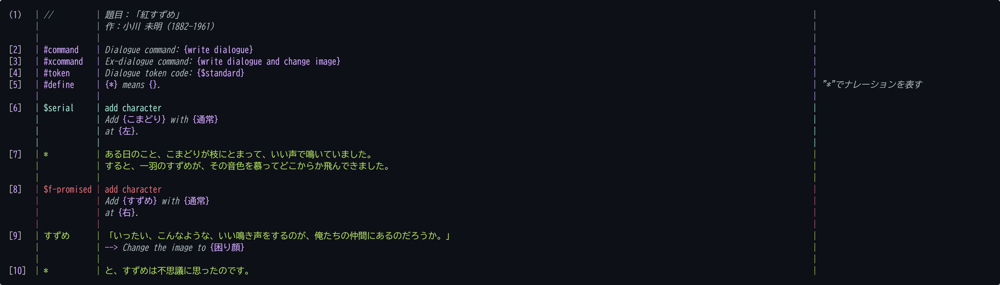

English:

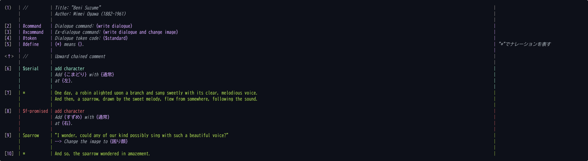

Simplified Chinese:

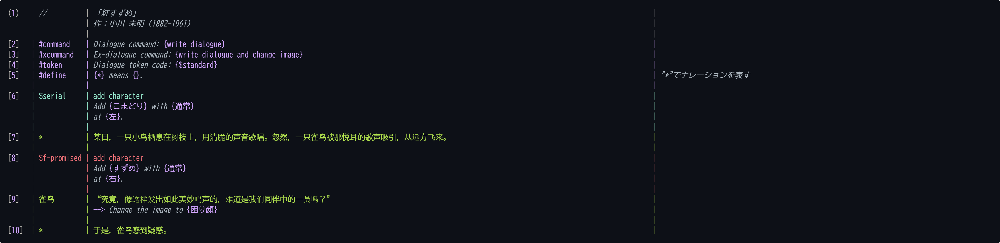

Traditional Chinese:

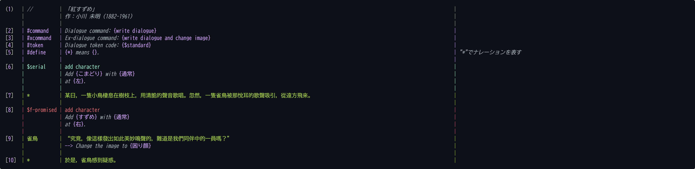

Korean:

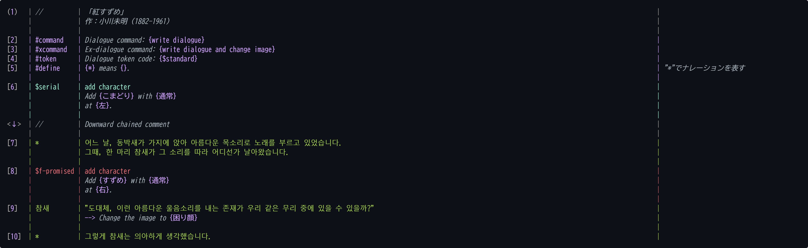

The points are:

+ The local scopes (with scope ID 1) in editions have independent values
+ The global scopes in the guest language editions (including the extra dialogue argument part) were replaced with the corresponding ones in the host language edition

First, we can find that the local scopes with scope ID 1 in the guest language editions were not overwritten by the one with the same scope ID in the host language edition as a result of the synchronization even though we overwrote the corresponding one in the host language edition. This clearly shows the characteristic of the local annotaion. Local scopes can have independent contents depending on the target language and will not be overwritten in the synchronization process.

On the other hand, the global scopes show the opposite behavior. Every global scope in the guest language editions were replaced with the corresponding scope that have the same scope ID in the host language edition.

> [!TIP]
>
> The synchronization process doesn't distinguish scope elements in detail, but it parses editions at the granularity of a scope. Therefore, global scopes in guest language editions are replaced entirely; the exception is dialogue scope, which are parsed seperately as dialogue text part and extra argument part.

### Summary

We tried the standard workflow in language localization with localized SFText. The most important thing is to consider whether the change you are tring to make is globally influeutial or has just local impact. If that change have an effect across all editions, you have to make that change to the host language edition at first, and then you have to perform the synchronization; otherwise you don't need the synchronization but you only have to edit just the target language edition directly.