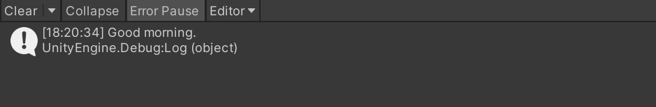

# ScenarioFlow

[Japanese README](./README_JP.md)

## URLs

+ [ConsoleSFSample](https://github.com/dotprologue/ConsoleSFSample.git)

## Table of Contents

+ Introductory Topics
    + [Introduction](#introduction)
    + [Getting Started](#getting-started)
    + [How to Play Dialogue Scenes](#hoe-to-play-dialogue-scenes)
    + [New Commands and Execution](#new-commands-and-execution)
    + [Parameter Types and Decoders](#prameter-types-and-decoders)
+ Practical Topics
    + [New Async Commands](#new-async-commands)
    + [Token Code](#token-code)
    + [SFText Script](#sftext-script)
    + [Composite Script](#composite-script)
    + [Scenario Progression Controls](#scenario-progression-controls)
    + [Scenario Branching](#scenario-branching)
    + [The Skip Mode](#the-skip-mode)
+ Advanced Topics
    + [General Token Code](#general-token-code)
    + [Advanced Scenario Progression Controls](#advanced-scenario-progression-controls)
    + [Token Code in the System](#token-code-in-the-system)
    + [The Structure of the Scenario Book](#the-structure-of-the-scenario-book)
## Introduction

### What Is ScenarioFlow?

ScenarioFlow is a library for Unity to implement scenes of characters conversing with each other effectively. This library provides the programmer-friendly and writer-friendly system by adopting novel architecture with the catchphrase "Suits for all projects."


### Why ScenarioFlow?

There are big two advantages of ScenarioFlow. Firstly, thanks to its high extensibility, it works well in any project, and dialogue scenes are created effectivery. Secondly, thanks to a novel script format, writers can write scripts effectively.

First,  for example, there are some libraries that have similar purposes to ScenarioFlow like [Utage](https://assetstore.unity.com/packages/tools/game-toolkits/utage4-for-unity-text-adventure-game-engine-version4-266447) and [Naninovel](https://assetstore.unity.com/packages/tools/game-toolkits/naninovel-visual-novel-engine-135453). However, ScenarioFlow is designed based on a completely different philosophy from them. It is the belief that "You have to build your dialogue system yourself." The dialogue system in this context means a set of functions needed for creating dialogue scenes like narrative directions, controlling the scenario progression, script parsing, and so on. Libraries mentioned as examples provide a dialogue system itself that has rich functions, so that users can create dialogue scenes without extra codes in most cases. On the other hand, ScenarioFlow provides "a system to create a dialogue system" by extracting essential elements needed for createing dialogue scenes. That is because if a library provides a dialogue system itself, functions of that system is often deficient, excessive, or unfit for some projects. So ScenarioFlow doesn't provides a dialogue system itself, but a highly extensible system to build a dialogue system that is suit for your project effectively.

Next, writers can use "SFText" which is a new script format when writing scripts. That format is designed based on real scripts for a play, so that it has simple grammar, and it is easy to write and easy to read. Writers can also edit it comfortably because extensions of VSCode are provided for editing support. As a side note, you can create a new script format to writers' preference because SFText is just one of script formats. And in most cases, adding or changing script formats doesn't have an impact on a dialogue system that has already been built.


## Getting Started

Let's learn how to use ScenarioFlow. Create a new project in Unity, and set up the project by following the steps below.

+ Import [UniTask](https://github.com/Cysharp/UniTask)
    + ScenarioFlow uses UniTask to handle async operations
+ Import [ScenarioFlow](#)
+ Install [Visual Studio Code](https://code.visualstudio.com/)
    + Recommended text editor
+ Install [SFText Extension Pack](#)
    + Editing support for SFText
+ Instal [Ayu Theme](https://marketplace.visualstudio.com/items?itemName=teabyii.ayu)
    + Recommended theme in SFText
+ Import [ConsoleSFSample](https://github.com/dotprologue/ConsoleSFSample.git)
    + A sample of ScenarioFlow

In this tutorial, we use a sample of a dialogue system that uses the debug console for learning. After the set up, open `ConsoleSFSample/SampleScene`, make sure that the sample scenario `HideAndSeek.sftxt` is bound to the `ScenarioManager` object, and enter the play mode. In this sample, characters' line will be displayed on the console, and you can move on to the next line with the enter key.

ScenarioManager:


Make sure that the scenario branches based on your choice.

Choice 1:


Choice 2:


## Hoe to Play Dialogue Scenes

Let's check how `HideAndSeek.sftxt` was runned and how the dialogue scene was played. Open the file `Scripts/ScenarioManager.cs`.

Dialogue scenes are executed by following the two steps below in ScenarioFlow.

1. Convert an instance of the `ScenarioScript` class to an instance of the `ScenarioBook` class with an instance of the `ScenarioPublisher` class
2. Run the instance of the `ScenarioBook` class with an instance of the `ScenarioBookReader` class

```cs
//Convert the scenario script to a scenario book
IScenarioBookPublisher scenarioBookPublisherInterface = scenarioBookPublisher;
IScenarioScript scenarioScriptInterface = scenarioScript;
ScenarioBook scenarioBook = scenarioBookPublisherInterface.Publish(scenarioScriptInterface);

//Start to read the scenario book
IScenarioBookReader scenarioBookReaderInterface = scenarioBookReader;
scenarioBookReaderInterface.ReadAsync(scenarioBook, this.GetCancellationTokenOnDestroy()).Forget();
```

Let's learn about classes and interfaces provided by ScenarioFlow, and terms in using them.

### Command and Script

Any narrative directions in dialogue scenes like displaying dialogue lines and replacing character's images are invoked by executing "command". Command means a function that is called from a script like `HideAndSeek.sftxt`, and what type of direction is executed depends on the executed command.

In the example `HideAndSeek`, `log dialogue async` is a command to display a dialogue line, `delay seconds` is a command to make the system wait for the specified number of seconds, and `branch on 2 selections async` is a command to present two selections to the player and make the scenario branch based on the answer.


This script, which is called "SFText," is a one of script formats you can use in ScenarioFlow. The grammar of this script is explaned later, so at this point, you only have to understand that the texts like "delay seconds async" and "log dialogue async" are the command names to be called and the words enclosed by curly brackets like "5," "Pigeon," and "Coo!" are the argumets passed to the correspoinding commands respectively.

Sets of command name and arguments are executed from top to bottom. In SFText, dialogue lines are described with the different format from other commands, however, they are transformed into the equivalent command invocation. That is, dialogue scenes in ScenarioFlow are caused simply by calling proper commands in a proper order. And all command invocations are treated equally regardless of what direction is caused by them.

One thing needed for playing dialogue scenes in ScenarioFlow is to write a script with commands provided in the system and to run it.

### ScenarioScript and ScenarioBook

In ScenarioFlow, a script in which things needed for dialogue scenes like dialogue lines and other narrative directions are described is passed to the `Publish` method in the `ScenarioBookPublisher` class as an instance of the `IScenarioScript` interface.

You can attach an object of the `ScenarioScript` class in the Unity editor because that class inherits the `ScriptableObject` class. Additionally, that object can be converted to an instance of the `ScenarioBook` class. This `ScenarioScript` class is used in practical for creating dialogue scenes.

```cs
[SerializeField]
private ScenarioScript scenarioScript;
```

The role of `ScenarioScript` class is to hold information about commands and their arguments to be called as strings, and information about "label" used for scenario branching. And the `ScenarioBook` class plays a role in holding them as a format that is executable in C#. The former is called "scenario script" or simply "script," and the latter is called "scenario book" in ScenarioFlow.

The point is that the `ScenarioScript` class plays a role in being intermediate state. The `ScenarioScript` class is defined as an abstract class, so that any object that inherits that abstract class can be converted to a scenario book regardless of how the format of the script is. Presently, ScenarioFlow provides two formats, SFText script as shown in the example before and Composite script as standard formats, however, you can create new formats as you like.

### ScenarioBookPublisher

A script in which dialogue lines and other narrative directions are described is passed to the `Publish` method declared in the `ScenarioBookPublisher` class, then it is converted to a scenario book which is executable in C#. This class implements the `IScenarioBookPublisher` interface in which the member method `Publish` is declared.

```cs
//Convert the scenario script to a scenario book
IScenarioBookPublisher scenarioBookPublisherInterface = scenarioBookPublisher;
IScenarioScript scenarioScriptInterface = scenarioScript;
ScenarioBook scenarioBook = scenarioBookPublisherInterface.Publish(scenarioScriptInterface);
```

The constructor of this class requires an array of the `IReflectable` interface, in which processing of commands that are called from scenario scripts are described. We are going to learn how to create commands in the section later.

```cs
ScenarioBookPublisher scenarioBookPublisher = new ScenarioBookPublisher(
    new IReflectable[]
    {
        new BranchMaker(labelOpener),
        new CancellationTokenDecoder(cancellationTokenDecoder),
        new ColorDecoder(),
        new ConsoleDialogueWriter(),
        new DelayMaker(),
        new PrimitiveDecoder(),
    });
```

### ScenarioBookReader

A scenario book convertd from a script is runned by passing it to the `ReadAsync` method in the `ScenarioBookReader` class. This class implements the `IScenarioBookReader` interface, in which the member method `ReadAsync` is declared.

```cs
//Start to read the scenario book
IScenarioBookReader scenarioBookReaderInterface = scenarioBookReader;
scenarioBookReaderInterface.ReadAsync(scenarioBook, this.GetCancellationTokenOnDestroy()).Forget();
```

The constructor of the `ScenarioBookReader` class requires an instance of the `IScenarioTaskExecutor` interface, and an instance of the `ScenarioTaskExecutor` class is passed in the `ScenarioManager`, for example. The `ScenarioTaskExecutor` class controls async operations in execution of scenario books as assistance for the `ScenarioBookReader` class. The scenario was proceeded by pressing the enter key in the `HideAndSeek.sftxt` execution. That progression control is conducted by the `ScenarioTaskExecutor` class.

```cs
EnterKeyNotifier enterKeyNotifier = new EnterKeyNotifier();

INextNotifier nextNotifier = enterKeyNotifier;
ICancellationNotifier cancellationNotifier = enterKeyNotifier;
ScenarioTaskExecutor scenarioTaskExecutor = new ScenarioTaskExecutor(nextNotifier, cancellationNotifier);

IScenarioTaskExecutor scenarioTaskExecutorInterface = scenarioTaskExecutor;
ScenarioBookReader scenarioBookReader = new ScenarioBookReader(scenarioTaskExecutorInterface);
```

The `ScenarioBookReader` class and the `ScenarioTaskExecutor` class implemets several interfaces to provide useful functions for creating dialogue scenes, for example, functions for scenario branching and functions to implement the skip mode. We are going to learn about these functions in the sections later.

## New Commands and Execution

The overview of steps for executing a dialogue scene is below:

+ Programmers implement commands
+ Writers write a script with provided commands
+ Run the script

 We are going to learn how to add new commands and how to call them in scripts.

 At first, we will create a command that outputs a message to the console. Create a new C# script `MessageManager.cs`.

```cs
using ScenarioFlow;
using UnityEngine;

public class MessageLogger : IReflectable
{
	[CommandMethod("log message")]
	public void LogMessage(string message)
	{
		Debug.Log(message);
	}
}
```

Then, register the command you created to the dialogue system. Open the file `Scripts/ScenarioManager.cs` and add an instance of the `MessageLogger` class to the array of the `IReflectable` interface passed to the constructor of the `ScenarioBookPublisher` class. Now, the `log message` command is available.

```cs
//in ScenarioManager.cs
ScenarioBookPublisher scenarioBookPublisher = new ScenarioBookPublisher(
    new IReflectable[]
    {
        new BranchMaker(labelOpener),
        new CancellationTokenDecoder(cancellationTokenDecoder),
        new ColorDecoder(),
        new ConsoleDialogueWriter(),
        new DelayMaker(),
        new PrimitiveDecoder(),
        //New
        new MessageLogger(),
    });
```

Let's invoke the command that was newly created. Right click on the project window, and select `Create/ScenarioFlow/SFText Script` to create a new SFText script, `LogTest.sftxt`. Open it with VSCode, and write the following text. At this point, limited editing support is available, but you can format the document by calling the `Format Document` command in the command palette. How to customize the editing support in VSCode is going to be explained later.

```
$sync | log message     | 
      | {Good morning.} | 
$sync | log message     | 
      | {Hello.}        | 
```

After writing the text, attach it to the `ScenarioManager` object on the scene, and enter the play mode. The messages written in the script will be displayed on the debug console.


Then, let's learn about points for adding new commands.

First, the most important point in implementing commands in ScenarioFlow is that, "method is equivalent to command." In the script shown before as an example, "log message" is a command name to be called, and the two texts respectively enclosed by curly brackets, "Good morning." and "Hello." are arguments for the respective invocations. It means that the C# method with the command name "log message" is called with the argument "Good morning. (or Hello.)". In ScenarioFlow, a command is implemented as a C# method. By exporting a method as a command, that method will be able to be called as a command in scenario scripts. You can export a method as a command by attaching the `CommandMethod` attribute to it, then a command with the specified command name and the same parameters the original method has will be created.

Next, let's confirm the rules you follow when you export a method as a command.

+ A method is exported as a command by attaching `CommandMethod` attribute with a command name
+ Any class that declares any command has to implement the `IReflectable` interface
    + But there are not any methods and properties to be especially implemented because this interface has no member
+ Any class that declares any command have to be passed to the constructor of the `ScenarioBookPublisher` class as an instance of the `IReflectable` interface

There are actually other rules you have to follow to use commands, so we are going to learn about it in the next section.

## Prameter Types and Decoders

In this section, we are going to learn "decoder," which is crucial idea to handle commands in ScenarioFlow. At first, let's add a new command `log greeting` to the `MessageLogger` class we created in the previous section. This command receives the `bool` type argument, `isMorning`, and displays different messages depending on that value.

```cs
using ScenarioFlow;
using UnityEngine;

public class MessageLogger : IReflectable
{
	[CommandMethod("log message")]
	public void LogMessage(string message)
	{
		Debug.Log(message);
	}

    //New
	[CommandMethod("log greeting")]
	public void LogGreeting(bool isMorning)
	{
		Debug.Log(isMorning ? "Good morning!" : "Hello!");
	}
}
```

Make changes to the script  `LogTest`. But you don't have to make any changes to the `ScenarioManager` class because the `MessageLogger` class was added to the constructor of the `ScenarioBookPublisher` class already.

```
$sync | log greeting | 
      | {true}       | 
$sync | log greeting | 
      | {false}      | 
```

Enter the play mode to run `LogTest`. Then an exception will be thrown.


This error is due to shortage of decoders. Decoder is a method that converts strings passed as arguments to values with proper types.

 Although we expect words like "true" and "false" are `bool` type variables, the system doesn't do that. Then it is a `bool` type argument that the `LogGreeting` method with the name `log greeting` requires. Therefore, strings passed as arguments from a script have to be converted to values with proper types. Decoder plays a role in such functions.

 Let's create a decoder for the `bool` type and register it. Create a new C# class `BoolDecoder`, and write the following codes.

```cs
using ScenarioFlow;

public class BoolDecoder : IReflectable
{
	[DecoderMethod]
	public bool ConvertToBool(string input)
	{
		return bool.Parse(input);
	}
}
```

We created a decoder for the `bool` type. Then add an instance of this class to the array of the `IReflectable` interface passed to the constructor of the `ScenarioBookPublisher` class in the `ScenarioManager` class to register the decoder.

```cs
ScenarioBookPublisher scenarioBookPublisher = new ScenarioBookPublisher(
    new IReflectable[]
    {
        new BranchMaker(labelOpener),
        new CancellationTokenDecoder(cancellationTokenDecoder),
        new ColorDecoder(),
        new ConsoleDialogueWriter(),
        new DelayMaker(),
        new PrimitiveDecoder(),
        new MessageLogger(),
        //New
        new BoolDecoder(),
    });
```

Run `LogTest` again. The messages will be displayed successfully. It's thanks to the decoder for the `bool` type, with which `string` type arguments like "true" and "false" became able to be converted to `bool` type values like `true` and `false`.


As shown in this example, decoders plays a role in converting arguments described as strings in scripts to values with proper types that are required for calling methods that were exported as commands. When adding new commands in ScenarioFlow, you have to follow the rules as shown below in addition to the rules we learned in the previous section.

+ Each parameter type that is used in any command to be called has a corresponding decoder

You have to create a decoder for the `int` type if you call a command with a `int` type parameter, and you have to create a decoder for the `float` type if you call a command with a `float` type parameter. Keep in mind that you have to create a decoder even for the `string` type if you use a command with a `string` type parameter. In `ConsoleSFSample`, some decoders are defined in the classes in the foler `Scripts/Decoder`. For example, decoders for the `int` type, the `float` type, and the `string` type are declared in the `PrimitiveDecoder` class, and a decoder for the `Color` type is decolared in the `ColorDecoder` class.

When creating a decoder, you have to follow the rules as listed below.

+ A method is exported as a decoder by attaching the `DecoderMethod` attribute
+ Any decoder method have to have only single `string` type parameter
+ The target type is the return type of a decoder method
+ Any class that declares any decoder has to implement the `IReflectable` interface, and it has to be passed to the constructor of the `ScenarioBookPublisher` class

### Note

The rules you have to follow when creating commands and decoders are listed below.

+ Command
    + A method is exported as a command by attaching the `CommandMethod` attribute with the command name
    + Each parameter type that is used in any command has a corresponding decoder
+ Decoder
    + A method is exported as a decoder by attaching the `DecoderMethod` attribute
    + Any decoder method have to have only single `string` type parameter
    + The target type is the return type of aa decoder method
+ Common
    + Any class that declares any command or decoder have to implement the `IReflectable` interface, and have to be passed to the constructor of the `ScenarioPublisher` class
    + Each command name and each target type of a decoder that are registered are unique

## New Async Commands

Commands we have already handled are all synchronous processing. However, we actually need asynchronous processing including animation when creating dialogue scenes. In this section, we are going to learn how to export an async method as an async command and how to invoke it.

First, make changes to the `MessageLogger` class to add a new command `log delayed message`. This command waits for the specified number of seconds and then output a message to the console.

```cs
using Cysharp.Threading.Tasks;
using ScenarioFlow;
using System;
using System.Threading;
using UnityEngine;

public class MessageLogger : IReflectable
{
	[CommandMethod("log message")]
	public void LogMessage(string message)
	{
		Debug.Log(message);
	}

	[CommandMethod("log greeting")]
	public void LogGreeting(bool isMorning)
	{
		Debug.Log(isMorning ? "Good morning!" : "Hello!");
	}

    //New
	[CommandMethod("log delayed message async")]
	public async UniTask LogDelayedMessageAsync(string message, float seconds, CancellationToken cancellationToken)
	{
		Debug.Log("Wait for the message...");
		try
		{
			await UniTask.Delay(TimeSpan.FromSeconds(seconds), cancellationToken: cancellationToken);
			Debug.Log(message);
		}
		catch (OperationCanceledException)
		{
			Debug.Log("Message canceled.");
		}
	}
}
```

Make changes to the script `LogTest`, and run it. Press the enter key to move on to the next command execution.

```
$standard | log delayed message async | 
          | {Good morning.} {3}       | 
$standard | log delayed message async | 
          | {Hello.} {5}              | 
$standard | log delayed message async | 
          | {Good evening.} {7}       | 
```


Confirm the following points when running this example. The big difference from the execution of the script that contains only sync commands in the previous section is that you have to press the enter key to move on to the next command every time an async command execution is completed.

+ A message is displayed after the specified number of seconds passes
+ If you press the enter key during waiting time, the message display will be canceled
+ The next command will not invoked after an async command execution is completed until the enter key is pressed regardless whether or not the execution has been canceled

Async commands are distinguished clearly from sync commands in ScenarioFlow. We can specify some options about execution of async commands, for example, whether the system waits for any action after the execution, whether the cancellation of the execution is allowed, and so on. On the other hand, sync commands are simply executed without any options. In this example, `$standard` is passed as an option, which allows cancellation and makes the system wait for any action after completion of a async command.

Also, this option is passed as an `CancellationToken` type argument. For example, the `log delayed message` command has the three parameters of the `string` type, the `float` type, and the `CancellationToken` type. Then the three arguments `Good morning.`, `3`, and `standard` correspond to that in the following invocation. Only the `CancellationToken` type argumet is placed at the difference position from other type arguments because `CancellationToken` type parameter has a special role, therefore SFText gives it a special treatment. This `CancellationToken` type parameter is called "token code," and we are going to learn about it in the next section.

```
$standard | log delayed message async | 
          | {Good morning.} {3}       | 
```

In addition, we have to create a decoder for the `CancellationToken` type to invoke async commands because async commands have `CancellationToken` type parameter, and we can do that easily by using the `ScenarioTaskExecutor` class. The `ScenarioTaskExecutor` class implements the `ICancellationTokenDecoder` interface, and we can get proper values of `CancellationToken` type through that interface. In `ConsoleSFSample`, a decoder for the `CancellationToken` type is declared in the `CancellationTokenDecoder` class.

ScenarioManager.cs:

```cs
ICancellationTokenDecoder cancellationTokenDecoder = scenarioTaskExecutor;
ScenarioBookPublisher scenarioBookPublisher = new ScenarioBookPublisher(
    new IReflectable[]
    {
        new BranchMaker(labelOpener),
        //A decoder for `CancellationToken` type here
        new CancellationTokenDecoder(cancellationTokenDecoder),
        new ColorDecoder(),
        new ConsoleDialogueWriter(),
        new DelayMaker(),
        new PrimitiveDecoder(),
        new MessageLogger(),
        new BoolDecoder(),
    });
```

CancellationTokenDecoder.cs:

```cs
public class CancellationTokenDecoder : IReflectable
{
    private readonly ICancellationTokenDecoder cancellationTokenDecoder;

    public CancellationTokenDecoder(ICancellationTokenDecoder cancellationTokenDecoder)
    {
        this.cancellationTokenDecoder = cancellationTokenDecoder ?? throw new ArgumentNullException(nameof(cancellationTokenDecoder));
    }

    [DecoderMethod]
    public CancellationToken Decode(string tokenCode)
    {
        return cancellationTokenDecoder.Decode(tokenCode);
    }
}
```


Then, let's confirm the rules you follow when exporting an async method as an async command.

+ The return type of a method have to be `UniTask`
+ The type of the last parameter of a method is `CancellationToken`
+ In SFText, `CancellationToken` type parameters are treated differently from other type parameters, so that they are described at the different place

A method whose return type is `UniTask` is exported as an async command while a method whose return type is not `UniTask` is exported as a sync command.

## Token Code

As we have learned already, async commands and sync commands are treated differently in ScenarioFlow. We can specify an option of execution for an async command while sync command is simply executed without any options. That option is passed to an async command as a `CancellationToken` type argument, and that argument is called "token code."

We can use the 12 types of token codes, and each of them attaches the different characteristics to an async command. But the variety of token codes we use is reduced to 8 types in SFText because there are actually some patterns we should follow in the use of some token codes, and SFText provides some unique token codes.

Token codes used in SFText are listed below.

| Token Code | Characteristics |
| ---- | ---- |
| standard | Waits action after completion. Both cancellation and skip are permitted | 
| forced | Waits action after completion. Skip is permitted but cancellation is prohibited |
| promised | Waits action after completion. Both cancellation and skip are prohibited |
| f-standard | Same as "standard," except that it doesn't wait action after completion  |
| f-forced | Same as "forced," except that it doesn't wait action after completion |
| f-promised | Same as "promised," except that it doesn't wait action after completion |
| serial | Comnbined with the next async command serially |
| parallel | Combined with the next async command parallelly |

First, let's understand the difference between `standard`, `forced`, and `promised`. Then first thing we have to know is "cancellation-instruction" and "skip-instruction." The cancellation-instruction is an instruction triggered to cancel an async command running, for example, in the previous example, this instruction is triggered by pressing enter key while an async command is running. Therefore, a message display is canceled if you press the enter key while waiting the message. On the other hand, the skip-instruction is an instruction triggered to skip command executions. This instruction continues to be triggered while the skip mode is enabled, and when a skippable async method receives the skip-instruction while it is running, the execution is canceled and the next command is executed immediately.

Let's enable the skip mode to trigger skip-instructions. Run the script `LogTest` in the previous section, and press the S key to toggle the skip mode on and off.


We are going to learn about details about the skip mode. At this point, note that the skip-instruction causes higher level cancellation than the cancellation-instruction.

Go back to token code. First, `standard` is the most tolerant in terms of cancellation of execution. Both the cancellation-instruction and the skip-instruction that means higher cancellation level are permitted. Then `forced` ignores the cancellation-instruction but accepts the skip-instruction. Finally, `promised` ignores both the cancellation-instruction and the skip-instruction. In other words, `promised` ensures that an async command is completed without any cancellation.

Let's rewrite the token codes in the `LogTest` script, and run it again to check how the behavior changes when the enter key is peressed while an async command is running and when the skip mode is enabled with the S key.

Next, let's learn about the token codes with `f-`. This `f-` is abbreviation for "fluent," which means that "next-instruction" is not awaited after completion of an async command. The next-instruction is an instruction triggered to move on to the next command after an async command is completed. In the example of the previous section, the next-instruction is triggered by pressing the enter key after an async command is completed. On the contrary, the next command will not invoked as long as the enter key is not pressed. Then, the next command is invoked right after an async command is completed without awaiting the next-instruction if a token code with `f-` is specified.

Let's replace the token codes in the `LogTest` script by token codes with `f-`, and run it again. The next message will be displayed right after a message is displayed without pressing any keys. In addition, whether cancellation is permitted and whether skip is permitted depend on the keyword behind the prefix `f-`.

Lastly, let's learn about `serial` and `parallel`. Specifying these token codes means combining the nexe async command with an async command. `serial` combines two commands serially while `parallel` do that parallely. So we have to understand the difference between these two token codes.

The characteristic attached to an asyc command with `serial` is similar to one with token codes with `f-`. After an async command with `serial` is completed, the next command is executed immediately without awaiting the next-instruction. One of the biggest differences is that whether an async command with `serial` can be canceled or skipped depends on whether the next async command combined can be canceled or skipped. An async command with `serial` can be canceled and skipped if `standard` is specified for the next async command, on the other hand, it can neither be canceled nor skipped if `promised` is specified for the next async command. In addition, the most important point is that if an async command with `serial` is canceled, the following async command combined will also canceled.

We will confirm the difference between the two characteristics.

A script with `f-standard` and the result:

```
$f-standard | log delayed message async | 
            | {Good morning.} {3}       | 
$f-standard | log delayed message async | 
            | {Hello.} {5}              | 
$standard   | log delayed message async | 
            | {Good evening.} {7}       | 
```


A script with `serial` and the result:

```
$serial   | log delayed message async | 
          | {Good morning.} {3}       | 
$serial   | log delayed message async | 
          | {Hello.} {5}              | 
$standard | log delayed message async | 
          | {Good evening.} {7}       | 
```


The point is whether the cancellation of the first message has an impact on the following message displays. The following messages are displayed successfully even if the first message is canceled in the example with `f-standard`, but the following messages are also canceled if the first message is canceled in the example with `serial`.

In addition, since whether an async command with `serial` can be canceled or skipped depends on the token code which is specified for the next async command, the async commands with `serial` will neither be canceled nor skipped in the following example.

```
$serial   | log delayed message async | 
          | {Good morning.} {3}       | 
$serial   | log delayed message async | 
          | {Hello.} {5}              | 
$promised | log delayed message async | 
          | {Good evening.} {7}       | 
```

Then, moving on to `parallel`. The characteristic of this token code is simple. An async command with this token code is executed with the next async command simultaneously. Let's confirm that with the example below.

A script with `parallel` and result:

```
$parallel | log delayed message async | 
          | {Good morning.} {3}       | 
$parallel | log delayed message async | 
          | {Hello.} {5}              | 
$standard | log delayed message async | 
          | {Good evening.} {7}       | 
```


You will be able to see that the three async commands are executed at the same time. Also, they are canceled simultaneously because they are running at the same time.


Whether an async command with `parallel` can be canceled or skipped depends on the following async command, which is same as `serial`. For example, any async comamnds can neither be canceled nor skipped in the script below.

```
$parallel | log delayed message async | 
          | {Good morning.} {3}       | 
$parallel | log delayed message async | 
          | {Hello.} {5}              | 
$promised | log delayed message async | 
          | {Good evening.} {7}       | 
```

### Note

Criteria to select a suitable token code for an async command depending on situation are listed below.

+ `standard`, `forced`, or `promised`
    + `standard` if cancellation is fine
    + `forced` if cancellation is undesirable but OK
    + `promised` if cancellation is definitely undesirable or it causes error in the system
+ Whether attaching `f-`
    + Usually not attached to async commands for displaying dialouge lines
    + Attached to async commands related to directions like player selection, scene transition, animation, etc.
+ `serial`
    + If you want to combine multiple animations to one
    + When attaching delay to narrative directions
+ `parallel`
    + When executing multiple directions or processing simultaneously

For example, let's consider what type of token code shoud be specified for a direction that presents player some selections. Firstly, `f-` should be attached because the next command should be invoked right after the player answers the selection. In addition, since the player must answer the selection so that the scenario can branch, in other words, if the selection were canceled, the scenario couldn't branch to any routes, we have to specify `f-promised`. This is one of typical patterns, which is seen in the `HideAndSeek` script.

## SFText Script

See [SFText](./SFText.md) for details.

## Composite Script

SFText scripts we have used are imported as instances of the `SFText` class in C#. A script is converted to a scenario book by the `ScenarioBookPublisher` class, but it doesn't have to be `SFText` class. It only has to be any class that inherits the `ScenarioScript` abstract class.

Another format provided by ScenarioFlow for now is "composite script." This is treated as an instance of the `CompositeScenarioScript` class and that class inherits the `ScenarioScript` abstract class, so that it is converted to a scenario book.

A composite script combines multiple scripts to single script. See `Stories/Comp_HideAndSeek` in `ConsoleSFSample`. This composite script is composed of the two divided SFText scripts.


Attach this script to the `ScenarioManager` object and run it. Then you will get exactly the same result as the `HideAndSeek.sftxt`.


A composite script combines information of command invocations and labels in registered scripts to single script.

The point is that each script registered to a composite script is treated as an object of the `ScenarioScript` abstract class. Therefore, it is possible to register a composite script to other composite script. And note that information that is unique to a specific format like macro scope in SFText is not passed to composite scripts. Information about command invocation, arguments, and labels is common for all script formats, but functions like dialogue scopes and macro scopes are unique to SFText script. So a script can refer labels described in the other scripts in the composite script, but a macro scope in a SFText script has no effect on the other scripts in the composite script, for example.

## Scenario Progression Controls

The next-instruction and the cancellation-instruction are triggered by pressing the enter key by default in `ConsoleSFSample`. For example, assuming that an async command with the `standard` token code is invoked, pressing the enter key while the async command is running causes the cancellation, and after the execution, the next command is invoked after the enter key is pressed.

In this section, we are going to learn about how to control the scenario progression with any method other than the enter key pressing.

An instruction triggered to move on to the next command execution after an async command is completed is the next-instruction, and an instruction triggered to cancel an async command running is the cancellation-instruction. They are defined with the `INextNotifier` interface and the `ICancellationNotifier` interface respectively.

We will create a class that triggers the next-instruction or the cancellation-instruction by mouse click. Create a new C# class `MouseNotifier`.

```cs
using Cysharp.Threading.Tasks;
using Cysharp.Threading.Tasks.Linq;
using ScenarioFlow.Tasks;
using System.Threading;
using UnityEngine;

public class MouseNotifier : INextNotifier, ICancellationNotifier
{
	public UniTask NotifyNextAsync(CancellationToken cancellationToken)
	{
		return WaitUntilMouseDown(cancellationToken);
	}

	public UniTask NotifyCancellationAsync(CancellationToken cancellationToken)
	{
		return WaitUntilMouseDown(cancellationToken);
	}

	private UniTask WaitUntilMouseDown(CancellationToken cancellationToken)
	{
		return UniTaskAsyncEnumerable.EveryUpdate()
			.Select(_ => Input.GetMouseButtonDown(0))
			.Where(x => x)
			.FirstOrDefaultAsync(cancellationToken: cancellationToken);
	}
}
```

Make changes to the `ScenarioManager` class to pass the created `MouseNotifier` class to the constructor of the `ScenarioTaskExecutor` class. The `ScenarioTaskExecutor` class plays a role in controlling executions of async commands depending on specified token codes.

```cs
//EnterKeyNotifier enterKeyNotifier = new EnterKeyNotifier();
MouseNotifier mouseNotifier = new MouseNotifier();

INextNotifier nextNotifier = mouseNotifier;
ICancellationNotifier cancellationNotifier = mouseNotifier;
ScenarioTaskExecutor scenarioTaskExecutor = new ScenarioTaskExecutor(nextNotifier, cancellationNotifier);
```

Now, the next-instruction and the cancellation-instruction are triggered by left click. Run the `HideAndSeek` script to confirm that.

The `INextNotifier` interface has the `NotifyNextAsync` member method, and completion of that method triggers the next-instruction. On the other hand, the `ICancellationToken` interface has the `NotifyCancellationAsync` member method, and completion of that method triggers the cancellation-instruction.

The two interfaces don't have to be implemented by the same class. Let's assign the `EnterKeyNotifier` class to the `INextNotifier` interface and assign the `MouseNotifier` class to the `ICancellationNotifier` interface. Then, the next-instruction is triggered by pressing the enter key while the cancellation-instruction is triggered by left click.

```cs
EnterKeyNotifier enterKeyNotifier = new EnterKeyNotifier();
MouseNotifier mouseNotifier = new MouseNotifier();

INextNotifier nextNotifier = enterKeyNotifier;
ICancellationNotifier cancellationNotifier = mouseNotifier;
ScenarioTaskExecutor scenarioTaskExecutor = new ScenarioTaskExecutor(nextNotifier, cancellationNotifier);
```

## Scenario Branching

The `ScenarioBookReader` class implements the `ILabelOpener` interface, through which you can change the execution order described in a scenario script. If you call the `OpenLabel` member method with a label name, the execution will restart from the command with that label in the script.

```cs
ILabelOpener labelOpener = scenarioBookReader;
```

We can implement scenario branching with this function. As an example, let's see the script `Scripts/BranchMaker.cs`.

```cs
    public class BranchMaker : IReflectable
    {
        private readonly ILabelOpener labelOpener;

        public BranchMaker(ILabelOpener labelOpener)
        {
            this.labelOpener = labelOpener ?? throw new ArgumentNullException(nameof(labelOpener));
        }

        [CommandMethod("jump to label")]
        public void JumpLabel(string label)
        {
            labelOpener.OpenLabel(label);
        }

		[CommandMethod("branch on 2 selections async")]
		public async UniTask BranchBasedOnTwoSelectionsAsync(string selection1, string label1, string selection2, string label2, CancellationToken cancellationToken)
		{
			var builder = new StringBuilder();
			builder.AppendLine("Select your answer with the number keys:");
			builder.AppendLine($"1 - {selection1}, 2 - {selection2}");
			Debug.Log(builder.ToString());

			var answer = await UniTask.WhenAny(
				WaitUntilKeyPressedAsync(KeyCode.Alpha1, cancellationToken),
				WaitUntilKeyPressedAsync(KeyCode.Alpha2, cancellationToken));
			var label = answer == 0 ? label1 : label2;
			labelOpener.OpenLabel(label);
		}

		private UniTask WaitUntilKeyPressedAsync(KeyCode keyCode, CancellationToken cancellationToken)
		{
			return UniTaskAsyncEnumerable.EveryUpdate()
				.Select(_ => Input.GetKeyDown(keyCode))
				.Where(x => x)
				.FirstOrDefaultAsync(cancellationToken: cancellationToken);
		}
	}
```

`jump to label` is a sync command that makes the system jump to the given label, and `branch on 2 selections async` is an async command that presents selections to player, waits for the answer, and makes the system jump to one of the two labels depending on the answer. In `HideAndSeek`, scenario branching is realized with these commands.

```
$f-promised | branch on 2 selections async                                                           | 
            | Selection 1: {Behind the tree}                                                         | 
            | - Jump to {Ans1}                                                                       | 
            | Selection 2: {Under the slide}                                                         | 
            | - Jump to {Ans2}                                                                       | 
            |                                                                                        | 
#label      | //============ {Ans1} ============//                                                   | 
            |                                                                                        | 
Girl        | Oh, you got me!                                                                        | 
            |                                                                                        | 
$sync       | jump to label                                                                          | 
            | Jump to {Exit}.                                                                        | 
            |                                                                                        | 
#label      | //============ {Ans2} ============//                                                   | 
            |                                                                                        | 
Narr        | You searched under the slide, but she wasn't there.                                    | 
            |                                                                                        | 
Girl        | I was behind the tree. I win!                                                          | 
            | --> Text color: {Red}                                                                  | 
            |                                                                                        | 
#label      | //============ {Exit} ============//                                                   | 
Girl        | So, why don't you play again?                                                          |
```

In addition, basically a label is attached to any command, but it is allowed to put a label on the end of file in SFText. If you make the system jump to such a label, the execution of a script finishes immediately as long as any command is not bound to that label in a composite script. Let's make changes to the `LogTest` script to confirm that.

```
$sync  | log message                          | 
       | Message: {Good morning.}             | 
$sync  | jump to label                        | 
       | Jump to {Exit}.                      | 
$sync  | log message                          | Not executed
       | Message: {Hello.}                    | 
$sync  | log message                          | Not executed
       | Message: {Good evening.}             | 
#label | //============ {Exit} ============// | 
```



## The Skip Mode

It is assumed that the skip mode is enabled when the player wants to skip reading a story. So while the skip mode is enabled, all skippable commands are canceled immediately after it is invoked, and the next command is invoked. The skip mode is controlled through the `ISkipActivator` interface implemented by the `ScenarioTaskExecutor` class.

Let's see the script `ScenarioManager.cs` controlling the skip mode as an example. The skip mode is toggled enabled and disabled every time the S key is pressed in this implementation.

```cs
//The skip mode is switched with the S key
ISkipActivator skipActivator = scenarioTaskExecutor;
skipActivator.Duration = 0.05f;
UniTaskAsyncEnumerable.EveryUpdate()
    .Select(_ => Input.GetKeyDown(KeyCode.S))
    .Where(x => x)
    .ForEachAsync(_ =>
    {
        skipActivator.IsActive = !skipActivator.IsActive;
        Debug.Log($"Skip Mode: {skipActivator.IsActive}");
    }, cancellationToken: this.GetCancellationTokenOnDestroy()).Forget();
```

The `ISkipActivator` class declares the two member properties, `Duration` and `IsActive`. You can change the waiting time awaited between two async commands when the skip mode is enabled with the `Duration` property, and you can toggle the skip mode enabled and disabled with the `IsActive` property.

## General Token Code

As we have learned, we can change the execution method of an async command by specifying a token code in ScenarioFlow. The specific token codes like `standard` and `forced` give async commands the unique characteristics, but you can also specify token codes other than such specific token codes.

While token codes like `standard` and `forced` that give the unique characteristics to async commands are called "special token code," other token codes are called "general token code." If you specify a general token code for an async command, that async command is bound to the specified token code and stored in the `ScenarioTaskExecutor` class when it is executed. Then the completion of the async command is not awaited, so the next command is executed immediately after the execution. However, you can wait for the completion of it or cancel it whenever you like through the `IScenarioTaskStorage` interface.

Let's see an example. At first, we add a new command to handle stored tasks. Create a new class `ScenarioTaskConsumer`.

```cs
using Cysharp.Threading.Tasks;
using ScenarioFlow;
using ScenarioFlow.Scripts.SFText;
using ScenarioFlow.Tasks;
using System;
using System.Threading;

public class ScenarioTaskConsumer : IReflectable
{
	private readonly IScenarioTaskStorage scenarioTaskStorage;

	public ScenarioTaskConsumer(IScenarioTaskStorage scenarioTaskStorage)
	{
		this.scenarioTaskStorage = scenarioTaskStorage ?? throw new ArgumentNullException(nameof(scenarioTaskStorage));
	}

	[CommandMethod("accept task async")]
	[Category("Task")]
	[Description("Wait for the completion of the tasks with the general token code.")]
	[Snippet("Wait for the completion of {${1:task name}}.")]
	public UniTask AcceptTaskAsync(string tokenCode, CancellationToken cancellationToken)
	{
		return scenarioTaskStorage.AcceptAsync(tokenCode, cancellationToken);
	}

	[CommandMethod("cancel task")]
	[Category("Task")]
	[Description("Cancel the tasks with the general token code.")]
	[Snippet("Cancel task {${1:task name}}.")]
	public void CancelTask(string tokenCode)
	{
		scenarioTaskStorage.Cancel(tokenCode);
	}
}
```

Pass an instance of the created class to the constructor of the `ScenarioBookPublisher` class.

```cs
IScenarioTaskStorage scenarioTaskStorage = scenarioTaskExecutor;
ScenarioBookPublisher scenarioBookPublisher = new ScenarioBookPublisher(
    new IReflectable[]
    {
        new BranchMaker(labelOpener),
        new CancellationTokenDecoder(cancellationTokenDecoder),
        new ColorDecoder(),
        new ConsoleDialogueWriter(),
        new DelayMaker(),
        new PrimitiveDecoder(),
        new MessageLogger(),
        new BoolDecoder(),
        //New
        new ScenarioTaskConsumer(scenarioTaskStorage),
    });
```

Make changes to the `LogTest` script, and run it.

```
$hello    | log delayed message async                                      | 
          | Message: {Hello.}                                              | 
          | Delay time: {10} sec.                                          | 
$sync     | log message                                                    | 
          | Message: {A message will be displayed in 10 seconds.}          | 
$standard | accept task async                                              | 
          | Wait for the completion of {hello}.                            | 
$bye      | log delayed message async                                      | 
          | Message: {Bye.}                                                | 
          | Delay time: {10} sec.                                          | 
$standard | log dialogue async                                             | 
          | {}:                                                            | 
          | {Move on to the next within 10 seconds to cancel the message.} | 
$sync     | cancel task                                                    | 
          | Cancel task {bye}.                                             | 
$sync     | log message                                                    | 
          | Message: {Finished.}                                           | 
```


The `log delayed message async` is invoked twice in this example. The token code `hello` is specified for the first invocation, and the token code `bye` is specified for the second invocation. When these commands are called, the comopletions of them are not awaited.

The `accept task async` command receives a token code name and waits for the completion of the tasks with that name. On the other hand, the `cancel task` command receives a token code name and cancels the tasks with that name. You can change the execution method for the `accept task async` by a token code because that command is an async command. In this example, the task bound to the token code `hello` can be canceled and the completion of it is awaited because `standard` is specified for it.

The point is that the characteristic of general token codes is completely different from `parallel`. The next command is executed right after an async command with one of the two token codes is executed, but they differ in that general token codes don't combine an async command and the following async command. Note that cancellation of an async command with any general token code has no impact on other async commands because it is executed independently.

Using general token codes enable us to handle async commands more frexibly compared to using only special token codes. However, keep in mind that excessive use of this feature can make a script more complex. You should refrain from using this feature as much as possible. Actually special token codes are sufficient for creating dialogue scenes in most cases.

## Advanced Scenario Progression Controls

There are often cases in which we want to execute some processes when building a dialogue system. If you want to execute some proceesses every time an async command is executed, it is realized by implementing a decorator for the `IScenarioTaskExecutor` interface.

For an example, let's create a decorator that outputs the passed token code to the console every time an async command is executed.

```cs
using Cysharp.Threading.Tasks;
using ScenarioFlow.Tasks;
using System.Threading;
using UnityEngine;
using System;

public class ScenarioTaskExecutorLogDecorator : IScenarioTaskExecutor
{
	private readonly IScenarioTaskExecutor scenarioTaskExecutor;
	private readonly ITokenCodeGetter tokenCodeGetter;

	public ScenarioTaskExecutorLogDecorator(IScenarioTaskExecutor scenarioTaskExecutor, ITokenCodeGetter tokenCodeGetter)
	{
		this.scenarioTaskExecutor = scenarioTaskExecutor ?? throw new ArgumentNullException(nameof(scenarioTaskExecutor));
		this.tokenCodeGetter = tokenCodeGetter ?? throw new ArgumentNullException(nameof(tokenCodeGetter));
	}

	public async UniTask ExecuteAsync(UniTask scenarioTask, CancellationToken cancellationToken)
	{
		var tokenCode = tokenCodeGetter.TokenCode;
		try
		{
			await scenarioTaskExecutor.ExecuteAsync(scenarioTask, cancellationToken);
		}
		finally
		{
			Debug.Log($"Token code: {tokenCode}");
		}
	}
}
```

Make changes the `SCenarioManager` class to include this decorator into the system.

```cs
ITokenCodeGetter tokenCodeGetter = scenarioTaskExecutor;
IScenarioTaskExecutor scenarioTaskExecutorInterface = scenarioTaskExecutor;
ScenarioTaskExecutorLogDecorator scenarioTaskExecutorLogDecorator = new ScenarioTaskExecutorLogDecorator(scenarioTaskExecutorInterface, tokenCodeGetter);
ScenarioBookReader scenarioBookReader = new ScenarioBookReader(scenarioTaskExecutorLogDecorator);
```

Run the `HideAndSeek` script. Then token codes passed to async commands are output to the console every time they are executed.


The `IScenarioTaskExecutor` interface, implemented by the `ScenarioTaskExecutor` class, has the member method `ExecuteAsync(UniTask, CancellationToken)`. A `UniTask` type argument passed to it is just an async process of an async command. This method is called by the `ScenarioBookReader` class to handle async commands, and the `ScenarioBookReader` class starts the next command execution after an async command is completed. So if we implement a decorator for the `IScenarioTaskExecutor` interface and execute necessary event processing after awaiting the `ExecuteAsync` method of the intercepted class, the next command is not executed until that event processing is completed.

The `ITokenCodeGetter` interface is implemented by the `ScenarioTaskExecutor`, and the member property `TokenCode` returns a token code passed at that particular time. But keep in mind that the token code is changed frequently in a short time particalarly when `parallel` token code is specified, so you may be unable to get token codes properly depending on place or timing you get token codes. Then you should get a token code as the first process of a member method in a decorator for the `IScenarioTaskExecutor` interface, the `INextNotifier` interface, or the `ICancellationNotifier` interface so that you can properly get a token code bound to an async command that caused the invocation of the member method in one of the three interfaces. In addition, the token codes actually passed to the system is slightly different from the token codes basically used in SFText. We will learn about the actual token codes used in the system in the following section.

In the example, we implemented a decorator for the `IScenarioTaskExecutor` interface. Then, it is a common pattern to implement a decorator for the `INextNotifier` interface or the `ICancellationNotifier` interface. For example, assuming that the player opened the menu while a dialogue scene was being played, the scenario progression can be stopped by preventing the `NotifyNextAsync` method and the `NotifyCancellation` method from completing. Also, you can control the scenario progression more flexibly by using a decorator for the `IScenarioTaskExecutor` interface and an instance of the `ITokenCodeGetter` interface, for example, you can let only `parallel` async commands continue to run even if the menu is opened.

## Token Code in the System

We learned that we use the 8 types of token code basically in SFText. However, there are the following 12 types of token code actually used in the system in fact.

+ standard
+ f-standard
+ s-standard
+ p-standard
+ forced
+ f-forced
+ s-forced
+ p-forced
+ promised
+ f-promised
+ s-promised
+ p-promised

These token codes are classified into the 4 types of execution method and the 3 types of cancellation permission level, totaling 12 varieties.

+ Execution Method
    + Plain
    + Fluent
    + Serial
    + Parallel
+ Cancellation Permission Level
    + Standard
    + Forced
    + Promised

About execution method, an async command with Serial or Parallel is combined with the followig async command as we learned in the SFText section. Also, Flulent is a method that doesn't wait for the next-instruction while Plain is a method that waits for the next-instruction. On the other hand, about cancellation permission level, the meanings of the words the are same as we learned in the SFText section, too.

The point is that it is possible to combine multiple async commands with different cancellation permission levels, but it almost never happens in practice. Combining async commands with the same cancellation level leads more natual dialogue scenes in most cases. SFText uses such characteristics and automatically selects cancellation permission levels for async commands with Serial or Parallel execution method, where the number of varieties of token code we should use is reduced to 8.

Then, a token code returned by the `ITokenCodeGetter` interface mentioned in the previous section is one of the 12 types token codes used in the system. So there is no point in writing a code like `if (tokenCode == "serial")`. Use the constants or the methods for classification defined in the `SpecialTokenCodes` static class if you want to classify a type of a token code in program.

The `SpecialTokenCodes` static class provides the following methods for classification.

+ `IsSpecial`
    + Whether a token code is a special token code
+ `IsStandard`
    + Whether the cancellation permission level of a token code is Standard
+ `IsForced`
    + Whether the cancellation permission level of a token code is Forced
+ `IsPromised`
    + Whether the cancellation permission level of a token code is Promised
+ `IsPlain`
    + Whther the execution method of a token code is Plain
+ `IsFluent`
    + Whther the execution method of a token code is Fluent
+ `IsSerial`
    + Whther the execution method of a token code is Serial
+ `IsParallel`
    + Whther the execution method of a token code is Parallel

As a side note, you can see how a SFText is imported on the inspector window in the Unity editor. Real token codes passed to the system are shown on the window. The following example is the inspector window of the `HideAndSeek` script.


## The Structure of the Scenario Book

After a script is converted to a scenario book, a dialogue scene is played automatically by passing it the `ScenarioBookReader` class as an instance of the `ScenarioBook` class. So, there is nothing to do if you just execute scripts, however, you have to understand the member of the `ScenarioBook` class if you want to build a dialogue system with function for saving data about scenario progress.

The `ScenarioBook` class holds an array of sets about information for invoking any command. Then the `ScenarioBookReader` class uses the following member methods of the `ScenarioBook` class to execute commands in the suitable order.

+ `int CurrentIndex { get; }`
    + Returns the index of the currently pointed command
+ `int Length { get; }`
    + Returns the length of the command array
+ `int LabelIndex(string labelName)`
    + Returns the index of the command with the given label
    + Returns -1 if the given label does not exist
+ `ScenarioBook OpenTo(int index)`
    + Change the value of `CurrentIndex`
    + You can pass any integer
    + Returns the object itself
+ `object Read()`
    + Invoke the command `CurrentIndex` is pointing
    + The return value is equal to the return value of the method exported as a command
    + Does nothing if `CurrentIndex` is out of range for the command array

For example, the `Length` property returns 3 in the following script. And `scenarioBook.OpenTo(1).Read()` outputs "Hello." to the console, where `CurrentIndex` returns 1. Also, `scenarioBook.OpenTo(LabelIndex("Start")).Read()` outputs "Good morning." to the console, where `CurrentIndex` returns 0.

```
#label | //============ {Start} ============// | 
$sync  | log message                           | 
       | Message: {Good morning.}              | 
$sync  | log message                           | 
       | Message: {Hello.}                     | 
$sync  | log message                           | 
       | Message: {Good evening}               | 
```

The members you may access directly when building a dialogue system are the `CurrentIndex` property and the `OpenTo` method. If you want to implement a dialogue system with function for saving data about scenario progress, you have to record the value of the `CurrentIndex` property when saving data, and you have to recover that value by the `OpenTo` method before passing the scenario book to the `ScenarioBookReader` class when loading data. The `ScenarioBookReader` receives a scenario book and run it without changing the value of the `CurrentIndex` property, so you can restart a script from wherever you like by changing the value of the property with the `OpenTo` method in advance. As a side note, in this case, you have to recover other settings in the dialogue scene in addition to the settings of the `ScenarioBook` class when loading data.