# ScenarioFlow

ScenarioFlowは現在準備中です。

[English README](./README.md)

## Support

`support@dotprologue.com`にメールを送ってください。

## URLs

+ [SFText Extension Pack](https://marketplace.visualstudio.com/items?itemName=dotprologue.sftext-extension-pack)
    + SFText用のVSCode拡張機能
+ [ConsoleSFSample](https://github.com/dotprologue/ConsoleSFSample.git)
    + デバッグコンソールを使用したサンプルシステム
+ [SimpleSFSample](https://github.com/dotprologue/SimpleSFSample.git)
    + 実用的な機能を備えたサンプルシステム
+ [SavableSFSample](https://github.com/dotprologue/SavableSFSample.git)
    + シナリオセーブ機能を備えたサンプルシステム

## 目次

+ 入門的内容
    + [イントロダクション](#イントロダクション)
    + [ScenarioFlowを始める](#scenairoflowを始める)
    + [会話シーンの再生方法](#会話シーンの再生方法)
    + [コマンドの追加と実行](#コマンドの追加と実行)
    + [引数型とデコーダー](#引数型とデコーダー)
+ 実践的内容
    + [非同期コマンドの追加](#非同期コマンドの追加)
    + [トークンコード](#トークンコード)
    + [SFTextスクリプト](#sftextスクリプト)
    + [Compositeスクリプト](#compositeスクリプト)
    + [シナリオ進行制御](#シナリオ進行制御)
    + [シナリオ分岐](#シナリオ分岐)
    + [スキップモード](#スキップモード)
+ 発展的内容
    + [一般のトークンコード](#一般のトークンコード)
    + [発展的なシナリオ進行制御](#発展的なシナリオ進行制御)
    + [システム上のトークンコード](#システム上のトークンコード)
    + [ScnearioBookの構造](#scenariobookの構造)

## イントロダクション

### ScenarioFlowとは

ScenarioFlowは、Unityでのゲーム開発において、キャラクター同士の会話シーンを効率的に実装するためのライブラリです。「どのようなプロジェクトにも対応する」をキャッチフレーズに、全く新しいアーキテクチャを採用することにより、プログラマーフレンドリーかつ、ライターフレンドリーなシステムを提供します。


### なぜScenarioFlowを使うのか

ScenarioFlowを採用する上で、大きな利点が２つあります。第一に拡張性が高く、どのようなプロジェクトにもフィットし、効率的に会話シーンを作成できるということ、第二に、全く新しいスクリプト形式により、ライターが効率的にシナリオを書くことができるということです。

まず、ScenarioFlowと同様に会話シーンを実装するためのライブラリとして[宴](https://assetstore.unity.com/packages/tools/game-toolkits/utage4-for-unity-text-adventure-game-engine-version4-266447)や[Naninovel](https://assetstore.unity.com/packages/tools/game-toolkits/naninovel-visual-novel-engine-135453)といったものが挙げられますが、ScenarioFlowは、これらのライブラリとは全く異なる思想に基づいて設計されています。それは、「会話システムを作るのはあなた自身だ」ということです。ここでの会話システムとは、会話シーンを実現するために必要な、物語上の演出、進行制御やスクリプト解析などのためのプログラムの集合のことを表します。例に挙げたようなライブラリでは、豊富な機能を含んだ会話システムそのものが提供され、ユーザーは追加のプログラムをほとんど書くことなく、会話シーンを作成することができます。それに対し、ScenarioFlowでは、会話シーンを作成するために必要となる本質的な機能を抜き出し、「会話システムを作るためのシステム」を提供することにしています。これは、会話システムそのものを提供してしまうと、それを使用するプロジェクトによってはシステムの機能が不足していたり、過剰だったり、プロジェクトそのものにそぐわなかったりしてしまうことが往々にしてあるからです。そのためScenarioFlowは、会話システムそのものを提供するのではなく、あなたのプロジェクトに合った会話システムを効率的に構築するための、拡張性の高いシステムを提供します。

次に、ScenarioFlowではシナリオを描く際、ライターは新たなスクリプト形式である「SFText」を使用することができます。これは現実の台本を参考にデザインされており、簡単な文法で書きやすいのはもちろん、同時に読みやすいものとなっています。VSCodeで使用できる、入力支援のための拡張機能も提供されており、ライターは快適にスクリプトを編集をすることができます。ちなみに、SFTextはスクリプト形式の一つであり、ライターの好みに合わせて全く新しいスクリプト形式を作ることもできます。そして、このスクリプト形式の追加あるいは変更はほとんどの場合、すでに実装された会話システムに影響を与えません。

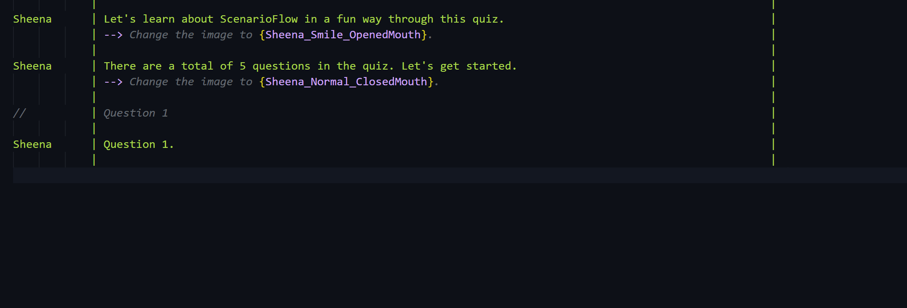

## ScenairoFlowを始める

では、ScenarioFlowの使い方を学んでいきましょう。
Unityで新たなプロジェクトを作成し、以下の手順に従ってセットアップを済ませます。

+ [UniTask](https://github.com/Cysharp/UniTask)のインポート
    + ScenarioFlowは非同期処理を扱うためにUniTaskを使用します
+ [ScenarioFlow](#)のインポート
+ [Visual Studio Code](https://code.visualstudio.com/)のインストール
    + 推奨テキストエディター
+ [SFText Extension Pack](https://marketplace.visualstudio.com/items?itemName=dotprologue.sftext-extension-pack)のインストール
    + SFText入力支援
+ [Ayu Theme](https://marketplace.visualstudio.com/items?itemName=teabyii.ayu)のインストール
    + SFText推奨テーマ
+ [ConsoleSFSample](https://github.com/dotprologue/ConsoleSFSample.git)のインポート
    + ScenarioFlowのサンプル

このチュートリアルでは、デバッグコンソールを利用した会話システムのサンプルであるConsoleSFSampleとともに学習を進めていきます。セットアップが済んだら、`ConsoleSFSample/SampleScene`を開いて、`ScenarioManager`オブジェクトにサンプルシナリオ`HideAndSeek.sftxt`が設定されていることを確認してプレイモードを開始します。このサンプルではキャラクターのセリフがコンソールに表示され、エンターキーを押すことによって次のセリフに進めることができます。

ScenarioManager:

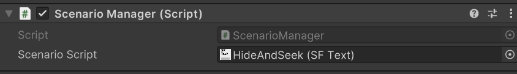

実行結果：

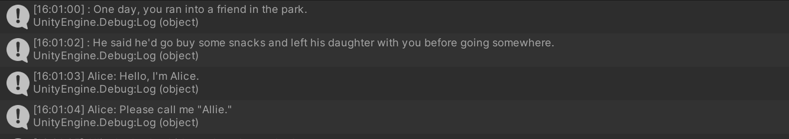

選択によって、シナリオが分岐することも確認しましょう。

回答1：

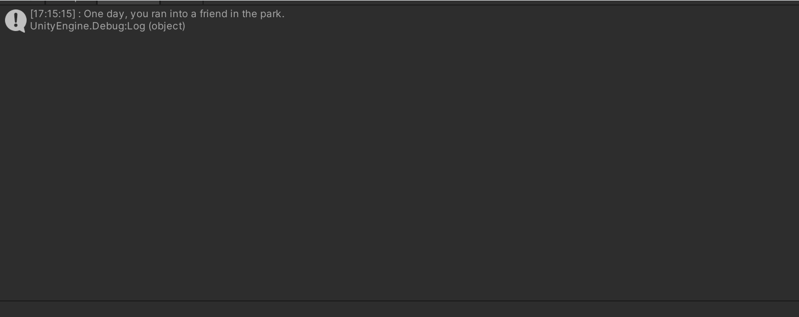

回答2：


## 会話シーンの再生方法

`HideAndSeek.sftxt`が、どのように実行され、会話シーンが再生されたのかを確認しましょう。`Scripts/ScenarioManager.cs`を開きます。

ScenarioFlowでの会話シーンの実行は、以下の2ステップで行います。

1. `ScenarioScript`を`ScenarioBookPublisher`で`ScenarioBook`に変換する
2. `ScenarioBook`を`ScenarioBookReader`で実行する

```cs
//Convert the scenario script to a scenario book
IScenarioBookPublisher scenarioBookPublisherInterface = scenarioBookPublisher;
IScenarioScript scenarioScriptInterface = scenarioScript;
ScenarioBook scenarioBook = scenarioBookPublisherInterface.Publish(scenarioScriptInterface);

//Start to read the scenario book
IScenarioBookReader scenarioBookReaderInterface = scenarioBookReader;
scenarioBookReaderInterface.ReadAsync(scenarioBook, this.GetCancellationTokenOnDestroy()).Forget();
```

ScenarioFlowが提供するクラスとインターフェース、そしてそれらを使用する中で使われる用語について学びましょう。

### コマンドとスクリプト

会話シーンの再生の中で、セリフの表示や、キャラクター画像の変更など、あらゆる演出は「コマンド」の実行によって引き起こされます。コマンドは、`HideAndSeek.sftxt`のようなスクリプト側から呼び出すことができる機能のことであり、どのような演出が実行されるのかは、コマンドによって異なります。

`HideAndSeek`の例では、`log dialogue async`がセリフを表示させるためのコマンド、`delay seconds`が指定された秒数だけ待機させるためのコマンド、また、`branch on 2 selections async`が、2つの選択肢を提示し、回答によってシナリオを分岐させるためのコマンドです。


このスクリプトは、「SFText」と呼ばれる、ScenarioFlowで使用可能なスクリプト形式の一つです。このスクリプトの文法についての詳しい説明は後に行いますが、ここでは、「delay seconds async」、「log dialogue async」などが呼び出すコマンド名、波括弧で括られた「5」や「Pigeon」、「Coo!」などが、それぞれのコマンドに対して与えられるパラメーターだということを覚えておいてください。

スクリプトに記述されたコマンドとパラメーターのセットは、上から順に実行されます。SFTextではキャラクターのセリフが他のコマンドとは異なる形式で記述されていますが、これも読み込まれる段階で等価なコマンド呼び出しに変換されます。すなわち、ScenarioFlowにおける会話シーンの再生は単に適切なコマンドを適切な順番で呼び出すことで実施され、どのような演出が引き起こされるのかに関わらず、全てのコマンド呼び出しは統一的に扱われます。

ScenarioFlowで会話シーンを再生するために必要なことの一つが、システムで用意されているコマンドを使用してスクリプトを書き上げ、それを実行することです。

### ScenarioScriptとScenarioBook

ScenarioFlowにおいて、会話シーンに必要なキャラクターのセリフやその他の演出が記述されたスクリプトは、`IScenarioScript`インターフェースのインスタンスとして`ScenarioBookPublisher`クラスの`Publish`メソッドに渡され、`ScenarioBook`クラスのインスタンスに変換されます。

`ScenarioScript`クラスは`ScriptableObject`クラスを継承しているので`SerializedField`属性によりUnityエディタ側から初期値を設定できると同時に、`IScenarioScript`インターフェースを実装しているので、そのインスタンスは`ScenarioBookPublisher`クラスによって`ScenarioBook`クラスのインスタンスに変換できます。会話シーンの作成で、実践的に使用するのはこのクラスになります。

```cs
[SerializeField]
private ScenarioScript scenarioScript;
```

`ScenarioScript`クラスは呼び出すべきコマンドやそのパラメーターを文字列として、そしてシナリオ分岐に必要な「ラベル」の情報を辞書として保持する役割を、`ScenarioBook`クラスは、それらをC#で実行可能な形式で保持する役割を担っています。ScenarioFlowでは、前者はシナリオスクリプトあるいは単にスクリプト、後者をシナリオブックと呼びます。

重要な点は、`ScenarioScript`クラスが中間状態としての役割を果たすということです。`ScnarioScript`は抽象クラスとして定義されており、このクラスを継承するオブジェクトならば、どのような形式でもシナリオブックに変換することができます。現時点では、すでに例で見たSFTextスクリプトと、もう一つ、Compositeスクリプトがデフォルトで提供されていますが、他のスクリプト形式に対応させることも可能です。

### ScenarioBookPublisher

キャラクターのセリフやその他の演出が記述されたスクリプトは、`ScenarioBookPublisher`クラスの`Publish`メソッドに渡されることで、C#で実行可能なシナリオブックに変換されます。このクラスは`IScenarioBookPublisher`インターフェースを実装しており、そのメンバとして`Publish`メソッドが定義されています。

```cs
//Convert the scenario script to a scenario book
IScenarioBookPublisher scenarioBookPublisherInterface = scenarioBookPublisher;
IScenarioScript scenarioScriptInterface = scenarioScript;
ScenarioBook scenarioBook = scenarioBookPublisherInterface.Publish(scenarioScriptInterface);
```

このクラスのコンストラクターは`IReflectable`インターフェースの配列を要求し、ここに渡されるクラスの中で、スクリプトから呼び出されるコマンドの処理が記述されています。コマンドの作成方法については、後のセクションで学習します。

```cs
ScenarioBookPublisher scenarioBookPublisher = new ScenarioBookPublisher(
    new IReflectable[]
    {
        new BranchMaker(labelOpener),
        new CancellationTokenDecoder(cancellationTokenDecoder),
        new ColorDecoder(),
        new ConsoleDialogueWriter(),
        new DelayMaker(),
        new PrimitiveDecoder(),
    });
```

### ScenarioBookReader

スクリプトから変換されたシナリオブックは、`ScenarioBookReader`クラスの`ReadAsync`メソッドに渡されることで実行されます。このクラスは`IScenarioBookReader`インターフェースを実装しており、そのメンバとして`ReadAsync`メソッドが定義されています。

```cs
//Start to read the scenario book
IScenarioBookReader scenarioBookReaderInterface = scenarioBookReader;
scenarioBookReaderInterface.ReadAsync(scenarioBook, this.GetCancellationTokenOnDestroy()).Forget();
```

`ScenarioBookReader`クラスのコンストラクターは`IScenarioTaskExecutor`インターフェースのインスタンスを要求しており、`ScenarioManager`の例では`ScenarioTaskExecutor`クラスのインスタンスを渡しています。`ScenarioTaskExecutor`クラスは、シナリオブックの実行における非同期処理の制御について、`ScenarioBookReader`クラスの補助を行っています。`HideAndSeek.sftxt`の実行では、エンターキーの押下によってシナリオを進めましたが、その進行制御はこのクラスが行っています。

```cs
EnterKeyNotifier enterKeyNotifier = new EnterKeyNotifier();

INextNotifier nextNotifier = enterKeyNotifier;
ICancellationNotifier cancellationNotifier = enterKeyNotifier;
ScenarioTaskExecutor scenarioTaskExecutor = new ScenarioTaskExecutor(nextNotifier, cancellationNotifier);

IScenarioTaskExecutor scenarioTaskExecutorInterface = scenarioTaskExecutor;
ScenarioBookReader scenarioBookReader = new ScenarioBookReader(scenarioTaskExecutorInterface);
```

`ScenarioBookReader`クラスと`ScenarioTaskExecutor`クラスは、シナリオ分岐のための機能やスキップモード実装のための機能など、会話シーンの作成に便利な機能を提供するためのインターフェースをいくつか実装しています。これについては、後のセクションで学習します。

なお、`ScenarioTaskExecutor`クラスは`IDisposable`インターフェースを実装します。そのため、シーンの終了とともにそのクラスのインスタンスを破棄するようにします。

```cs
IDisposable disposable = scenarioTaskExecutor;
disposable.AddTo(this.GetCancellationTokenOnDestroy());
```

## コマンドの追加と実行

ScenarioFlowで会話シーンを実行する際の大まかな流れは、以下の通りです。

+ プログラマーがコマンドを実装する
+ ライターが用意されたコマンドを使用してスクリプトを書き上げる
+ スクリプトを実行する

このセクションでは、スクリプトで呼び出すための新たなコマンドを追加し、それをスクリプトから実行する手順を学びましょう。

まずは、コンソールに任意のメッセージを出力するコマンドを実装します。新たなC#スクリプト`MessageLogger.cs`を作成してください。

```cs
using ScenarioFlow;
using UnityEngine;

public class MessageLogger : IReflectable
{
	[CommandMethod("log message")]
	public void LogMessage(string message)
	{
		Debug.Log(message);
	}
}
```

次に、作成したコマンドを会話システムに登録します。`Scripts/ScenarioManager.cs`を開き、`ScenarioBookPublisher`クラスのコンストラクタに渡されている`IReflectable`配列に`MessageLogger`クラスのインスタンスを追加してください。これで、コマンド`log message`が使用可能になります。

```cs
//in ScenarioManager.cs
ScenarioBookPublisher scenarioBookPublisher = new ScenarioBookPublisher(
    new IReflectable[]
    {
        new BranchMaker(labelOpener),
        new CancellationTokenDecoder(cancellationTokenDecoder),
        new ColorDecoder(),
        new ConsoleDialogueWriter(),
        new DelayMaker(),
        new PrimitiveDecoder(),
        //New
        new MessageLogger(),
    });
```

では、新しく作成したコマンドを実行してみます。プロジェクトウィンドウで右クリックをして`Create/ScenarioFlow/SFText Script`を選択し、新しいSFTextスクリプト、`LogTest.sftxt`を作成します。VSCodeでスクリプトを開き、以下のテキストを入力します。現時点では利用できる入力支援が限られていますが、コマンドパレットから`Format Document`を実行することで、テキストの体裁を整えることはできます。VSCodeにおける入力支援をカスタマイズする方法については、後に説明します。

```
$sync | log message     | 
      | {Good morning.} | 
$sync | log message     | 
      | {Hello.}        | 
```

テキストの準備ができたら、シーン上の`ScenarioManager`オブジェクトにそれを設定し、プレイモードを開始しましょう。デバッグコンソールに、スクリプトに書いたメッセージが表示されます。

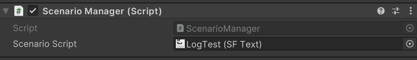


ここからは、コマンドを追加する際のポイントについて学んでいきます。

まず、ScenarioFlowにおけるコマンド実装について最も重要な点は、「メソッドとコマンドは等価である」ということです。先の例のスクリプトにおいて、「log message」が呼び出すコマンド名、波括弧で括られた「Good morning.」および「Hello.」が、それぞれの呼び出しにおけるパラメーターです。つまり、`log message`というコマンドを二度、それぞれ`"Good morning."`、`"Hello."`というパラメーターとともに呼び出しています。これは、コマンド名「log message」が付けられたC#のメソッドに、「Good morning. (またはHello.)」というパラメーターを渡して呼び出す、ということを意味しています。ScenarioFlowにおいてコマンドは、C#のメソッドそのものとして実装され、そのメソッドをコマンドとしてエクスポートすることによりスクリプト側から使用可能になります。メソッドは`CommandMethod`属性を付加することでコマンドとしてエクスポートすることができ、指定したコマンド名と、メソッドと同じパラメーターを持つコマンドが出来上がります。

次に、メソッドをコマンドとしてエクスポートする際の規則について確認します。

+ メソッドに対して`CommandMethod`属性を付加することによりコマンド名を指定し、コマンドとしてエクスポートする
+ コマンドを宣言するクラスは`IReflectable`インターフェースを実装する
    コマンドしこのインターフェースはメンバを持たないので、特別に実装しなければならないメソッドやプロパティは存在しない
+ コマンドを宣言するクラスは`IReflectable`インターフェースのインスタンスとして、`ScnearioPublisher`クラスのコンストラクタに渡される

実際には、コマンドを利用するために従うべき規則が他にもあり、それを次のセクションで学習します。

## 引数型とデコーダー

このセクションでは、ScenarioFlowでコマンドを扱う上で重要な概念である「デコーダー」について学習します。まずは、前のセクションで作成した`MessageLogger`クラスに、新たなコマンド`log greeting`を追加しましょう。このコマンドは`bool`型のパラメーター、`isMorning`を受け取り、その値によって異なる文字列をコンソールに出力します。

```cs
using ScenarioFlow;
using UnityEngine;

public class MessageLogger : IReflectable
{
	[CommandMethod("log message")]
	public void LogMessage(string message)
	{
		Debug.Log(message);
	}

    //New
	[CommandMethod("log greeting")]
	public void LogGreeting(bool isMorning)
	{
		Debug.Log(isMorning ? "Good morning!" : "Hello!");
	}
}
```

スクリプト`LogTest`を書き換えます。すでに`MessageLogger`クラスを`ScenarioBookPublisher`クラスのコンストラクタに追加しているので、`ScenarioManager`クラスに変更を加える必要はありません。

```
$sync | log greeting | 
      | {true}       | 
$sync | log greeting | 
      | {false}      | 
```

プレイモードを開始し、`LogTest`を実行します。すると、例外がスローされます。

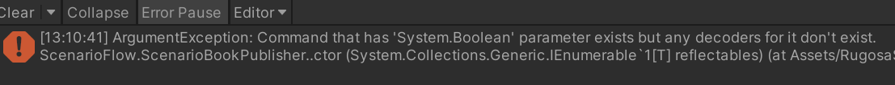

このエラーは、デコーダーの不足により起こります。デコーダーとは、パラメーターとして渡される文字列を、適切な型に変換するためのメソッドのことです。

スクリプトに記述された「true」や「false」は、私たちは`bool`型の変数であることを予想できますが、システムにとっては`string`型の文字列にすぎません。そして、コマンド名`log greeting`を持つ`LogGreeting`メソッドが求めているのは、`bool`型のパラメーターです。そこで、スクリプトから渡された文字列のパラメーターを、適切な型に変換してやる必要があります。その役割を担うのが、デコーダーです。

では、`bool`型用のデコーダーを作成し、追加しましょう。新たなC#クラス、`BoolDecoder`クラスを作成し、以下のコードを記述します。

```cs
using ScenarioFlow;

public class BoolDecoder : IReflectable
{
	[DecoderMethod]
	public bool ConvertToBool(string input)
	{
		return bool.Parse(input);
	}
}
```

これで、`bool`型用のデコーダーが出来上がりました。`ScenarioManager`クラス内の`ScenarioBookPublisher`クラスのコンストラクタに渡される`IReflectable[]`配列に`BoolDecoder`クラスのインスタンスを追加し、デコーダーを登録します。

```cs
ScenarioBookPublisher scenarioBookPublisher = new ScenarioBookPublisher(
    new IReflectable[]
    {
        new BranchMaker(labelOpener),
        new CancellationTokenDecoder(cancellationTokenDecoder),
        new ColorDecoder(),
        new ConsoleDialogueWriter(),
        new DelayMaker(),
        new PrimitiveDecoder(),
        new MessageLogger(),
        //New
        new BoolDecoder(),
    });
```

再度、`LogTest`を実行します。すると、今度は正常にメッセージが表示されます。これは、`bool`型用のデコーダーのおかげで、コマンド`log greeting`に渡された`string`型のパラメーターである`"true"`や`"false"`を、`bool`型の`true`および`false`に変換できるようになったからです。


このように、デコーダーはスクリプトに記述された文字列としてのパラメーターを、コマンドとしてエクスポートされているメソッドの呼び出しに必要である、適切な型に変換するという役割を果たします。ScenarioFlowにおいてコマンドを追加する際は、前のセクションで学習した規則に加えて、以下の規則に従う必要があります。

+ 呼び出すコマンドで使用される引数型すべてに対して、対応するデコーダーが存在する

コマンドのパラメーターとして`int`型が必要であれば`int`型用のデコーダーを、`float`型が必要であれば`float`型用のデコーダーを作成する必要があります。`string`型についても、デコーダーが必要なことに注意してください。`ConsoleSFSample`では、`Scripts/Decoder`内のクラスにいくつかのデコーダーが定義されています。例えば、`PrimitiveDecoder`クラス内では`int`型、`float`型、`string`型用のデコーダーが、`ColorDecoder`クラス内では`Color`型用のデコーダーが定義されています。

デコーダーを作成する際は、以下の規則に従ってください。

+ メソッドに`DecoderMethod`属性を付加して、メソッドをデコーダーとしてエクスポートする
+ メソッドは、`string`型のパラメーターを一つだけ持つ
+ ターゲットとする型を、メソッドの返り値の型とする
+ デコーダーを宣言するクラスは、`IReflectable`インターフェースを実装し、`ScenarioBookPublisher`クラスのコンストラクタに渡される

### Note

コマンドとデコーダーについて、従わなければならない規則をまとめておきます。

+ コマンド
    + メソッドに対して`CommandMethod`属性を付加することによりコマンド名を指定し、コマンドとしてエクスポートする
    + コマンドで使用される引数型すべてに対し、対応するデコーダーが存在する
+ デコーダー
    + メソッドに`DecoderMethod`属性を付加して、メソッドをデコーダーとしてエクスポートする
    + デコーダーは、`string`型のパラメーターを一つだけ持つ
    + デコーダーのターゲットとする型を、メソッドの返り値の型とする
+ 共通
    + メソッドまたはデコーダーを宣言するクラスは`IReflectable`インターフェースを実装し、`ScnearioPublisher`クラスのコンストラクタに渡される
    + 登録されるコマンド名とデコーダーのターゲットとなる型は唯一である

## 非同期コマンドの追加

これまでに扱ったコマンドは、どれも返り値の型が`void`である同期処理でした。しかし、実際に会話シーンを作成する際には、アニメーションを始めとした、多くの非同期処理が必要になります。このセクションでは、非同期メソッドを非同期コマンドとしてエクスポートし、実行する方法について学習します。

まずは、`MessageLogger`クラスに変更を加え、新たなコマンド`log delayed message`を追加します。このコマンドは、指定された秒数だけ待機し、その後にメッセージを表示します。

```cs
using Cysharp.Threading.Tasks;
using ScenarioFlow;
using System;
using System.Threading;
using UnityEngine;

public class MessageLogger : IReflectable
{
	[CommandMethod("log message")]
	public void LogMessage(string message)
	{
		Debug.Log(message);
	}

	[CommandMethod("log greeting")]
	public void LogGreeting(bool isMorning)
	{
		Debug.Log(isMorning ? "Good morning!" : "Hello!");
	}

    //New
	[CommandMethod("log delayed message async")]
	public async UniTask LogDelayedMessageAsync(string message, float seconds, CancellationToken cancellationToken)
	{
		Debug.Log("Wait for the message...");
		try
		{
			await UniTask.Delay(TimeSpan.FromSeconds(seconds), cancellationToken: cancellationToken);
			Debug.Log(message);
		}
		catch (OperationCanceledException)
		{
			Debug.Log("Message canceled.");
		}
	}
}
```

スクリプト`LogTest`に変更を加え、実行します。エンターキーを押して、コマンドの実行を進めます。

```
$standard | log delayed message async | 
          | {Good morning.} {3}       | 
$standard | log delayed message async | 
          | {Hello.} {5}              | 
$standard | log delayed message async | 
          | {Good evening.} {7}       | 
```

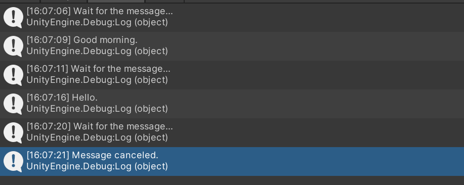

実行時、以下の点を確認してください。前セクションまでの、同期コマンドのみを含んだスクリプトの実行と大きく違う点は、一つの非同期コマンドの実行ごとにエンターキー押下の待機が入ることです。

+ 指定秒数が経過した後、メッセージが表示される
+ メッセージ待機中にエンターキーを押すと、メッセージの表示がキャンセルされる
+ メッセージがキャンセルされたかどうかに関わらず、コマンドの実行が終了後、エンターキーが押されるまで次のコマンドは実行されない

ScenarioFlowは、同期コマンドと非同期コマンドを明確に区別します。同期コマンドはただ実行されるだけですが、非同期コマンドの場合は、コマンド終了後に何らかのアクションを待機するかどうか、実行のキャンセルを可能にするかどうかなど、実行に関していくつかのオプションを設定することができます。今回の例では、`$standard`により、キャンセルの許可と、コマンド完了後の待機を設定しています。

また、このオプションは、`CancellationToken`型に対するパラメーターとして渡されます。コマンド`log delayed message`には、`string`型、`float`型、`CancellationToken`型のパラメーターを渡さなければなりませんが、以下の呼び出しではそれぞれ`Good morning.`, `3`, `standard`が対応しています。`CancellationToken`型のパラメーターのみ、他のパラメーターと別の位置に記述されていますが、これは`CancelationToken`型のパラメーターが特別な役割を担っており、SFTextはそれを特別に扱っているからです。この`CancellationToken`型のパラメーターは「トークコード」と呼ばれ、次のセクションで学習します。

```
$standard | log delayed message async | 
          | {Good morning.} {3}       | 
```

なお、非同期コマンドは`CancellationToken`型のパラメーターを持つため、非同期コマンドの実行には`CancellationToken`型の用のデコーダーが必要ですが、これは`ScenarioTaskExecutor`クラスを使用して簡単に作成できます。`ScenarioTaskExecutor`クラスは`ICancellationTokenDecoder`インターフェースを実装しており、このインターフェースの`Decode`メンバメソッドを通して、適切な`CancellationToken`の値を取得することができます。`ConsoleSFSample`では、`CancellationTokenDecoder`クラスの中で、`CancellationToken`型用のデコーダーが定義されています。

ScenarioManager.cs:

```cs
ICancellationTokenDecoder cancellationTokenDecoder = scenarioTaskExecutor;
ScenarioBookPublisher scenarioBookPublisher = new ScenarioBookPublisher(
    new IReflectable[]
    {
        new BranchMaker(labelOpener),
        //A decoder for `CancellationToken` type here
        new CancellationTokenDecoder(cancellationTokenDecoder),
        new ColorDecoder(),
        new ConsoleDialogueWriter(),
        new DelayMaker(),
        new PrimitiveDecoder(),
        new MessageLogger(),
        new BoolDecoder(),
    });
```

CancellationTokenDecoder.cs:

```cs
public class CancellationTokenDecoder : IReflectable
{
    private readonly ICancellationTokenDecoder cancellationTokenDecoder;

    public CancellationTokenDecoder(ICancellationTokenDecoder cancellationTokenDecoder)
    {
        this.cancellationTokenDecoder = cancellationTokenDecoder ?? throw new ArgumentNullException(nameof(cancellationTokenDecoder));
    }

    [DecoderMethod]
    public CancellationToken Decode(string tokenCode)
    {
        return cancellationTokenDecoder.Decode(tokenCode);
    }
}
```

では、非同期メソッドを非同期コマンドとしてエクスポートする際の規則を確認しましょう。

+ メソッドの返り値の型は`UniTask`である
+ 最後のパラメーターの型は`CancellationToken`である
+ SFTextにおいて、`CancellationToken`型のパラメーターは他の型のパラメーターと区別され、別の位置に記述される

返り値の型が`UniTask`であるメソッドは非同期コマンドとして、それ以外のメソッドは同期コマンドとしてエクスポートされます。

## トークンコード

すでに学習した通り、ScenarioFlowでは同期コマンドと非同期コマンドは明確に区別されます。同期コマンドがただ実行されるのみであるのに対し、非同期コマンドには、実行時のオプションを設定することができます。そのオプションは`CancellationToken`型のパラメーターとしてコマンドに渡され、そのパラメーターのことを、「トークンコード」と呼びます。

ScenarioFlowでは、非同期コマンドに対してそれぞれ異なる特性を付与する、12種類の特別なトークンコードを使用することができます。そして、実際にはいくつかのトークンコードの使用に関しては規則性があり、SFTextが独自のトークンコードをいくつか提供しているので、使用すべきトークンコードは8種類にまで削減されます。

以下が、SFTextで使用されるトークコードの一覧です。

| トークンコード | 特性 |
| ---- | ---- |
| standard | 完了後の待機あり。キャンセルもスキップも可能 | 
| forced |　完了後の待機あり。キャンセル不可能だがスキップは可能 |
| promised |　完了後の待機あり。キャンセルもスキップも不可能 |
| f-standard |　完了後の待機なしのstandard |
| f-forced | 完了後の待機なしforced |
| f-promised | 完了後の待機なしのpromised |
| serial | 次の非同期コマンドと直列に接続 |
| parallel | 次の非同期コマンドと並列に接続 |

まずは、`standard`、`forced`、`promised`の違いについて学びましょう。そのためには、「キャンセル命令」と「スキップ命令」について知る必要があります。キャンセル命令は、実行中の非同期コマンドをキャンセルするための命令であり、前のセクションの例では、コマンドの実行中にエンターキーを押すことで発行されます。そのため、メッセージの待機中にエンターキーを押すと、メッセージの表示がキャンセルされていました。一方でスキップ命令は、コマンドをスキップするための命令であり、「スキップモード」がオンの間はその命令が発行され続けます。スキップ可能なある非同期コマンドが実行されている間にスキップ命令を受けると、その実行は即座にキャンセルされ、そのまま次の非同期コマンドが実行されます。

スキップモードを有効にし、スキップ命令を発行してみましょう。前のセクションの`LogTest`を実行し、Sキーを押してスキップモードの有効と無効を切り替えます。

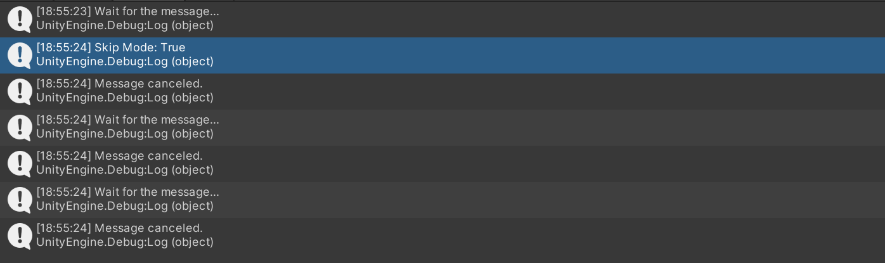

スキップモードについてのより詳しいことは後のセクションで学習します。ここでは、スキップ命令が、より強いレベルでのキャンセル命令を表すということを覚えておいてください。

トークンコードの説明に戻りましょう。実行のキャンセルに関して、`standard`は最も寛容です。キャンセル命令も、一段階上のキャンセルを意味するスキップ命令も許可します。そして、`forced`はキャンセル命令は無視するものの、スキップ命令は受け付けます。最後に、`promised`はキャンセル命令も、スキップ命令も無視します。すなわち、`promised`は非同期コマンドがキャンセルされずに、実行が完了することを保証します。

`LogTest`のトークンコードを書き変えた上で再度スクリプトを実行し、非同期コマンドの実行中にエンターキーを押したとき、また、Ｓキーを押してスキップモードを有効にしたときの振る舞いがどのように変化するかを確認してみてください。

次に、`f-`付きのトークンコードについて学びましょう。この`f-`は「fluent」の略で、非同期コマンドの完了後に「進行命令」を待機しないことを意味します。進行命令というのは、ある非同期コマンドが完了した後、次のコマンドを実行させるために発行する命令のことです。前のセクションの例では、一つの非同期コマンドが完了した後、エンターキーを押すことにより進行命令が発行され、次のコマンドが実行されました。逆に、エンターキーを押さなければ、いつまでも次のコマンドは実行されません。`f-`が付いたトークンコードを指定することで、その非同期コマンドの完了後、進行命令を無視して即座に次のコマンドの実行に進むことができます。

では、`LogTest`のトークンコードを、`f-`付きのトークンコードに置き換えた上で、再度スクリプトを実行してみましょう。メッセージが表示された後、何のキーを押すこともなく、次のメッセージの表示に移行するはずです。コマンドの実行中にキャンセルが可能かどうかや、スキップが可能かどうかは、`f-`の後ろのキーワードによります。

最後に、`serial`と`parallel`について学びましょう。これらのトークンコードを付与することは、それを付与した非同期コマンドを次の非同期コマンドと接続し、一つの非同期コマンドにまとめることを意味します。`serial`ならば直列に、`parallel`ならば並列に接続されます。この違いを、より詳しく確認しましょう。

`serial`を非同期コマンドに付与した場合、付与される特性としては`f-`が付いたトークンコードと似ています。`serial`が付与された非同期コマンドの実行が完了した後、進行命令は待機されず、すぐに次のコマンドが実行されます。`f-`付きのトークンコードと異なるのは、`serial`付きの非同期コマンドがキャンセルできるかどうか、スキップできるかどうかは、その非同期コマンドが接続されている非同期コマンドのそれと一致するということです。`standard`の非同期コマンドに接続されていればキャンセルもスキップも可能であり、`promised`の非同期コマンドに接続されていればキャンセルもスキップも不可能です。加えて、最も重要な点は、`serial`付きの非同期コマンドがキャンセルされたとき、それが接続されている後続の非同期コマンドもキャンセルされるということです。

以下の二つの例で、その特性の差を確認しましょう。

`f-standard`を利用したスクリプトと実行結果：

```
$f-standard | log delayed message async | 
            | {Good morning.} {3}       | 
$f-standard | log delayed message async | 
            | {Hello.} {5}              | 
$standard   | log delayed message async | 
            | {Good evening.} {7}       | 
```


`serial`を利用したスクリプトと実行結果：

```
$serial   | log delayed message async | 
          | {Good morning.} {3}       | 
$serial   | log delayed message async | 
          | {Hello.} {5}              | 
$standard | log delayed message async | 
          | {Good evening.} {7}       | 
```

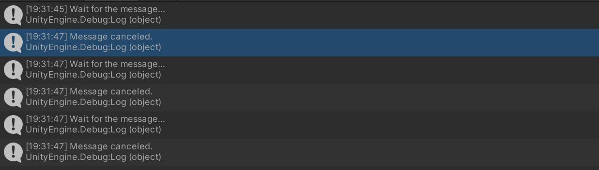

重要な点は、最初のメッセージのキャンセルが、後続のメッセージの表示に影響を与えているかどうかということです。`f-standard`を使用した例では最初のメッセージをキャンセルしても、後続のメッセージは正常に表示されていますが、`serial`を使用した例では、最初のメッセージをキャンセルすると、後続のメッセージも一斉にキャンセルされています。

なお、`serial`がキャンセルできるかどうか、スキップできるかどうかは後続の非同期コマンドに指定されているトークコードに依存するので、例えば以下の例では`serial`付きの非同期コマンドは、キャンセルもスキップもできません。

```
$serial   | log delayed message async | 
          | {Good morning.} {3}       | 
$serial   | log delayed message async | 
          | {Hello.} {5}              | 
$promised | log delayed message async | 
          | {Good evening.} {7}       | 
```

では、次は`parallel`についてです。このトークンコードの特性は単純です。このトークンコードが付加された非同期コマンドは、次の非同期コマンドと同時に実行されます。次の例でそのことを確かめましょう。

`parallel`を利用したスクリプトと実行結果：

```
$parallel | log delayed message async | 
          | {Good morning.} {3}       | 
$parallel | log delayed message async | 
          | {Hello.} {5}              | 
$standard | log delayed message async | 
          | {Good evening.} {7}       | 
```

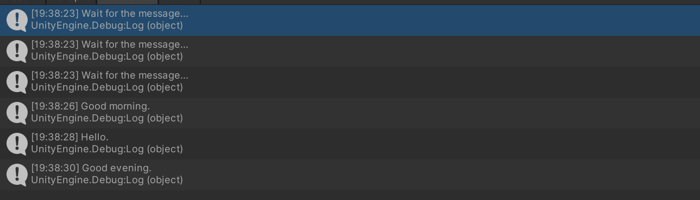

3つの非同期コマンドが、同時に実行されていることが分かります。また、同時に実行されているので、キャンセルも同時に行われます。

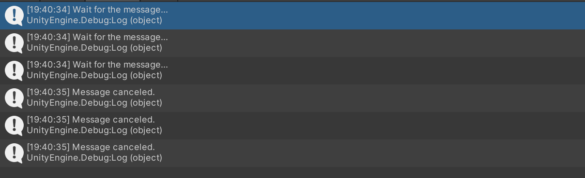

キャンセル可能かどうか、スキップ可能かどうかについては、`serial`と同様、後続の非同期コマンドに依存します。例えば、次の例ではどの非同期コマンドもキャンセル、スキップ共に不可能です。

```
$parallel | log delayed message async | 
          | {Good morning.} {3}       | 
$parallel | log delayed message async | 
          | {Hello.} {5}              | 
$promised | log delayed message async | 
          | {Good evening.} {7}       | 
```

### Note

各トークンコードの使い分けについて、簡単にまとめます。

+ `standard`か、`forced`か、`promised`か
    + キャンセルしてもいいなら`standard`
    + なるべくキャンセルしてほしくないなら`forced`
    + 絶対にキャンセルしてほしくない、もしくはキャンセルするとシステム上不具合が出るなら`promised`
+ `f-`をつけるかどうか
    + セリフ関係には基本的につけない
    + プレイヤー選択肢や、場面遷移、アニメーションなどには`f-`をつける
+ `serial`
    + アニメーションをつなげてひとまとめにしたい場合
    + 遅延を演出に付加する場合
+ `parallel`
    + 複数の演出や処理を同時に実行する必要がある場合

例えば、プレイヤーに選択肢を選ばせる演出であれば、まず、プレイヤーが回答した後はすぐに次のコマンドに移行したいので`f-`をつけます。そして、シナリオ分岐のためには必ずプレイヤーには選択肢を回答してもらわなければならない、言い換えればキャンセルされるとどのシナリオに分岐すれば良いのかが分からなくなるので、`f-promised`を指定する必要があります。これは`HideAndSeek`の中でも見られる、典型的なパターンです。

## SFTextスクリプト

詳細は[SFText_JP](./SFText_JP.md)を確認してください。

## Compositeスクリプト

ここまでに使用したSFTextスクリプトは、C#では`SFText`クラスとしてインポートされます。スクリプトは`ScenarioBookPublisher`クラスによってシナリオブックに変換されますが、そのスクリプトは`ScenarioBook`抽象クラスを継承するクラスであればよく、`SFText`クラスである必要はありません。

現時点で、ScenarioFlowがデフォルトで用意しているもう一つの形式が、「Compositeスクリプト」形式です。これは`CompositeScenarioScript`クラスとして扱われますが、このクラスも、`ScenarioScript`抽象クラスを継承しているのでシナリオブックに変換可能です。

Compositeスクリプトは、複数のスクリプトをまとめて一つのスクリプトにします。`ConsoleSFSample`の、`Stories/Comp_HideAndSeek`を確認しましょう。このCompositeスクリプトは、2つの分割されたSFTextスクリプトによって構成されています。


このスクリプトを`ScenarioManager`オブジェクトに設定して、実行してみます。すると、`HideAndSeek.sftxt`の実行と全く同じ結果が得られます。


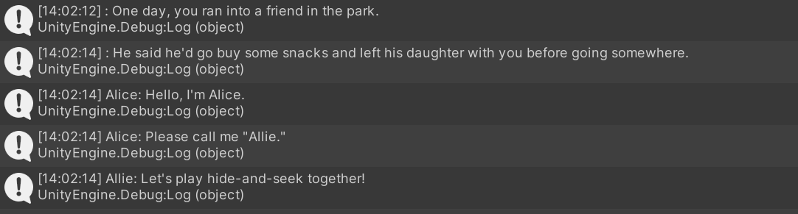

Compositeスクリプトは、登録されたスクリプトに記述されたコマンド呼び出しの情報と、ラベルの情報を結合して一つのスクリプトにまとめます。

重要な点は、Compositeスクリプトに登録されるスクリプトはすべて、`ScenarioScript`抽象クラスのオブジェクトとして独立に認識されるということです。すなわち、Compositeスクリプトに別のCompositeスクリプトを登録する、といったことも可能です。ただし、SFTextのマクロスコープのようなスクリプト固有の情報はCompositeスクリプトに認識されないということに注意してください。呼び出すべきコマンド及びパラメータの情報、そしてラベルの情報の保持はすべてのスクリプトで共通の機能ですが、会話スコープ、マクロスコープなどの概念はSFTextスクリプトに特有のものです。そのため、あるスクリプトから、別のスクリプトに記述されたラベルを参照することは可能ですが、あるスクリプトで宣言されたマクロスコープの効力は、別のスクリプトにまでは及びません。

## シナリオ進行制御

`ConsoleSFSample`の初期設定では、エンターキーを押すと進行命令、キャンセル命令が発行されるようになっています。例えばトークンコード`standard`を指定した非同期コマンドを実行する場合、それが実行されている途中にエンターキーを押すとその実行がキャンセルされ、実行が完了した後、エンターキーを押すと次のコマンドが実行されます。

このセクションでは、エンターキー以外の、任意の方法で進行制御を行う方法を学習します。

ある非同期コマンドが完了した時に、次のコマンドの実行へ移行させる命令が進行命令、ある非同期コマンドの実行中に、その実行をキャンセルする命令がキャンセル命令です。これらの命令は、それぞれ`INextNotifier`インターフェースと`ICancellationNotifier`インターフェースを利用して定義することができます。

マウスのクリックにより、進行命令およびキャンセル命令を発行するクラスを作ります。新たなC#クラス、`MouseNotifier`を作成してください。

```cs
using Cysharp.Threading.Tasks;
using Cysharp.Threading.Tasks.Linq;
using ScenarioFlow.Tasks;
using System.Threading;
using UnityEngine;

public class MouseNotifier : INextNotifier, ICancellationNotifier
{
	public UniTask NotifyNextAsync(CancellationToken cancellationToken)
	{
		return WaitUntilMouseDown(cancellationToken);
	}

	public UniTask NotifyCancellationAsync(CancellationToken cancellationToken)
	{
		return WaitUntilMouseDown(cancellationToken);
	}

	private UniTask WaitUntilMouseDown(CancellationToken cancellationToken)
	{
		return UniTaskAsyncEnumerable.EveryUpdate()
			.Select(_ => Input.GetMouseButtonDown(0))
			.Where(x => x)
			.FirstOrDefaultAsync(cancellationToken: cancellationToken);
	}
}
```

`ScenarioManager`クラスに変更を加えます。作成した`MouseNotifier`クラスを、`ScenarioTaskExecutor`クラスのコンストラクターに渡してください。`ScenarioTaskExecutor`クラスは、指定されたトークコードに合わせて非同期コマンドの実行を制御する役割を担います。

```cs
//EnterKeyNotifier enterKeyNotifier = new EnterKeyNotifier();
MouseNotifier mouseNotifier = new MouseNotifier();

INextNotifier nextNotifier = mouseNotifier;
ICancellationNotifier cancellationNotifier = mouseNotifier;
ScenarioTaskExecutor scenarioTaskExecutor = new ScenarioTaskExecutor(nextNotifier, cancellationNotifier);
```

これで、進行命令とキャンセル命令が、マウスの左クリックにより発行されるようになりました。`HideAndSeek`を実行して、そのことを確かめてみてください。

`INextNotifier`インターフェースはメンバメソッドとして`NotifyNextAsync`メソッドを持ち、そのメソッドの完了により、進行命令が発行されます。そして、`ICancellationNotifier`インターフェースはメンバメソッドとして`NotifyCancellationAsync`メソッドを持ち、そのメソッドの完了により、キャンセル命令が発行されます。

二つのインターフェースは、同じクラスで実装される必要はありません。`INextNotifier`インターフェースには`EnterKeyNotifier`クラスを、`ICancellationNotifier`インターフェースには`MouseNotifier`クラスを割り当ててみましょう。このとき、エンターキーを押すことによって進行命令が、マウスの左クリックによってキャンセル命令が発行されるようになります。

```cs
EnterKeyNotifier enterKeyNotifier = new EnterKeyNotifier();
MouseNotifier mouseNotifier = new MouseNotifier();

INextNotifier nextNotifier = enterKeyNotifier;
ICancellationNotifier cancellationNotifier = mouseNotifier;
ScenarioTaskExecutor scenarioTaskExecutor = new ScenarioTaskExecutor(nextNotifier, cancellationNotifier);
```

## シナリオ分岐

`ScenarioBookReader`クラスは`ILabelOpener`インターフェースを実装しており、このインターフェースを介して、スクリプトに記述されたコマンドの実行順序を変えることができます。メンバメソッドである`OpenLabel`メソッドにラベル名を渡して呼び出すことで、スクリプト側でそのラベルが付加されているコマンドから実行が再開されます。

```cs
ILabelOpener labelOpener = scenarioBookReader;
```

この性質を利用すると、シナリオ分岐を実装することができます。例として、`Scripts/BranchMaker.cs`を確認しましょう。

```cs
    public class BranchMaker : IReflectable
    {
        private readonly ILabelOpener labelOpener;

        public BranchMaker(ILabelOpener labelOpener)
        {
            this.labelOpener = labelOpener ?? throw new ArgumentNullException(nameof(labelOpener));
        }

        [CommandMethod("jump to label")]
        public void JumpLabel(string label)
        {
            labelOpener.OpenLabel(label);
        }

		[CommandMethod("branch on 2 selections async")]
		public async UniTask BranchBasedOnTwoSelectionsAsync(string selection1, string label1, string selection2, string label2, CancellationToken cancellationToken)
		{
			var builder = new StringBuilder();
			builder.AppendLine("Select your answer with the number keys:");
			builder.AppendLine($"1 - {selection1}, 2 - {selection2}");
			Debug.Log(builder.ToString());

			var answer = await UniTask.WhenAny(
				WaitUntilKeyPressedAsync(KeyCode.Alpha1, cancellationToken),
				WaitUntilKeyPressedAsync(KeyCode.Alpha2, cancellationToken));
			var label = answer == 0 ? label1 : label2;
			labelOpener.OpenLabel(label);
		}

		private UniTask WaitUntilKeyPressedAsync(KeyCode keyCode, CancellationToken cancellationToken)
		{
			return UniTaskAsyncEnumerable.EveryUpdate()
				.Select(_ => Input.GetKeyDown(keyCode))
				.Where(x => x)
				.FirstOrDefaultAsync(cancellationToken: cancellationToken);
		}
	}
```

`jump to label`は単に受け取ったラベルへジャンプする同期コマンド、`branch on 2 selections async`は、選択肢を提示し、回答があるまで待機し、回答によって二つのラベルのどちらかにジャンプする非同期コマンドです。`HideAndSeek`では、これらのコマンドを使用してシナリオ分岐を実現しています。

```
$f-promised | branch on 2 selections async                                                           | 
            | Selection 1: {Behind the tree}                                                         | 
            | - Jump to {Ans1}                                                                       | 
            | Selection 2: {Under the slide}                                                         | 
            | - Jump to {Ans2}                                                                       | 
            |                                                                                        | 
#label      | //============ {Ans1} ============//                                                   | 
            |                                                                                        | 
Girl        | Oh, you got me!                                                                        | 
            |                                                                                        | 
$sync       | jump to label                                                                          | 
            | Jump to {Exit}.                                                                        | 
            |                                                                                        | 
#label      | //============ {Ans2} ============//                                                   | 
            |                                                                                        | 
Narr        | You searched under the slide, but she wasn't there.                                    | 
            |                                                                                        | 
Girl        | I was behind the tree. I win!                                                          | 
            | --> Text color: {Red}                                                                  | 
            |                                                                                        | 
#label      | //============ {Exit} ============//                                                   | 
Girl        | So, why don't you play again?                                                          |
```

なお、基本的に一つのラベルはどれかのコマンドに付加されていますが、SFTextではファイルの一番下にラベルを置くことが許可されています。そのようなラベルにジャンプした場合、Compositeで他のコマンドがそのラベルに結び付けられていない限り、その時点でスクリプトの実行が終了します。`LogTest`に変更を加えて、そのことを確かめましょう。

```
$sync  | log message                          | 
       | Message: {Good morning.}             | 
$sync  | jump to label                        | 
       | Jump to {Exit}.                      | 
$sync  | log message                          | Not executed
       | Message: {Hello.}                    | 
$sync  | log message                          | Not executed
       | Message: {Good evening.}             | 
#label | //============ {Exit} ============// | 
```


## スキップモード

スキップモードはプレイヤーが物語を読み飛ばしたい場合に有効にすることを想定しており、これがオンの間、スキップが可能な非同期コマンドは実行後即座にキャンセルされ、すぐに次のコマンドが実行されるようになります。このスキップモードは、`ScenarioTaskExecutor`クラスが実装する`ISkipActivator`インターフェースを介して制御が可能です。

`ScenarioManager.cs`でのスキップモードの制御例を見てみましょう。この実装では、Sキーを押すたびに、スキップモードのオンとオフが切り替わるようになっています。

```cs
//The skip mode is switched with the S key
ISkipActivator skipActivator = scenarioTaskExecutor;
skipActivator.Duration = 0.05f;
UniTaskAsyncEnumerable.EveryUpdate()
    .Select(_ => Input.GetKeyDown(KeyCode.S))
    .Where(x => x)
    .ForEachAsync(_ =>
    {
        skipActivator.IsActive = !skipActivator.IsActive;
        Debug.Log($"Skip Mode: {skipActivator.IsActive}");
    }, cancellationToken: this.GetCancellationTokenOnDestroy()).Forget();
```

`ISkipActivator`インターフェースはメンバプロパティとして`Duration`と`IsActive`を定義しており、それぞれスキップモード有効時の非同期コマンド間の待機時間、スキップモードのオンオフを設定することができます。

## 一般のトークンコード

すでに学習した通り、ScenarioFlowでは、非同期コマンドにトークンコードを指定することで、その実行方法を変更できます。`standard`や`forced`など、特定のトークンコードは特定の特性を非同期コマンドに付与しますが、それら以外のトークンコードも指定することができます。

`standard`や`forced`といった、特定の特性を非同期コマンドに付与するトークンコードを「特別なトークンコード」、それ以外のトークンコードを「一般のトークンコード」と呼びます。非同期コマンドに一般のトークンコードを指定した場合、実行時にその非同期コマンドはトークコードと結び付けられて`ScenarioTaskExecutor`クラスにストックされます。そして、このクラスが実装する`IScenarioTaskStorage`インターフェースを通して、任意のタイミングでその完了を待機したり、キャンセルしたりすることができます。また、一般のトークンコードが渡された非同期コマンドの完了は待機されず、すぐに次のコマンドが実行されます。

では、例を見ていきましょう。まずは、ストックされたタスクを操作するためのコマンドを追加します。新たなクラス、`ScenarioTaskConsumer`を作成してください。

```cs
using Cysharp.Threading.Tasks;
using ScenarioFlow;
using ScenarioFlow.Scripts.SFText;
using ScenarioFlow.Tasks;
using System;
using System.Threading;

public class ScenarioTaskConsumer : IReflectable
{
	private readonly IScenarioTaskStorage scenarioTaskStorage;

	public ScenarioTaskConsumer(IScenarioTaskStorage scenarioTaskStorage)
	{
		this.scenarioTaskStorage = scenarioTaskStorage ?? throw new ArgumentNullException(nameof(scenarioTaskStorage));
	}

	[CommandMethod("accept task async")]
	[Category("Task")]
	[Description("Wait for the completion of the tasks with the general token code.")]
	[Snippet("Wait for the completion of {${1:task name}}.")]
	public UniTask AcceptTaskAsync(string tokenCode, CancellationToken cancellationToken)
	{
		return scenarioTaskStorage.AcceptAsync(tokenCode, cancellationToken);
	}

	[CommandMethod("cancel task")]
	[Category("Task")]
	[Description("Cancel the tasks with the general token code.")]
	[Snippet("Cancel task {${1:task name}}.")]
	public void CancelTask(string tokenCode)
	{
		scenarioTaskStorage.Cancel(tokenCode);
	}
}
```

`ScenarioBookPublisher`のコンストラクターに、作成したクラスのインスタンスを渡します。

```cs
IScenarioTaskStorage scenarioTaskStorage = scenarioTaskExecutor;
ScenarioBookPublisher scenarioBookPublisher = new ScenarioBookPublisher(
    new IReflectable[]
    {
        new BranchMaker(labelOpener),
        new CancellationTokenDecoder(cancellationTokenDecoder),
        new ColorDecoder(),
        new ConsoleDialogueWriter(),
        new DelayMaker(),
        new PrimitiveDecoder(),
        new MessageLogger(),
        new BoolDecoder(),
        //New
        new ScenarioTaskConsumer(scenarioTaskStorage),
    });
```

`LogTest`に変更を加え、実行します。

```
$hello    | log delayed message async                                      | 
          | Message: {Hello.}                                              | 
          | Delay time: {10} sec.                                          | 
$sync     | log message                                                    | 
          | Message: {A message will be displayed in 10 seconds.}          | 
$standard | accept task async                                              | 
          | Wait for the completion of {hello}.                            | 
$bye      | log delayed message async                                      | 
          | Message: {Bye.}                                                | 
          | Delay time: {10} sec.                                          | 
$standard | log dialogue async                                             | 
          | {}:                                                            | 
          | {Move on to the next within 10 seconds to cancel the message.} | 
$sync     | cancel task                                                    | 
          | Cancel task {bye}.                                             | 
$sync     | log message                                                    | 
          | Message: {Finished.}                                           | 
```

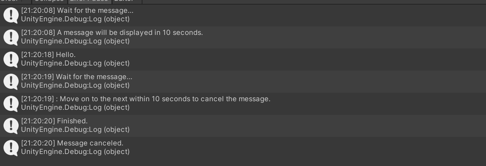

この例ではコマンド`log delayed message async`が二度呼び出されています。始めの呼び出しではトークンコード`hello`が、二度目の呼び出しではトークンコード`bye`が指定されています。これらが実行されるとき、その処理の完了は待機されません。

`accept task async`はトークンコードの名前を受け取り、そのトークンコードが指定されたタスクの完了を待機します。そして、`cancel task`はトークコードの名前を受け取り、そのトークンコードが指定されたタスクを即座にキャンセルします。コマンド`accept task async`は非同期コマンドなので、トークンコードによって実行方法を変更することができます。今回の例では`standard`を指定しているので、トークコード`hello`が結び付けられたタスクの完了が待機され、実行中、そのタスクのキャンセルも可能です。

重要な点は、一般のトークンコードと`parallel`の性質は全く異なるということです。どちらも、それらが指定された非同期コマンドの実行後、すぐに次のコマンドが実行される点は同じですが、一般のトークンコードを指定した場合、その非同期コマンドが後続の非同期コマンドと結合されることはありません。一般のトークンコードが指定された非同期コマンドのキャンセルは他の非同期コマンドに影響は与えず、あくまで独立していることに注意してください。

一般のトークンコードを与えることで、特別なトークンコードのみを使用するよりも柔軟な非同期コマンドの実行が可能です。しかし、この機能の多用はスクリプトをより複雑なものにしてしまうことにも注意してください。実際には特別なトークンコードのみで事足りる場合がほとんどであり、可能な限りこの機能の使用は避けるようにしてください。

## 発展的なシナリオ進行制御

会話システムの構築時、非同期コマンドを実行するたびに何かしらの処理を実行したい場合がよくあります。一つの非同期コマンドが実行されるたびに何かの処理を実行したい場合、`IScenarioTaskExecutor`インターフェースのデコレーターを実装することで実現できます。

例として、非同期コマンドが実行されるたびに、渡されたトークンコードをコンソールに出力するデコレーターを実装します。

```cs
using Cysharp.Threading.Tasks;
using ScenarioFlow.Tasks;
using System.Threading;
using UnityEngine;
using System;

public class ScenarioTaskExecutorLogDecorator : IScenarioTaskExecutor
{
	private readonly IScenarioTaskExecutor scenarioTaskExecutor;
	private readonly ITokenCodeGetter tokenCodeGetter;

	public ScenarioTaskExecutorLogDecorator(IScenarioTaskExecutor scenarioTaskExecutor, ITokenCodeGetter tokenCodeGetter)
	{
		this.scenarioTaskExecutor = scenarioTaskExecutor ?? throw new ArgumentNullException(nameof(scenarioTaskExecutor));
		this.tokenCodeGetter = tokenCodeGetter ?? throw new ArgumentNullException(nameof(tokenCodeGetter));
	}

	public async UniTask ExecuteAsync(UniTask scenarioTask, CancellationToken cancellationToken)
	{
		var tokenCode = tokenCodeGetter.TokenCode;
		try
		{
			await scenarioTaskExecutor.ExecuteAsync(scenarioTask, cancellationToken);
		}
		finally
		{
			Debug.Log($"Token code: {tokenCode}");
		}
	}
}
```

`ScenarioManager`クラスに変更を加え、このデコレーターをシステムに組み込みます。

```cs
ITokenCodeGetter tokenCodeGetter = scenarioTaskExecutor;
IScenarioTaskExecutor scenarioTaskExecutorInterface = scenarioTaskExecutor;
ScenarioTaskExecutorLogDecorator scenarioTaskExecutorLogDecorator = new ScenarioTaskExecutorLogDecorator(scenarioTaskExecutorInterface, tokenCodeGetter);
ScenarioBookReader scenarioBookReader = new ScenarioBookReader(scenarioTaskExecutorLogDecorator);
```

`HideAndSeek`を実行してみます。すると、非同期コマンドが実行されるたびに、その非同期コマンドに渡されたトークンコードが出力されます。


`IScenarioTaskExecutor`は`ScnearioTaskExecutor`クラスが実装するインターフェースで、メンバメソッドとして`ExecuteAsync(UniTask, CancellationToken)`を持ちます。ここに渡される`UniTask`型のパラメーターは、非同期コマンドの処理そのものです。このメソッドは非同期コマンドを制御するために`ScenarioBookReader`クラスから呼び出されますが、このメソッドが完了次第、`ScenarioBookReader`クラスは次のコマンドの実行を開始します。つまり、`IScenarioTaskExecutor`インターフェースのデコレーターを実装し、インターセプトされた側の`ExecuteAsync`を待機した後に必要なイベント処理を実行すれば、そのイベント処理が完了するまでは次のコマンドの実行には移行しません。

`ITokenCodeGetter`は`ScenarioTaskExecutor`クラスが実装するインターフェースで、メンバの`TokenCode`により、現在指定されているトークンコードを取得することができます。注意としては、特に`parallel`トークンコードが指定されているときは短い時間でトークンコードが切り替わるので、取得する場所やタイミングによっては適切にトークンコードが取得できません。`IScenarioTaskExecutor`インターフェース、`INextNotifier`インターフェース、`ICancellationNotifier`インターフェースのデコレーターの中で、始めの処理としてトークンコードを取得すると、各インターフェースのメンバメソッドが呼び出される要因となった非同期コマンドに結び付いたトークンコードを取得することができます。なお、SFTextで基本的に使用するトークンコードと、実際にシステムに渡されるトークンコードには微妙な違いがあります。実際のシステム上のトークンコードの扱いについては別のセクションで学びます。

ここの例では`IScenarioTaskExecutor`インターフェースのデコレーターを実装しましたが、`INextNotifier`インターフェースや`ICancellationNotifier`インターフェースのデコレーターの実装も、よくあるパターンです。例えば、会話シーン実行中にプレイヤーがメニュー画面を開いたとして、その間は`NotifyNextAsync`や`NotifyCancelAsync`が完了しないようにすることで、シナリオの進行を止めることができます。そして、`IScenarioTaskExecutor`インターフェースのデコレーターや`ITokenCodeGetter`インターフェースを共に利用することで、メニュー画面が開かれていても`parallel`の非同期コマンドが実行されていた場合は次のコマンドまで実行するなど、さらに柔軟な進行制御が可能です。

## システム上のトークンコード

SFTextでは、基本的には8種類のトークンコードを使用するということを学習しました。しかし、実際にシステム上で使用されるトークンコードは以下の12種類です。

+ standard
+ f-standard
+ s-standard
+ p-standard
+ forced
+ f-forced
+ s-forced
+ p-forced
+ promised
+ f-promised
+ s-promised
+ p-promised

これらのトークンコードは、実行方式で4種類、キャンセル許可レベルで3種類に分類され、合計で12種類に分類されます。

+ 実行形式
    + Plain
    + Fluent
    + Serial
    + Parallel
+ キャンセル許可レベル
    + Standard
    + Forced
    + Promised

実行形式に関して、SerialとParallelが指定された非同期コマンドが後続の非同期コマンドと結合される点はSFTetxtで学習した通りです。Fluentは進行命令を待たない方式、Plainは進行命令を待つ方式です。キャンセル許可レベルに関しても、その語句が意味することはSFTextで学習した通りです。

重要なのは、システム上はキャンセル許可レベルが異なる非同期コマンドを結合することは可能である一方で、実践的にそのような結合が必要になるケースはほとんどないということです。キャンセル許可レベルが一致している非同期コマンドを結合する方が、ほとんどの場合は自然な会話シーンになります。SFTextではこの性質を利用して、Serial実行形式とParallel実行形式について、その非同期コマンドのキャンセル許可レベルを自動的に決定することで、使用するトークンコードの種類を8種類にまで削減しています。

さて、前のセクションで取り上げた`ITokenCodeGetter`インターフェースで取得できるトークンコードは、12種類のトークンコードの方です。`serial`や`parallel`といったトークンコードはSFText固有のものなので、例えば`if (tokenCode == "serial")`としても意味がありません。トークンコードの判定をプログラムで行う場合は、`SpecialTokenCodes`静的クラスに定義されている定数と、判定用のメソッドを利用します。

`SpecialTokenCodes`静的クラスが提供する、判定用のメソッドは以下の通りです。

+ `IsSpecial`
    + 特別なトークンコードかどうか
+ `IsStandard`
    + Standardキャンセル許可レベルかどうか
+ `IsForced`
    + Forcedキャンセル許可レベルかどうか
+ `IsPromised`
    + Promisedキャンセル許可レベルかどうか
+ `IsPlain`
    + Plain実行形式かどうか
+ `IsFluent`
    + Fluent実行形式かどうか
+ `IsSerial`
    + Serial実行形式かどうか
+ `IsParallel`
    + Parallel実行形式かどうか

ちなみに、Unityエディタのインスペクターウィンドウで、SFTextがどのようにインポートされているのかを確認できます。そこでは、実際にシステムへ渡されるトークンコードが見られます。以下は、`HideAndSeek`の例です。

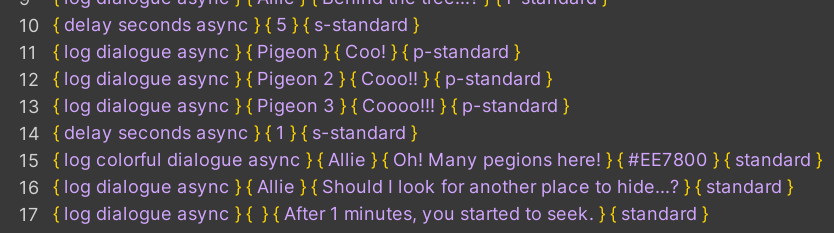

## ScenarioBookの構造

スクリプトをシナリオブックに変換した後は、それを`ScenarioBook`クラスのインスタンスとして`ScnearioBookReader`クラスに渡すことで自動的に会話シーンが実行されます。ただ実行するだけであれば問題はありませんが、セーブ機能が付いた会話システムを構築する場合は、`ScenarioBook`クラスのメンバについて理解しておく必要があります。

`ScenarioBook`クラスは、あるコマンドを呼び出すために必要な情報がセットになったものの配列を保持しています。そして、以下のメンバを利用して、`ScenarioBookReader`クラスは適切なコマンド呼び出しを行います。

+ `int CurrentIndex { get; }`
    + 現在指されているコマンドのインデックスを返す
+ `int Length { get; }`
    + コマンド配列の長さを返す
+ `int LabelIndex(string labelName)`
    + ラベルが付加されたコマンドのインデックスを返す
    + ラベルが存在しない場合、-1を返す
+ `ScenarioBook OpenTo(int index)`
    + `CurrentIndex`の値を設定する
    + 任意の整数値を設定できる
    + 返り値は`ScenarioBook`クラスのインスタンスそれ自身
+ `object Read()`
    + `CurrentIndex`が指すコマンドを実行する
    + 返り値はコマンドとしてエクスポートされたメソッドの返り値
    + `CurrentIndex`がコマンド配列の範囲外の場合は何もしない

例えば、以下のスクリプトに対して`Length`は3を返します。そして、`scenarioBook.OpenTo(1).Read()`を呼び出すと、"Hello."がコンソールに出力され、`CurrnetIndex`は1を返します。`scenarioBook.OpenTo(LabelIndex("Start")).Read()`を呼び出すと、"Good morning."がコンソールに出力され、`CurrentIndex`は0を返します。

```
#label | //============ {Start} ============// | 
$sync  | log message                           | 
       | Message: {Good morning.}              | 
$sync  | log message                           | 
       | Message: {Hello.}                     | 
$sync  | log message                           | 
       | Message: {Good evening}               | 
```

会話システムの構築時に直接操作する可能性があるのは、`CurrentIndex`プロパティと`OpenTo`メソッドです。ScenarioFlowでセーブ機能が付いた会話システムを開発するためには、セーブ時の`CurrentIndex`の値を記録したうえで、ロード時には`OpenTo`メソッドによって`CurrentIndex`の値を復元してからシナリオブックを`ScenarioBookReader`クラスに渡さなければなりません。`ScnearioBookReader`クラスは`ReadAsync`メソッド実行時に、渡された`ScenarioBook`クラスの`CurrentIndex`プロパティの値を変更せずそのまま実行を開始するので、あらかじめ`OpenTo`メソッドによってプロパティの値を変更しておくことにより、スクリプトの実行を途中から再開できます。なお、このケースではロード時に`ScenarioBook`クラスの復元のほか、その他の会話シーン上のあらゆる設定値を復元する必要もあります。