# SFText Script

## Table of Contents

+ [SFText Script - Grammar](#sftext-script---grammar)
+ [SFText Script - Editing Support](#sftext-script---editing-support)

### Note

Shortcut keys mentioned in the following sections are for Windows. If you are using Mac, see the keybinding in VSCode.

## SFText Script - Grammar

SFText is one of the script formats you can use in ScenarioFlow. SFText has so simple grammar that you can write it easily and has appearance like script for a play so it is easy to read. We are going to learn about grammar of SFText script in this section.

### Split by Vertical Bars

```
Scope Declaration Part | Content Description Part | Comment Description Part
(Scope Part)           | (Content Part)           | (Comment part)
```

Each line in SFText is devided into the three area, "scope declaration part," "content descriptioin part," and "comment description part."

"Scope" is the building block of SFText. A scope is composed of multiple lines, and there are some types of scope.

Each part has the following roles.

+ Scope Declaration Part
    + Identify the scope type to be started
    + Describe a part of scope elements
+ Content Description Part
    + Describe required elements for the current scope
+ Comment Description Part
    + Describe comment

What is described in scope parts and content parts depends on type of scope. You can write comments as you like in comment parts.

### Scope

Scope is the building block of SFText. A scope is composed of multiple lines, and SFText is composed of multiple scopes. There are the three types of scope as follows.

| Scope | Role |
| ---- | ---- |
| Command Scope | Invoke any command |
| Dialogue Scope | Invoke command related to dialogue lines |
| Macro Scope | Preprocess texts, or attach label |

The scope classification example of the `HideAndSeek` script is shown below. A scope continues in multiple lines until the next scope starts. We describe the unique symbols on the scope part depending on the type of a new scope to start it.


```
#token      | Dialogue token code: {$standard}            | Macro Scope
Girl        | Oh! Many pegions here!                      | Dialogue Scope
            | --> Text color: {#EE7800}                   | 
            |                                             | 
Girl        | Should I look for another place to hide...? | Dialogue Scope
            |                                             | 
Narr        | After 1 minutes, you started to seek.       | Dialogue Scope
            |                                             | 
Narr        | Where do you search?                        | Dialogue Scope
            | --> Text color: {#00FFFF}                   | 
            |                                             | 
$f-promised | branch on 2 selections async                | Command Scope
            | Selection 1: {Behind the tree}              | 
            | - Jump to {Ans1}                            | 
            | Selection 2: {Under the slide}              | 
            | - Jump to {Ans2}                            | 
            |                                             | 
#label      | //============ {Ans1} ============//        | Macro Scope
            |                                             | 
Girl        | Oh, you got me!                             | Dialogue Scope
            |                                             | 
$sync       | jump to label                               | Command Scope
            | Jump to {Exit}.                             | 
            |                                             | 
```

### Command Scope

Command scope is used for calling any command.

Describe a token code specified for an async command on a scope part with the format `$TokenCode` to start this scope. But as an exception, `$sync` have to be passed when a sync command is invoked.

Describe a command name to call on the content part at the start line of the scope, and describe arguments enclosed by curly brackets on the content part in the following line.

```
$TokenCode | Command Name               | 
           | {Arg1} {Arg2} {Arg3} ...   |
```

Arguments can be described in multiple lines.

```
$TokenCode | Command Name               | 
           | {Arg1} {Arg2}              |
           | {Arg3}                     |
           | {Arg4} {Arg5} ...          |
```

Arguments have to be enclosed by curly brackets; otherwise the text is recognized as a comment.

```
$TokenCode | Command Name                                 | 
           | Comment {Arg1} Comm {Arg2} en {Arg3} t ...   |
```

### Dialogue Scope

Dialogue scope is used for describing dialogue lines.

Describe a character name on a scope part to start this scope. Then write dialogue lines on the content parts from the start line.

```
Character Name | Dialogue Line |
```

Dialogue lines can be described in mutiple lines. Texts written in multiple lines are combined to single text.

```
Character Name | Dialogue Line 1                |
               | Dialogue Line 2                |
               |                                |
Character Name | Dialgoue Line 1Dialogue Line 2 | Equivalent to the above text
```

Note that all leading and trailing whitespaces are removed from texts in SFText. If you want to insert a new line or a whitespace to texts, use rich text or define a symbol to replace it with a whitespace by a decoder for the `string` type.

```
Character Name | Dialogue Line 1                |
               | <sp>Dialogue Line 2            | <sp> is a symbol replaced by a white space
               | <br>Dialogue Line 3            | <br> means a new line
```

```cs
[DecoderMethod]
public string ConvertToString(string input)
{
    input = input.Replace("<sp>", " ");
    return input;
}
```

You have to specify an async command and a token code used in dialogue scopes before using dialouge scopes. That's because a dialogue scope is replaced by an equivalent command scope when a SFText script is imported.

```
#command  | Dialogue command: {log dialogue async} | 
#token    | Dialogue token code: {$standard}       | 
          |                                        | 
Alice     | Hello, I'm Alice.                      | 
          |                                        | 
$standard | log dialogue async                     | Equivalent to the above scope
          | {Alice}                                | 
          | {Hello, I'm Alice.}                    | 
```

We are going to learn details about macro scope, but at this point, note that a macro type is described on a scope part, and arguments enclosed by curly brackets are described on content parts in a macro scope.

The thing is that dialogue scope is the abbreviation format for command scope. Dialogue scope can handle any command if the command has the proper number of parameters, although dialogue scope is designed for commands that display dialogue line. On the contrary, even a command registered to dialogeu scope can be invoked by command scopes. The example in `HideAndSeek` is shown below.

```
$parallel   | log dialogue async         | 
            | {Pigeon}                   | 
            | {Coo!}                     |
```

### Dialogue Scope with Extra Arguments

Dialogue scopes can have extra arguments. In addition to a character name and a dialogue line, extra arguments can be passed with content parts starting with the symbol "-->". Arguments have to be enclosed by curly brackets, which is the same as command scope. Extra arguments can be described in multiple lines, and texts that is not enclosed by curly brackets are recognized as comments.

```
Character Name | Dialogue Line                      |
               | --> Comment {Arg1} Comm {Arg2} ent |
               | --> {Arg3} ...                     |
```

Dialogue scope with extra arguments is a kind of dialogue scope. A command and a token code used in normal dialogue scopes are specified by a command macro scope and a token macro scope, on the other hand, a command used in dialogue scopes with extra arguments is specified by a xcommand dialogue scope, and a token code used in them is shared with normal dialogue scopes.

A diualogue scope with extra arguments is also replaced by an equivalent command scope, which is the same as normal dialogue scope.

```
#xcommand | Ex-dialogue command: {log colorful dialogue async} | 
#token    | Dialogue token code: {$standard}                   | 
          |                                                    | 
Alice     | Oh! Many pegions here!                             | 
          | --> Text color: {#EE7800}                          | 
          |                                                    | 
$standard | log colorful dialogue async                        | Equivalent to the above scope
          | {Alice}                                            | 
          | {Oh! Many pegions here!}                           | 
          | {#EE7800}                                          | 
```

Dialogue scope with extra arguments works well if a command that requires some extra arguments in addition to a character name and a dialogue line is called frequently. For example, specifying a character's image with a dialogue line, specifying a voice file, etc. In the `HideAndSeek` example, a command that requires text color is used.

### Macro Scope

Macro scope is used for preprocessing texts or attaching labels to other scopes.

There are serveral types of macro scope, and to start this scope, describe the symbol `#MacroName` with a macro name. Then describe arguments on the content parts from the start line. The rule about describing arguments is the same as command scope, so a text enclosed by curly brackets is recognized as an argument; otherwise it is recognized as a comment.

```
#MacroName | Comment {Arg1} Comment {Arg2} ... |
```

### Command Macro Scope

This scope specifies an async command used in dialogue scopes. It can be overwritten.

```
#command | {Command Name} |
```

### Xcommand Macro Scope

This scope specifies an async command used in dialogue scopes with extra arguments. It can be overwritten.

```
#xcommand | {Command Name} |
```

### Token Macro scope

This scope specifies a token code used in normal dialouge scopes and dialogue scopes with extra arguments. Make sure to precede the token code with a dollor symbol "$." It can be overwritten.

```
#token | {$TokenCode}
```

### Define Macro Scope

This scope replaces specific symbols by other values. It can be overwritten.

```
#define | {Symbol} {Value} |
```

The target symbols replaced with other values by this scope are listed below.

+ Character names in diaogue scopes
+ Arguments in command scopes
+ Arguments in dialogue scopes with extra arguments

Let's see the `HideAndSeek` example.

```
#define | {Little} means {1}.        | 
$serial | delay seconds async        | 
        | Wait for {Little} seconds. | 
        |                            | 
$serial | delay seconds async        | 
        | Wait for {1} seconds.      | Equivalent to the above scope
```

```
#define | {Girl} means {Alice}. | 
Girl    | Hello, I'm Alice.     | 
        |                       | 
Alice   | Hello, I'm Alice.     | Equivalent to the above scope
```

```
#define | {Red} means {#EA5000}.        | 
Girl    | I was behind the tree. I win! | 
        | --> Text color: {Red}         | 
        |                               | 
Girl    | I was behind the tree. I win! | Equivalent to the above scope
        | --> Text color: {#EA5000}     | 
```

### Label Macro Scope

This scope attaches labels to dialogue scopes and command scopes.

```
#label | {LabelName} |
```

Label is used for implementing scenario branching. Scopes in SFText are executed from top to bottom basically, but it is possible to change the execution order by refering to label names. We are going to learn how to do that later.

In the `HideAndSeek` script, command for scenario branching are used.

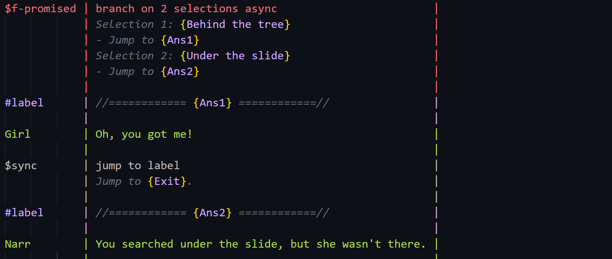

## SFText Script - Editing Support

The VSCode extension for SFText is provided in ScenarioFlow so that you can edit SFText scripts comfortably. We are going to learn how to write SFText scripts effectively with the extension.

### Command Snippets

At first, let's learn how to add a new snippet for a command.

Add several attributes to the `log message` command declared in the `MessageLogger` class.

```cs
using Cysharp.Threading.Tasks;
using ScenarioFlow;
//New
using ScenarioFlow.Scripts.SFText;
using System;
using System.Threading;
using UnityEngine;

public class MessageLogger : IReflectable
{
	[CommandMethod("log message")]
    //New ---
	[Category("Message")]
	[Description("Display a message text on the console.")]
	[Snippet("Message: {${1:text}}")]
    // ---
	public void LogMessage(string message)
	{
		Debug.Log(message);
	}

	//Omitted
}
```

Right click on the project window in the Unity editor, and select `Create/ScenarioFlow/SFText Snippets` to create a new JSON file `SFTextSnippets.json`. Then select `Window/ScenarioFlow/SFText Snippets Builder` on the top menu bar to open the `SFText Snippets Builder` window. Select `Edit` and `Add JSON Text` on the window, and attach `SFTextSnippets.json` to the property.

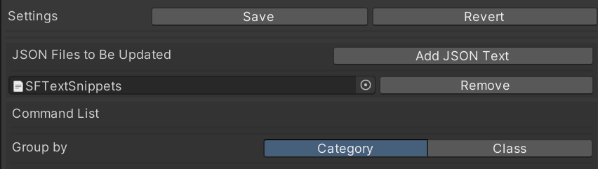

Select `Save` to save the configuration. After that, click `Update JSON Files` to output snippets information to the registered JSON file.

Open the `LogText.sftxt` script with VSCode, and follow the steps below to load the snippets.

+ Call the `Select JSON path` command in Command Palette, and select `SFTextSnippets.json`
+ Call the `Load JSON file` command in Command Palette to load the snippets

Now the snioppet for the `log message` is available. In addition, other snippets for commands in `ConsoleSFSample` are also available.


If the `Alt+Enter` keys are pressed and the cursor is on a command scope with a token code and a command name, a snippet for arguments will be inserted.

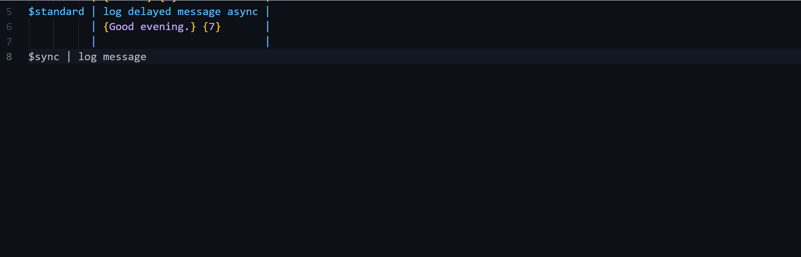

Then, let's confirm the attributes to add snippets for commands.

+ The `Category` attribute
    + Specify a category to which a command belongs
+ The `Description` attribute
    + Write a description of a command
+ The `Snippet` attribute
    + Describe a snippet for command arguments
    + A placeholder for an argument is inserted with the format  `{${(parameter number):(parameter name)}}`

You can attach multiple `Description` attributes and multiple `Snippet` attributes. As an example, let's create a new snippet for the `log delayed message async` command in the `MessageLogger` class.

```cs
//Omitted

public class MessageLogger : IReflectable
{
    //Omitted

	[CommandMethod("log delayed message async")]
    //New ---
	[Category("Message")]
	[Description("Display a message text on the console.")]
	[Description("It is delayed by the specified seconds.")]
	[Snippet("Message: {${1:text}}")]
	[Snippet("Delay time: {${2:n}} sec.")]
    // ---
	public async UniTask LogDelayedMessageAsync(string message, float seconds, CancellationToken cancellationToken)
	{
		Debug.Log("Wait for the message...");
		try
		{
			await UniTask.Delay(TimeSpan.FromSeconds(seconds), cancellationToken: cancellationToken);
			Debug.Log(message);
		}
		catch (OperationCanceledException)
		{
			Debug.Log("Message canceled.");
		}
	}
}
```

Then click `Update JSON Files` on the `SFText Snippet Builder` window to update the JSON file. Open VSCode and call the `Load JSON File` command in Command Palette to reload the JSON file. Now the new snippet is available.

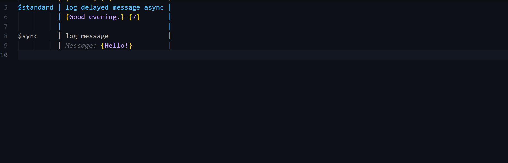

### Extra Arguments Snippets

Next, let's learn about snippets for dialogue scopes with extra arguments. You can attach the `DialogueSnippet` attribute to add a new snippet for extra arguments. Multiple attributes can be added just like the `Snippet` attribute. Add a new command to the `MessageLogger` class.

```cs
//Omitted

public class MessageLogger : IReflectable
{
    //Omitted

    //New
	[CommandMethod("log test async")]
	[Category("Message")]
	[Description("Dialogue snippet test.")]
	[DialogueSnippet("Text speed: {${1:n}}, Text color: {${2:#FFFFFF}}")]
	[DialogueSnippet("Voice: {${3:true/false}}")]
	public UniTask LogTestAsync(string name, string message, float textSpeed, Color textColor, bool attachVoice, CancellationToken cancellationToken)
	{
		return UniTask.CompletedTask;
	}
}
```

Click `Update JSON Files` on the `SFText Snippets Builder` window, and call the `Load JSON file` command in VSCode to reload the JSON file. If the `Alt+Enter` keys are pressed and the cursor is on a dialogue scope with a character name and a dialogue line, a snippet for extra arguments will be inserted.

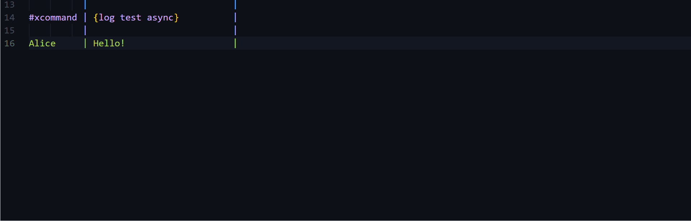

Note that you have to specify a command by a xcommand macro scope before inserting a snippet for extra arguments. What snippet is inserted depends on the last xcommand macro scope declared before the target scope.

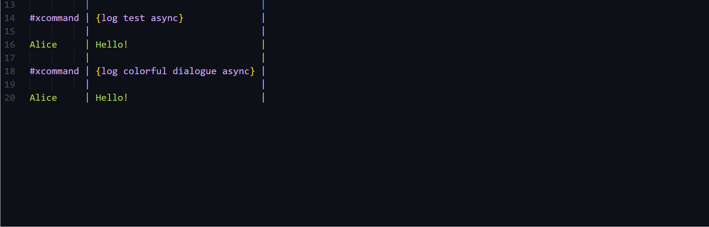

### Macro Snippets

If the `Alt+Enter` keys are pressed and the cursor is on a macro scope with a macro name, a snippet for that macro scope will be inserted. This is provided by default.

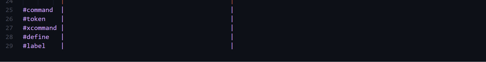

You can cahnge snippets inserted to macro scopes with the configuration in VSCode.

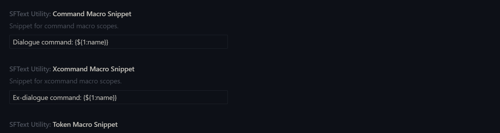

### Shortcut keys

If you press the `Shift+Enter` keys, the cursor will move in the order of the scope decralation part, the content description part, and the comment description part. In addition, vertical bars are inserted automatically if there are not enough vertical bars. So you don't have to enter vertical bars manually, but use this shortcut key.


If you press the `Ctrl+Enter` keys, a new line will be inserted and the document will be formatted.


Also, if you press the `Alt+Enter` keys, a snippet for arugments will be inserted and the document will be formatted.

### The Configuration of Half-Width and Full-Width Characters

Positions of vertical bars are adjusted based on the number of half-width characters and the number of full-width characters at lines when the document is formetted in SFText. If positions of some vertical bars are not adjusted properly, that is because whether any character is half-width or full-width is not judged properly. In this case, you can specify cahracters that are recognized as half-widh characters in the configuration in VSCode. You can specify the target range of characters with the format like `a-zA-Z`, and you can also use UTF-8 character code like the initial configuration as shown below.

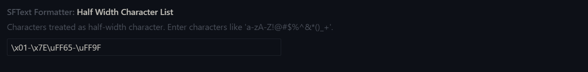

### The Configuration of JSON File

As we learned in the earlier example, you can specify a path to a JSON file that has snippets information by the `Select JSON Path` command, and it is loaded by calling the `Load JSON File` command.

You can erase the information about this JSON file by the `Clear JSON Data` command.

### SFText Command List

You can open the SFText Command List window by selecting `Window/ScenarioFlow/SFText Command List` on the top menu bar.

You can see information about commands and decoders declared in this window. Details will be shown if you click a command or decoder name.

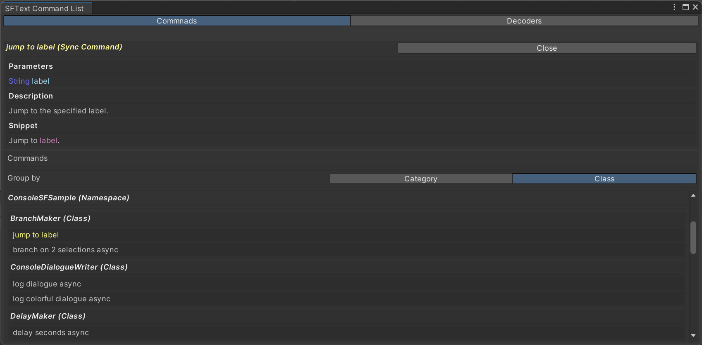


As a side note, the `Description` attribute we have learned can be attached to not only a command but also a decoder. The information attached to decoders is shown in this window.

### SFText Snippets Builder

You can open the SFText Snippets Builder window by selecting `Window/ScenarioFlow/SFText Snippets Builder` on the top menu bar.

In this window, you can create a JSON file passed to VSCode to add snippets based on information about attributes attached to methods exported as commands.

If you registered a JSON file to the window, you will be able to make the window write information about snippets to that file. The snippets will be available after passing it to VSCode. In addition, you can toggle commands enable and disable in the Command List under the list of JSON files. Snippets for disabled commands will not be output to files.

As a side note, after you add a new command in a C# script, sometimes that change might not be reflected on the window immediately. In this case, try re-importing the C# script.

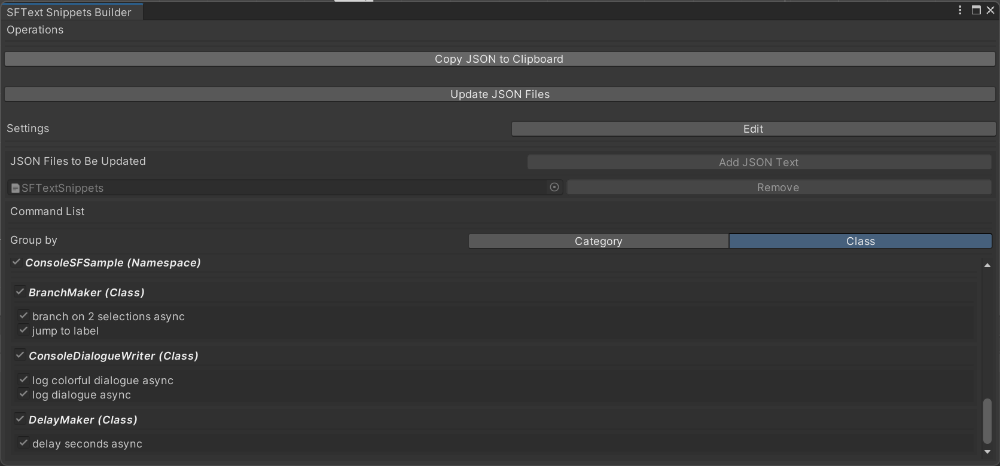