# SFText Script

## Table of Contents

- [SFText Script](#sftext-script)
  - [Table of Contents](#table-of-contents)
  - [SFText Script - Grammar](#sftext-script---grammar)
    - [Split by Vertical Bars](#split-by-vertical-bars)
    - [Scope](#scope)
    - [Comment Scope](#comment-scope)
    - [Command Scope](#command-scope)
    - [Dialogue Scope](#dialogue-scope)
    - [Macro Scope for Dialogue Scope](#macro-scope-for-dialogue-scope)
    - [Dialogue Scope with Extra Arguments](#dialogue-scope-with-extra-arguments)
    - [Macro Scope](#macro-scope)
    - [Command Macro Scope](#command-macro-scope)
    - [Xcommand Macro Scope](#xcommand-macro-scope)
    - [Token Macro scope](#token-macro-scope)
    - [Define Macro Scope](#define-macro-scope)
    - [Label Macro Scope](#label-macro-scope)
  - [SFText Script - Editing Support](#sftext-script---editing-support)
    - [Command Snippets](#command-snippets)
    - [Extra Arguments Snippets](#extra-arguments-snippets)
    - [Macro Snippets](#macro-snippets)
    - [Editing Commands](#editing-commands)
      - [Move Cursor](#move-cursor)
      - [Insert Arguments](#insert-arguments)
      - [Insert Scope Below](#insert-scope-below)
      - [Insert Scope Above](#insert-scope-above)
      - [Toggle Line Comment](#toggle-line-comment)
      - [Toggle Scope Comment](#toggle-scope-comment)
    - [SFText Formatter](#sftext-formatter)
      - [Setting 1: Half-width Characters](#setting-1-half-width-characters)
      - [Setting 2: Alignment Ratio of Half-/Full-width Characters](#setting-2-alignment-ratio-of-half-full-width-characters)
    - [The Configuration of JSON File](#the-configuration-of-json-file)
    - [SFText Command List](#sftext-command-list)
    - [SFText Snippets Builder](#sftext-snippets-builder)


> [!NOTE]
> Shortcut keys mentioned in the following sections are for Windows. If you are using Mac, see the keybinding in VSCode.

## SFText Script - Grammar

SFText is one of the script formats you can use in ScenarioFlow. SFText has so simple grammar that you can write it easily and has appearance like script for a play so it is easy to read. We are going to learn about grammar of SFText script in this section.

### Split by Vertical Bars

```
Scope Declaration Part | Content Description Part | Comment Description Part
(Scope Part)           | (Content Part)           | (Comment part)
```

Each line in SFText is devided into the three area, "scope declaration part," "content descriptioin part," and "comment description part."

"Scope" is the building block of SFText. A scope is composed of multiple lines, and there are some types of scope.

Each part has the following roles.

+ Scope Declaration Part
    + Identify the scope type to be started
    + Describe a part of scope elements
+ Content Description Part
    + Describe required elements for the current scope
+ Comment Description Part
    + Describe comment

What is described in scope parts and content parts depends on type of scope. You can write comments as you like in comment parts.

### Scope

Scope is the building block of SFText. A scope is composed of multiple lines, and SFText is composed of multiple scopes. There are the four types of scope as follows.

| Scope | Role |
| ---- | ---- |
| Comment Scope | Write comments |
| Command Scope | Invoke any command |
| Dialogue Scope | Invoke command related to dialogue lines |
| Macro Scope | Preprocess texts, or attach label |


The scope classification example of the `HideAndSeek` script is shown below. A scope continues in multiple lines until the next scope starts. How each scope is started depends on type of a scope.


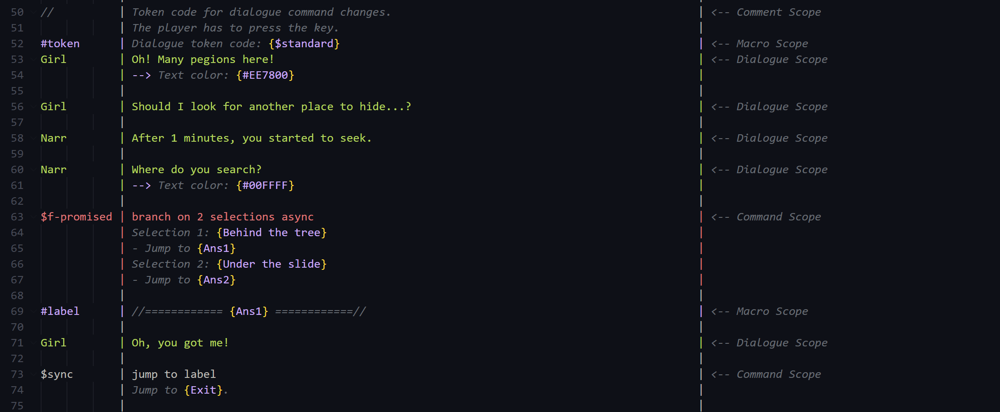

### Comment Scope

In a comment scope, you can write comments in content description parts. To start this scope, you place double slash "//" at the beginning of a line.

As a side note, you can easily comment out or uncomment any lines with `Ctrl+/` in VSCode.

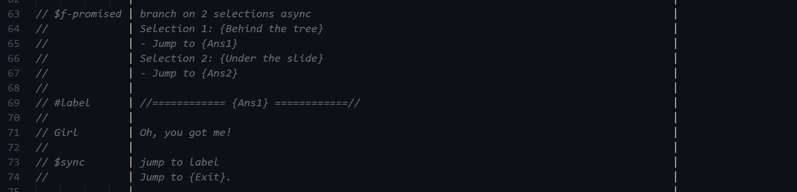

### Command Scope

Command scope is used for calling any command.

Describe a token code specified for an async command on a scope part with the format `$TokenCode` to start this scope. But as an exception, `$sync` have to be passed when a sync command is invoked.

Describe a command name to call on the content part at the start line of the scope, and describe arguments enclosed by curly brackets on the content part in the following line.

```
$TokenCode | Command Name               | 
           | {Arg1} {Arg2} {Arg3} ...   |
```

Arguments can be described in multiple lines.

```
$TokenCode | Command Name               | 
           | {Arg1} {Arg2}              |
           | {Arg3}                     |
           | {Arg4} {Arg5} ...          |
```

Arguments have to be enclosed by curly brackets; otherwise the text is recognized as a comment.

```
$TokenCode | Command Name                                 | 
           | Comment {Arg1} Comm {Arg2} en {Arg3} t ...   |
```

### Dialogue Scope

Dialogue scope is used for describing dialogue lines.

You can start a dialogue scope by placing a character name at the scope declaration part of a line. And you can write dialogue lines at the content description parts in the dialogue scope.

```
Name    | Line1                     |
        | Line2                     |
        | ...                       |
```

Note that all white spaces at the beginning of and the end of dialogue lines are trimmed.

Also, multiple texts in a dialogue scope are combined with "\<bk>", which means "line break". The dialogue lines in the following dialogue scope will be imported as a single text, "Hello!\<bk>I'm Alice.\<bk>Nice to meet you!".

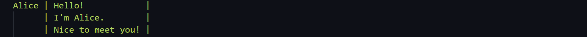

You can combine multiple lines in a dialogue scope with any words you like by replacing this symbol in a `string` decoder or a command that displays dialogue lines. For example, dialogue lines in a dialogue scope are combined with a white space with the following decoder or command. The texts in the above dialogue scope are displayed as "Hello! I'm Alice. Nice to meet you!".

`SFText.LineBreakSymbol`, which returns "\<bk>", is available when replacing line break symbols.

```cs
// String decoder
[DecoderMethod]
public string ConvertToString(string input)
{
    return input.Replace(SFText.LineBreakSymbol, " ");
}

// Command that displays a dialogue line
[CommandMethod("display dialogue")]
public UniTask DisplayDialogueAsync(string name, string line, CancellationToken cancellationToken)
{
    line = line.Replace(SFText.LineBreakSymbol, " ");

    // Display a dialogue line
    // ...
}
```

### Macro Scope for Dialogue Scope

You have to specify an async command and a token code used in dialogue scopes before describing them. That's because a dialogue scope is replaced by an equivalent command scope when a SFText script is imported.

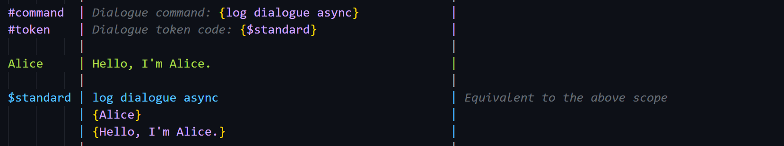

We are going to learn details about macro scope later, but at this point, note that a macro type is described at a scope part, and arguments enclosed by curly brackets are described at content parts in a macro scope.

The thing is that dialogue scope is the abbreviation format for command scope. Dialogue scope can handle any command if it has the proper number of parameters, although dialogue scope is designed for commands that display dialogue lines. On the contrary, even a command used in dialogue scopes can be invoked by command scopes. The example in `HideAndSeek` is shown below.

```
$parallel   | log dialogue async         | 
            | {Pigeon}                   | 
            | {Coo!}                     |
```

### Dialogue Scope with Extra Arguments

Dialogue scopes can have extra arguments. In addition to a character name and a dialogue line, extra arguments can be passed with content parts starting with the symbol "-->". Arguments have to be enclosed by curly brackets, which is the same as command scope. Extra arguments can be described in multiple lines, and texts that is not enclosed by curly brackets are recognized as comments.

```
Character Name | Dialogue Line                      |
               | --> Comment {Arg1} Comm {Arg2} ent |
               | --> {Arg3} ...                     |
```

Dialogue scope with extra arguments is a kind of dialogue scope. A command and a token code used in normal dialogue scopes are specified by a command macro scope and a token macro scope, on the other hand, a command used in dialogue scopes with extra arguments is specified by a xcommand dialogue scope, and a token code used in them is shared with normal dialogue scopes.

A diualogue scope with extra arguments is also replaced by an equivalent command scope, which is the same as normal dialogue scope.

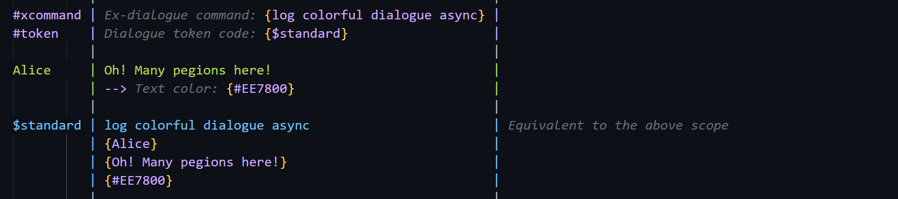

Dialogue scope with extra arguments works well if a command that requires some extra arguments in addition to a character name and a dialogue line is called frequently. For example, specifying a character's image with a dialogue line, specifying a voice file, etc. In the `HideAndSeek` example, a command that requires text color is used.

### Macro Scope

Macro scope is used for preprocessing texts or attaching labels to other scopes.

There are serveral types of macro scope, and to start this scope, describe the symbol `#MacroName` with a macro name. Then describe arguments on the content parts from the start line. The rule about describing arguments is the same as command scope, so a text enclosed by curly brackets is recognized as an argument; otherwise it is recognized as a comment.

```
#MacroName | Comment {Arg1} Comment {Arg2} ... |
```

### Command Macro Scope

This scope specifies an async command used in dialogue scopes. It can be overwritten.

```
#command | {Command Name} |
```

### Xcommand Macro Scope

This scope specifies an async command used in dialogue scopes with extra arguments. It can be overwritten.

```
#xcommand | {Command Name} |
```

### Token Macro scope

This scope specifies a token code used in normal dialouge scopes and dialogue scopes with extra arguments. Make sure to precede the token code with a dollor symbol "$." It can be overwritten.

```
#token | {$TokenCode}
```

### Define Macro Scope

This scope replaces specific symbols by other values. It can be overwritten.

```
#define | {Symbol} {Value} |
```

The target symbols replaced with other values by this scope are listed below.

+ Character names in diaogue scopes
+ Arguments in command scopes
+ Arguments in dialogue scopes with extra arguments

Let's see the `HideAndSeek` example.

```
#define | {Little} means {1}.        | 
$serial | delay seconds async        | 
        | Wait for {Little} seconds. | 
        |                            | 
$serial | delay seconds async        | 
        | Wait for {1} seconds.      | Equivalent to the above scope
```

```
#define | {Girl} means {Alice}. | 
Girl    | Hello, I'm Alice.     | 
        |                       | 
Alice   | Hello, I'm Alice.     | Equivalent to the above scope
```

```
#define | {Red} means {#EA5000}.        | 
Girl    | I was behind the tree. I win! | 
        | --> Text color: {Red}         | 
        |                               | 
Girl    | I was behind the tree. I win! | Equivalent to the above scope
        | --> Text color: {#EA5000}     | 
```

### Label Macro Scope

This scope attaches labels to dialogue scopes and command scopes.

```
#label | {LabelName} |
```

Label is used for implementing scenario branching. Scopes in SFText are executed from top to bottom basically, but it is possible to change the execution order by refering to label names. We are going to learn how to do that later.

In the `HideAndSeek` script, command for scenario branching are used.

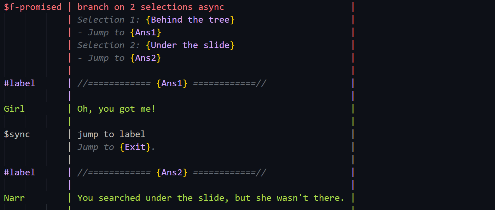

## SFText Script - Editing Support

The VSCode extension for SFText is provided in ScenarioFlow so that you can edit SFText scripts comfortably. We are going to learn how to write SFText scripts effectively with the extension.

### Command Snippets

At first, let's learn how to add a new snippet for a command.

Add several attributes to the `log message` command declared in the `MessageLogger` class.

```cs
using Cysharp.Threading.Tasks;
using ScenarioFlow;
//New
using ScenarioFlow.Scripts.SFText;
using System;
using System.Threading;
using UnityEngine;

public class MessageLogger : IReflectable
{
	[CommandMethod("log message")]
    //New ---
	[Category("Message")]
	[Description("Display a message text on the console.")]
	[Snippet("Message: {${1:text}}")]
    // ---
	public void LogMessage(string message)
	{
		Debug.Log(message);
	}

	//Omitted
}
```

Right click on the project window in the Unity editor, and select `Create/ScenarioFlow/SFText Snippets` to create a new JSON file `SFTextSnippets.json`. Then select `Window/ScenarioFlow/SFText Snippets Builder` on the top menu bar to open the `SFText Snippets Builder` window. Select `Edit` and `Add JSON Text` on the window, and attach `SFTextSnippets.json` to the property.

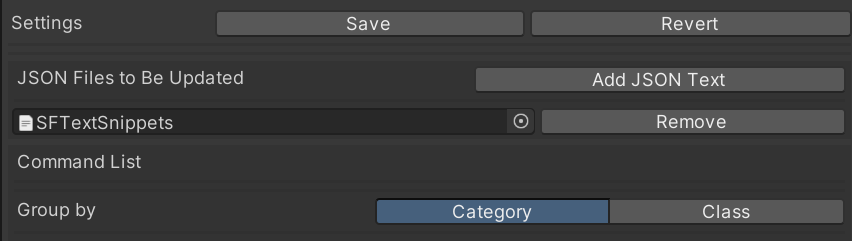

Select `Save` to save the configuration. After that, click `Update JSON Files` to output snippets information to the registered JSON file.

Open the `LogText.sftxt` script with VSCode, and follow the steps below to load the snippets.

+ Call the `Select JSON path` command in Command Palette, and select `SFTextSnippets.json`
+ Call the `Load JSON file` command in Command Palette to load the snippets

Now the snioppet for the `log message` is available. In addition, other snippets for commands in `ConsoleSFSample` are also available.

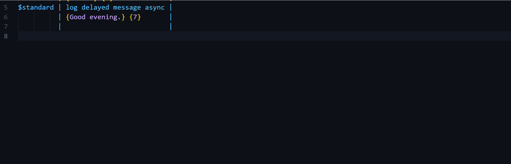

If the `Alt+Enter` keys are pressed and the cursor is on a command scope with a token code and a command name, a snippet for arguments will be inserted.

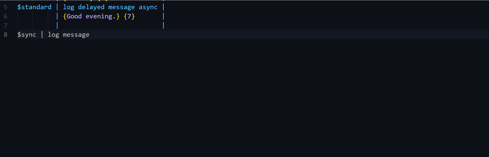

Then, let's confirm the attributes to add snippets for commands.

+ The `Category` attribute
    + Specify a category to which a command belongs
+ The `Description` attribute
    + Write a description of a command
+ The `Snippet` attribute
    + Describe a snippet for command arguments
    + A placeholder for an argument is inserted with the format  `{${(parameter number):(parameter name)}}`

You can attach multiple `Description` attributes and multiple `Snippet` attributes. As an example, let's create a new snippet for the `log delayed message async` command in the `MessageLogger` class.

```cs
//Omitted

public class MessageLogger : IReflectable
{
    //Omitted

	[CommandMethod("log delayed message async")]
    //New ---
	[Category("Message")]
	[Description("Display a message text on the console.")]
	[Description("It is delayed by the specified seconds.")]
	[Snippet("Message: {${1:text}}")]
	[Snippet("Delay time: {${2:n}} sec.")]
    // ---
	public async UniTask LogDelayedMessageAsync(string message, float seconds, CancellationToken cancellationToken)
	{
		Debug.Log("Wait for the message...");
		try
		{
			await UniTask.Delay(TimeSpan.FromSeconds(seconds), cancellationToken: cancellationToken);
			Debug.Log(message);
		}
		catch (OperationCanceledException)
		{
			Debug.Log("Message canceled.");
		}
	}
}
```

Then click `Update JSON Files` on the `SFText Snippet Builder` window to update the JSON file. Open VSCode and call the `Load JSON File` command in Command Palette to reload the JSON file. Now the new snippet is available.

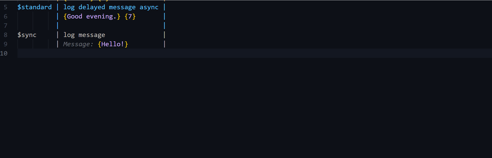

### Extra Arguments Snippets

Next, let's learn about snippets for dialogue scopes with extra arguments. You can attach the `DialogueSnippet` attribute to add a new snippet for extra arguments. Multiple attributes can be added just like the `Snippet` attribute. Add a new command to the `MessageLogger` class.

```cs
//Omitted

public class MessageLogger : IReflectable
{
    //Omitted

    //New
	[CommandMethod("log test async")]
	[Category("Message")]
	[Description("Dialogue snippet test.")]
	[DialogueSnippet("Text speed: {${1:n}}, Text color: {${2:#FFFFFF}}")]
	[DialogueSnippet("Voice: {${3:true/false}}")]
	public UniTask LogTestAsync(string name, string message, float textSpeed, Color textColor, bool attachVoice, CancellationToken cancellationToken)
	{
		return UniTask.CompletedTask;
	}
}
```

Click `Update JSON Files` on the `SFText Snippets Builder` window, and call the `Load JSON file` command in VSCode to reload the JSON file. If the `Alt+Enter` keys are pressed and the cursor is on a dialogue scope with a character name and a dialogue line, a snippet for extra arguments will be inserted.

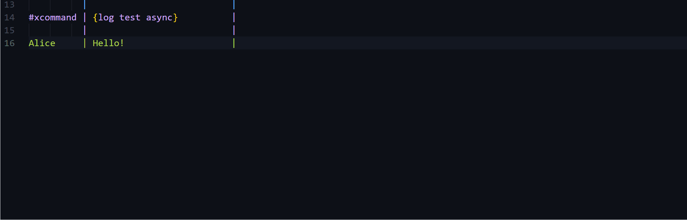

Note that you have to specify a command by a xcommand macro scope before inserting a snippet for extra arguments. What snippet is inserted depends on the last xcommand macro scope declared before the target scope.

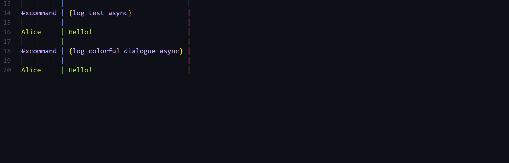

### Macro Snippets

If the `Alt+Enter` keys are pressed and the cursor is on a macro scope with a macro name, a snippet for that macro scope will be inserted. This is provided by default.

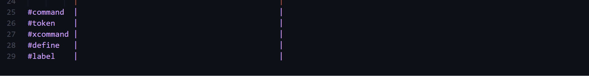

You can cahnge snippets inserted to macro scopes with the configuration in VSCode.

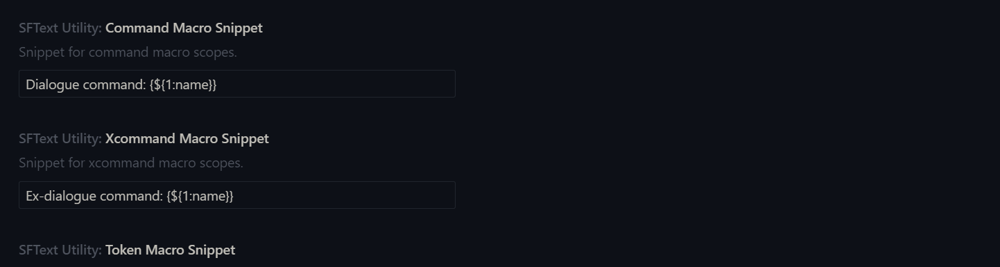

### Editing Commands

You can use the commands as listed below for efficient SFText editing.

| Command | Shortcut key (windows) | Functionality |
| --- | --- | --- |
| Move Cursor | Shift+Enter | Move the cursor based on the vertical bar positions |
| Insert Arguments | Alt+Enter | Insert a scope argument snippet |
| Insert Scope Below | Ctrl+Enter | Insert a new line below the scope |
| Insert Scope Above | Ctrl+Shift+Enter | Insert a new line above the scope |
| Toggle Line Comment | Ctrl+/ | Comment out or uncomment every line in the selection |
| Toggle Scope Comment | Ctrl+Shift+/ | Comment out or uncomment every scope start line in the selection |

#### Move Cursor

By calling this command, you can move the cusor to each vetical bar position in order. Also, difficient vertical bars will be inserted by the command. 

Note that you don't have to add vertical bars manually, but you can rely on this command (and other commands) to insert required vertical bars into lines.

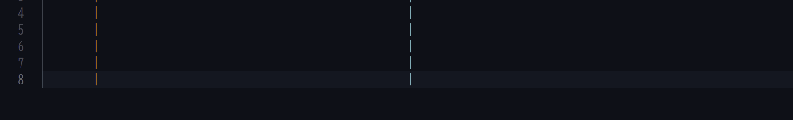

#### Insert Arguments

This command inserts a argument snippet for the target scope.

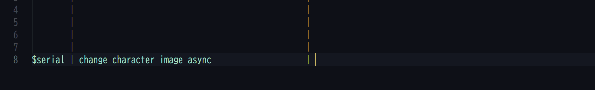

#### Insert Scope Below

This command inserts a new line below the target scope.

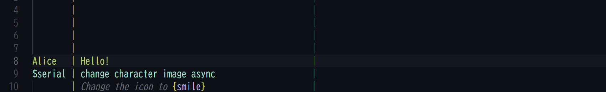

#### Insert Scope Above

This command inserts a new line above the target scope.

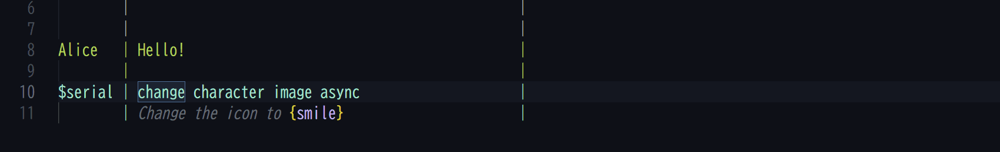

#### Toggle Line Comment

This command comments out or uncomments the lines in the selection.

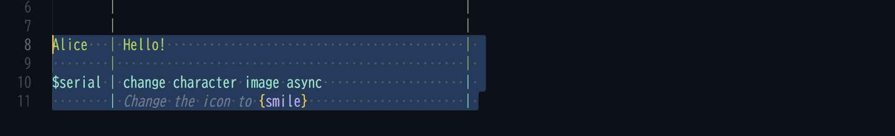

#### Toggle Scope Comment

This command comments out or uncomments the start lines of the scopes in the selection.

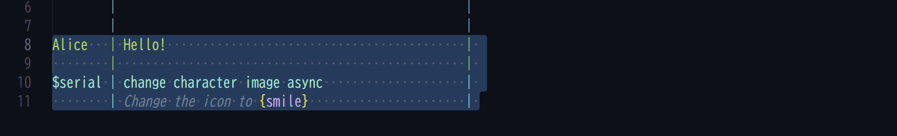

### SFText Formatter

The SFText formatter, which aligns SFTexts, is provided as a VSCode extension. The formatting is performed when the editing commands are called, but you can perform it manually by calling the `Format Documet` command.

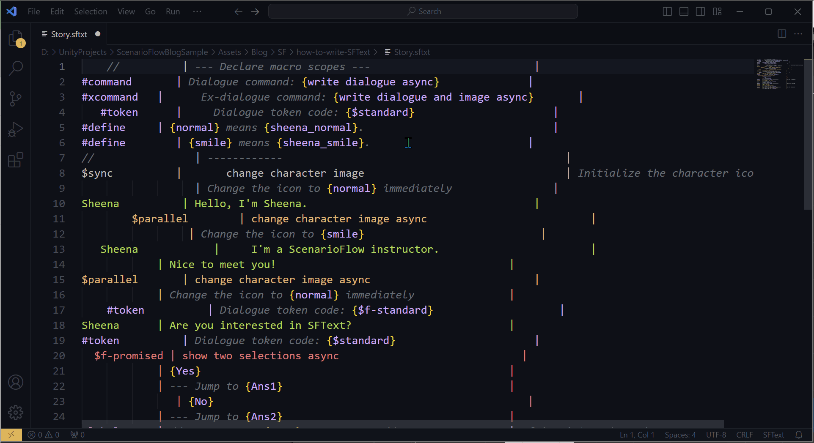

In fact, the formatter may not work appropriately in your environment especially if your document includes some full-width characters. The formatter distinguishes half-width characters and full-width characters to align the target SFText. However, it is unfortunately challenging to determine whether a character is half-width or full-width precisely, and both half-width character length and full-width character length are different depending on the font. Consequently, you may have to change some settings for the proper alignment, although the default settings should work well in many cases.

If the formatter does not work appropriately in your environment, it will be resolved by modifying the following settings. You can access them by opening the VSCode settings and find them by entering "sftext" on the search console.


> [!IMPORTANT]
> If your SFText is not aligned by the formatter appropriately even though you are sure that appropriate values are specified for the three settings in the SFText formatter (as shown in the figure above), it may be due to the font you are using itself. It was found that the formatter doesn't work with the default font in some cases and it is the problem caused by the font itself.
> 
> In such a case, you may want to use different fonts to avoid alignment issues.

> [!TIP]
> If you want to use a specific font when writing SFTexts but want to use different fonts when writing other scripts, you can specify the font that is valid only when you edit SFTexts by modifying the settings file as follows:
> 
> ```json
> {
>     "[sftext]": {
>         "editor.fontFamily": "font-you-want-to-use",
>     }
> }
> ```

#### Setting 1: Half-width Characters

You specify which characters are recognized as half-width characters in the item `Half Width Character List`. In other words, characters that are not registered here are recognized as full-width characters.

The target characters are desribed in the regular-expression-like manner as shown above. The figure above shows the initial setting, which includes basic alphabets and symbols.

#### Setting 2: Alignment Ratio of Half-/Full-width Characters

In the items `Half Width Constant` and `Full Width Constant`, you specify the ratio between half-width characters and full-width characters required for the alignment. The former item  specifies the number of half-width characters while the latter item specifies the number of full-width characters required for the alignemnt.

For example, with the default font, we specify 20 for the half-width constant and 11 for the full-width constant because 20 half-width characters align with 11 full-width characters.


Another example is the "BIZ UD Gothic" font. With this font, 2 half-width character align with 1 full-width character, so that the half-width constant is set to 2 while the full-width constant is set to 1.


> [!NOTE]
>
> You are likely to modify these settings when you switch the font used in SFText editing.

### The Configuration of JSON File

As we learned in the earlier example, you can specify a path to a JSON file that has snippets information by the `Select JSON Path` command, and it is loaded by calling the `Load JSON File` command.

You can erase the information about this JSON file by the `Clear JSON Data` command.

### SFText Command List

You can open the SFText Command List window by selecting `Window/ScenarioFlow/SFText Command List` on the top menu bar.

You can see information about commands and decoders declared in this window. Details will be shown if you click a command or decoder name.

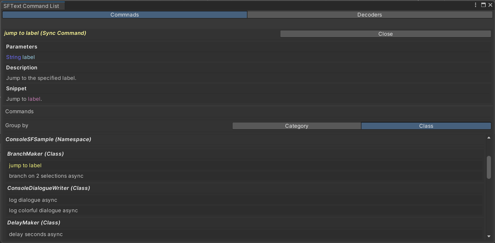


As a side note, the `Description` attribute we have learned can be attached to not only a command but also a decoder. The information attached to decoders is shown in this window.

### SFText Snippets Builder

You can open the SFText Snippets Builder window by selecting `Window/ScenarioFlow/SFText Snippets Builder` on the top menu bar.

In this window, you can create a JSON file passed to VSCode to add snippets based on information about attributes attached to methods exported as commands.

If you registered a JSON file to the window, you will be able to make the window write information about snippets to that file. The snippets will be available after passing it to VSCode. In addition, you can toggle commands enable and disable in the Command List under the list of JSON files. Snippets for disabled commands will not be output to files.

As a side note, after you add a new command in a C# script, sometimes that change might not be reflected on the window immediately. In this case, try re-importing the C# script.

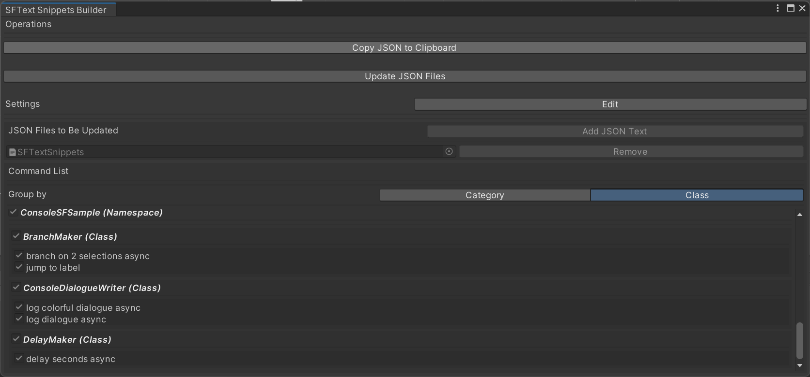