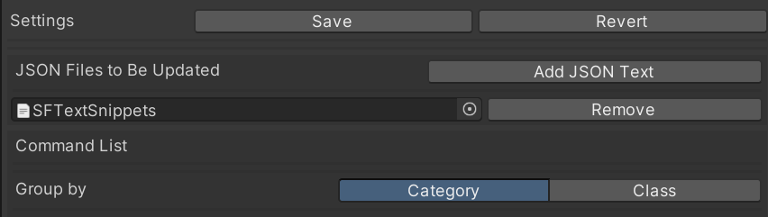
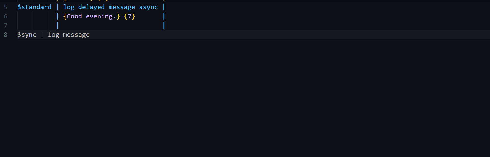
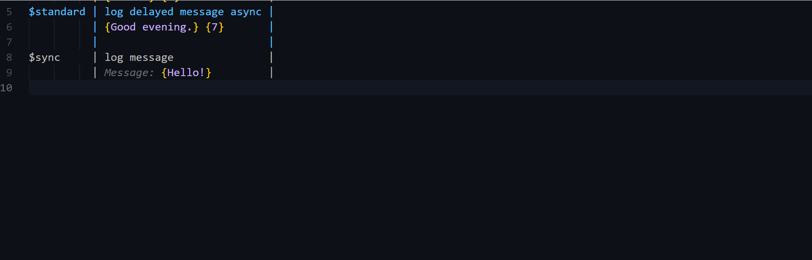
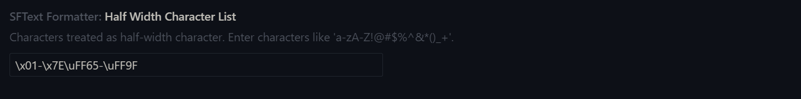

# SFTextスクリプト

## 目次

+ [SFTextスクリプト - 文法](#sftextスクリプト---文法)
+ [SFTextスクリプト - 入力支援](#sftextスクリプト---入力支援)

### Note

ここで紹介されているショートカットキーは、Windowsマシンの場合です。Macマシンを使用している場合は、VSCodeのKeyboard Shortcutsでキー割り当てを確認してください。

## SFTextスクリプト - 文法

SFTextは、ScenarioFlowで使用できるスクリプト形式の一つです。SFTextは、単純な文法で簡単に書くことができ、台本のような見た目で読みやすいという特徴を持っています。このセクションでは、SFTextスクリプトの文法について学習します。

### 縦線区切り

```
Scope Declaration Part | Content Description Part | Comment Description Part
(Scope Part)           | (Content Part)           | (Comment part)
```

SFTextの全ての行は、縦線「|」で3つの領域に区切られます。3つの領域をそれぞれ、「スコープ宣言部」、「コンテンツ記述部」、「コメント記述部」と呼びます。

「スコープ」とは、SFTextの構成単位であり、一つのスコープは複数の行から構成されます。そして、スコープにはいくつかの種類があります。

それぞれのパートは、以下の役割を持ちます。

+ スコープ宣言部
    + 新たに開始するスコープの種類を特定する
    + スコープの構成要素の一部を記述する
+ コンテンツ記述部
    + 現在のスコープに必要な要素を記述する
+ コメント記述部
    + コメントを記述する

スコープ宣言部とコンテンツ記述部に何を記述するのかは、スコープの種類によって異なります。コメント記述部には、好きなようにコメントを記述することができます。

### スコープ

スコープはSFTextの構成単位です。スコープは複数の行から構成され、SFTextは複数のスコープから構成されます。スコープには以下の三種類があります。

| スコープ | 役割 |
| ---- | ---- |
| コマンドスコープ |　任意のコマンドを呼び出す |
| 会話スコープ | セリフを表示するためのコマンドを呼び出す |
| マクロスコープ | 文字列の前処理や、ラベルの付加を行う |

`HideAndSeek`におけるスコープの分類を以下に示します。一つのスコープは複数行に渡って、次のスコープが開始するまで続きます。新たなスコープを開始するには、スコープ記述部に各スコープ特有のシンボルを記述します。

```
#token      | Dialogue token code: {$standard}            | Macro Scope
Girl        | Oh! Many pegions here!                      | Dialogue Scope
            | --> Text color: {#EE7800}                   | 
            |                                             | 
Girl        | Should I look for another place to hide...? | Dialogue Scope
            |                                             | 
Narr        | After 1 minutes, you started to seek.       | Dialogue Scope
            |                                             | 
Narr        | Where do you search?                        | Dialogue Scope
            | --> Text color: {#00FFFF}                   | 
            |                                             | 
$f-promised | branch on 2 selections async                | Command Scope
            | Selection 1: {Behind the tree}              | 
            | - Jump to {Ans1}                            | 
            | Selection 2: {Under the slide}              | 
            | - Jump to {Ans2}                            | 
            |                                             | 
#label      | //============ {Ans1} ============//        | Macro Scope
            |                                             | 
Girl        | Oh, you got me!                             | Dialogue Scope
            |                                             | 
$sync       | jump to label                               | Command Scope
            | Jump to {Exit}.                             | 
            |                                             | 
```

### コマンドスコープ

コマンドスコープにより、任意のコマンドを呼び出すことができます。

このスコープを開始するにはスコープ宣言部に`$TokenCode`の形で、非同期コマンドに付加したいトークンコードを記述します。ただし、同期コマンドを呼び出したい場合は例外的に、`$sync`と記述します。

スコープを開始した行のコンテンツ記述部には呼び出したいコマンドの名前を、以降の行のコンテンツ記述部にはパラメーターを波括弧で括って記述します。

```
$TokenCode | Command Name               | 
           | {Arg1} {Arg2} {Arg3} ...   |
```

パラメーターは、複数の行に渡って書くことができます。

```
$TokenCode | Command Name               | 
           | {Arg1} {Arg2}              |
           | {Arg3}                     |
           | {Arg4} {Arg5} ...          |
```

パラメーターは波括弧で括られる必要がありますが、波括弧で括られていないテキストはすべて、コメントとして認識されます。

```
$TokenCode | Command Name                                 | 
           | Comment {Arg1} Comm {Arg2} en {Arg3} t ...   |
```

### 会話スコープ

キャラクターのセリフを記述するには、会話スコープを使用します。

会話スコープを開始するには、スコープ宣言部にキャラクターの名前を記述します。そして、スコープの開始行からは、コンテンツ記述部にセリフを記述します。

```
Character Name | Dialogue Line |
```

セリフは、複数行に渡って記述することができます。複数行に書かれたテキストは、SFTextが読み込まれる際に結合され、一つのテキストになります。

```
Character Name | Dialogue Line 1                |
               | Dialogue Line 2                |
               |                                |
Character Name | Dialgoue Line 1Dialogue Line 2 | Equivalent to the above text
```

SFTextにおいては、テキストの前後の空白は除去されることに注意してください。複数のテキスト間に改行や空白を挿入する場合は、リッチテキストを利用したり、シンボルを定義して`string`型用のデコーダーで置き換えたりします。

```
Character Name | Dialogue Line 1                |
               | <sp>Dialogue Line 2            | <sp> is a symbol replaced by a white space
               | <br>Dialogue Line 3            | <br> means a new line
```

```cs
[DecoderMethod]
public string ConvertToString(string input)
{
    input = input.Replace("<sp>", " ");
    return input;
}
```

会話スコープを利用するためには、commandマクロスコープとtokenマクロスコープにより、会話スコープで使用するコマンドとトークンコードを指定しておく必要があります。これは、会話スコープはSFTextがインポートされる際に等価なコマンドスコープに置き換わるためです。

```
#command  | Dialogue command: {log dialogue async} | 
#token    | Dialogue token code: {$standard}       | 
          |                                        | 
Alice     | Hello, I'm Alice.                      | 
          |                                        | 
$standard | log dialogue async                     | Equivalent to the above scope
          | {Alice}                                | 
          | {Hello, I'm Alice.}                    | 
```

マクロスコープの詳細は後に学習しますが、ここでは、スコープ宣言部にマクロの種類、コンテンツ記述部に波括弧で括られたパラメーターが記述されていることのみ理解しておいてください。

重要な点は、会話スコープは特定のコマンドスコープの省略記法にすぎないということです。会話スコープはキャラクターのセリフを表示するためのコマンドによく合うように設計されていますが、実際はパラメーターの数が合致すれば、どのようなコマンドも会話スコープで扱うことができます。逆に、会話スコープで使用するために設定されたコマンドも、コマンドスコープで呼び出すことができます。`HideAndSeek`の例を以下に示します。

```
$parallel   | log dialogue async         | 
            | {Pigeon}                   | 
            | {Coo!}                     |
```


### 追加パラメーター付き会話スコープ

会話スコープには、追加のパラメーターを渡すこともできます。キャラクターの名前とセリフに加えて、コンテンツ記述部をシンボル「-->」で始めることで、追加のパラメーターを与えることができます。パラメーターを記述する際は、コマンドスコープ同様、中括弧で値を括る必要があります。追加のパラメーターは複数行に渡って記述することができ、中括弧で括られていないテキストはコメントとして認識されます。

```
Character Name | Dialogue Line                      |
               | --> Comment {Arg1} Comm {Arg2} ent |
               | --> {Arg3} ...                     |
```

追加パラメーター付きの会話スコープは、会話スコープの一種です。通常の会話スコープに使用するコマンドとトークンコードはcommandマクロスコープとtokenマクロスコープで指定しましたが、追加パラメーター付き会話スコープに使用するコマンドは、xcommandマクロスコープで指定します。トークンコードは、通常の会話スコープと共用です。

追加パラメーター付き会話スコープも、通常の会話スコープ同様、等価なコマンドスコープに置き換わります。

```
#xcommand | Ex-dialogue command: {log colorful dialogue async} | 
#token    | Dialogue token code: {$standard}                   | 
          |                                                    | 
Alice     | Oh! Many pegions here!                             | 
          | --> Text color: {#EE7800}                          | 
          |                                                    | 
$standard | log colorful dialogue async                        | Equivalent to the above scope
          | {Alice}                                            | 
          | {Oh! Many pegions here!}                           | 
          | {#EE7800}                                          | 
```

追加パラメーター付き会話スコープは、キャラクターの名前とセリフに加えて、何かしらのパラメーターを必要とするコマンドを頻繁に使用する際に有効です。例えば、セリフと同時にキャラクターの画像を指定する場合や、音声ファイルを指定する場合などです。`HideAndSeek`の例では、テキストに任意の色を指定するコマンドが使用されています。

### マクロスコープ

マクロスコープは、文字列の前処理をしたり、他のスコープにラベルを付加したりするために使用します。

マクロスコープにはいくつかの種類があり、このスコープを開始するためには、マクロ名とともにスコープ宣言部にシンボル`#MacroName`を記述します。そして、スコープ開始行からは、コンテンツ記述部にパラメーターを記述します。パラメーター記述の規則はコマンドスコープと同じで、波括弧で括られたテキストがパラメーターとして、それ以外のテキストはコメントとして認識されます。

```
#MacroName | Comment {Arg1} Comment {Arg2} ... |
```

### commandマクロスコープ

会話スコープで使用する非同期コマンドを指定します。この指定は、何度でも上書き可能です。

```
#command | {Command Name} |
```

### xcommandマクロスコープ

追加パラメーター付き会話スコープで使用する非同期コマンドを指定します。この指定は、何度でも上書き可能です。

```
#xcommand | {Command Name} |
```

### tokenマクロスコープ

会話スコープ、追加パラメーター付き会話スコープで使用するトークンコードを指定します。トークンコードの先頭にはコマンドスコープを開始するときと同様、ドルマーク「$」をつけてください。この指定は、何度でも上書き可能です。

```
#token | {$TokenCode}
```

### defineマクロスコープ

特定のシンボルをある値で置き換えます。この指定は、何度でも上書き可能です。

```
#define | {Symbol} {Value} |
```

このスコープがシンボルを置き換える対象は、以下の通りです。

+ 会話スコープのキャラクター名
+ コマンドスコープのパラメーター
+ 追加パラメーター付き会話スコープにおける追加パラメーター

`HideAndSeek`の例を以下に示します。

```
#define | {Little} means {1}.        | 
$serial | delay seconds async        | 
        | Wait for {Little} seconds. | 
        |                            | 
$serial | delay seconds async        | 
        | Wait for {1} seconds.      | Equivalent to the above scope
```

```
#define | {Girl} means {Alice}. | 
Girl    | Hello, I'm Alice.     | 
        |                       | 
Alice   | Hello, I'm Alice.     | Equivalent to the above scope
```

```
#define | {Red} means {#EA5000}.        | 
Girl    | I was behind the tree. I win! | 
        | --> Text color: {Red}         | 
        |                               | 
Girl    | I was behind the tree. I win! | Equivalent to the above scope
        | --> Text color: {#EA5000}     | 
```

### labelマクロスコープ

会話スコープとコマンドスコープに対して、ラベルを付加します。

```
#label | {LabelName} |
```

ラベルは、シナリオ分岐を実装するために利用されます。SFTextを実行する際は、基本的には上のスコープから順に実行されますが、ラベル名を参照して、コマンド側から実行の順番を変更することが可能です。ラベルを使用してシナリオ分岐を実装する方法は、後のセクションで学習します。

`HideAndSeek`でも、シナリオ分岐のためのコマンドが使用されています。


### コメント

コメント文をコメント記述部に書くことができますが、加えて、行をダブルスラッシュ「//」で始めることで、他の二つの領域にコメント文を書くこともできます。


## SFTextスクリプト - 入力支援

ScenarioFlowでは、SFTextの編集を快適に行うための、VSCode拡張機能が提供されています。このセクションでは、拡張機能を使用して、SFTextスクリプトを効率的に記述する方法について学習します。

### コマンドスニペット

まずは、コマンドのスニペットを追加する方法について学習します。

`MessageLogger`クラス内で定義された`log message`コマンドに、いくつかの属性を追加します。

```cs
using Cysharp.Threading.Tasks;
using ScenarioFlow;
//New
using ScenarioFlow.Scripts.SFText;
using System;
using System.Threading;
using UnityEngine;

public class MessageLogger : IReflectable
{
	[CommandMethod("log message")]
    //New ---
	[Category("Message")]
	[Description("Display a message text on the console.")]
	[Snippet("Message: {${1:text}}")]
    // ---
	public void LogMessage(string message)
	{
		Debug.Log(message);
	}

	//Omitted
}
```

Unityエディターのプロジェクトウィンドウ内で右クリックし、`Create/ScenarioFlow/SFText Snippets`を選択し、新しいJSONファイル`SFTextSnippets.json`を作成します。そして、上部メニューバーの`Window/ScenarioFlow/SFText Snippets Builder`を選択し、`SFText Snippets Builder`ウィンドウを開きます。ウィンドウの`Edit`、`Add JSON Text`を選択後、プロパティに`SFTextSnippets.json`を設定します。



`Save`を選択して、設定を保存します。その後、`Update JSON Files`を押すと、登録したJSONファイルに、スニペットの情報が出力されます。

では、VSCodeで`LogTest.sftxt`を開きます。そして、以下の手順に従いスニペットをロードします。

+ コマンドパレットから`Select JSON Path`コマンドを呼び出し、`SFTextSnippets.json`を選択します
+ コマンドパレットから`Load JSON File`コマンドを呼び出し、スニペットをロードします

これで、コマンド`log message`のスニペットが有効になりました。なお、`log message`以外にも、`ConsoleSFSample`内にすでにあるコマンドのスニペットも有効になっています。


トークンコードとコマンド名が入力されたコマンドスコープ内にカーソルがある状態で`Alt+Enter`を押すと、パラメーターのスニペットが挿入されます。



では、コマンドのスニペットを追加するために必要な各属性について確認します。

+ `Category`属性
    + コマンドが属するカテゴリーを指定する
+ `Description`属性
    + コマンドの説明を記述する
+ `Snippet`属性
    + コマンドパラメーターのためのスニペットを記述する
    + `{${(parameter number):(parameter name)}}`の形式で、パラメーターのためのプレースホルダーを挿入できる

`Description`属性と`Snippet`属性は、複数付加することができます。例として、`MessageLogger`内の、`log delayed message async`コマンドのスニペットを作成しましょう。

```cs
//Omitted

public class MessageLogger : IReflectable
{
    //Omitted

	[CommandMethod("log delayed message async")]
    //New ---
	[Category("Message")]
	[Description("Display a message text on the console.")]
	[Description("It is delayed by the specified seconds.")]
	[Snippet("Message: {${1:text}}")]
	[Snippet("Delay time: {${2:n}} sec.")]
    // ---
	public async UniTask LogDelayedMessageAsync(string message, float seconds, CancellationToken cancellationToken)
	{
		Debug.Log("Wait for the message...");
		try
		{
			await UniTask.Delay(TimeSpan.FromSeconds(seconds), cancellationToken: cancellationToken);
			Debug.Log(message);
		}
		catch (OperationCanceledException)
		{
			Debug.Log("Message canceled.");
		}
	}
}
```

クラスに変更を加えたら、`SFText Snippet Builder`ウィンドウの`Update JSON Files`をクリックし、JSONファイルを更新します。そして、VSCodeを開き、コマンドパレットから`Load JSON File`コマンドを呼び出してJSONファイルをリロードします。これで、新しいスニペットが有効になります。



### 追加パラメータースニペット

次に、追加パラメーター付き会話スコープのためのスニペットについて学習しましょう。追加パラメーターのスニペットを追加するためには、`DialogueSnippet`属性を付加します。これは`Snippet`属性同様、複数の属性を付加できます。
`MessageLogger`に、新しいコマンドを追加します。

```cs
//Omitted

public class MessageLogger : IReflectable
{
    //Omitted

    //New
	[CommandMethod("log test async")]
	[Category("Message")]
	[Description("Dialogue snippet test.")]
	[DialogueSnippet("Text speed: {${1:n}}, Text color: {${2:#FFFFFF}}")]
	[DialogueSnippet("Voice: {${3:true/false}}")]
	public UniTask LogTestAsync(string name, string message, float textSpeed, Color textColor, bool attachVoice, CancellationToken cancellationToken)
	{
		return UniTask.CompletedTask;
	}
}
```

`SFText Snippets Builder`ウィンドウの`Update JSON Files`をクリックし、VSCodeの`Load JSON File`コマンドを呼び出してJSONファイルをリロードします。キャラクター名とセリフが記述された会話スコープにカーソルがある状態で`Alt+Enter`を押すと、追加パラメーターのスニペットが挿入されます。


注意としては、追加パラメーターのスニペットを挿入するためには、xcommandマクロスコープによってコマンドを指定しておく必要があるということです。挿入されるスニペットは、そのスコープの前に宣言された一番最後のxcommandマクロスコープに依存します。


### マクロスニペット

マクロ名が記述されているマクロスコープにカーソルが置かれた状態で`Alt+Enter`を押すと、マクロスコープ用のスニペットが挿入されます。これはデフォルトで用意されています。


マクロスコープに挿入されるスニペットは、VSCode側の設定で変更することができます。


### ショートカットキー

`Shift+Enter`を押すと、カーソルの位置がスコープ宣言部、コンテンツ記述部、コメント記述部の順に移動します。縦線が不足している場合は自動で挿入されるので、SFTextで縦線を入力するときは、`Sift+\`ではなくこのショートカットキーを利用するようにします。


`Ctrl+Enter`を押すと、改行と同時にテキストがフォーマットされます。


なお、`Alt+Enter`ではパラメーター用のスニペットが挿入されますが、その際にもテキストのフォーマットが実行されます。

### 半角文字と全角文字の設定

SFTextにおいてテキストのフォーマットが実行される際は、半角文字と全角文字の数を元に縦線の位置が揃えられます。テキストのフォーマットによって縦線の位置が揃わない場合、ある文字の半角と全角が正しく判定されていません。その場合、VSCodeの設定により、半角文字として判定されるべき文字を指定できます。対象の文字は、`a-zA-Z`のように範囲指定ができ、下の初期設定のようにUTF-8の文字コードを使用することもできます。



### JSONファイルの設定

前の例で確認したように、スニペットの情報が記述されたJSONファイルへのパスを`Select JSON Path`コマンドにより指定し、その後`Load JSON File`コマンドを呼び出すことによってスニペットをロードすることできます。

`Clear JSON Data`コマンドを呼び出すと、これらのコマンドにより設定した情報を消去することができます。

### SFText Command List

上部メニューの`Window/ScenarioFlow/SFText Command List`から、SFText Command Listウィンドウを開くことができます。

このウィンドウでは、宣言されているコマンドとデコーダーの情報を確認することができます。コマンドやデコーダーの名前をクリックすることで、詳細な情報が表示されます。


ちなみに、すでに学習した`Description`属性は、コマンドだけでなく、デコーダーにも付加することができます。デコーダーに付加された情報は、このウィンドウで確認することができます。

### SFText Snippets Builder

上部メニューの`Window/ScenarioFlow/SFText Snippets Builder`から、SFText Snippets Builderウィンドウを開くことができます。

このウィンドウでは、コマンドとしてエクスポートされたメソッドに付加された属性の情報をもとに、スニペットをVSCodeに追加するためのJSONファイルを作成することができます。

JSONファイルを登録すると、そのファイルにコマンドのスニペットに関する情報を書き込むことができます。それをVSCodeに渡すことで、スニペットが有効になります。JSONファイルのリストの下のCommand Listでは、各コマンドの有効と無効を切り替えることができます。無効にしたコマンドのスニペットは、ファイルに書き出されません。

ちなみに、新たなコマンドをC#側で追加した後、直ちにウィンドウに反映されないことがありますが、その場合はC#スクリプトを再インポートしてください。

