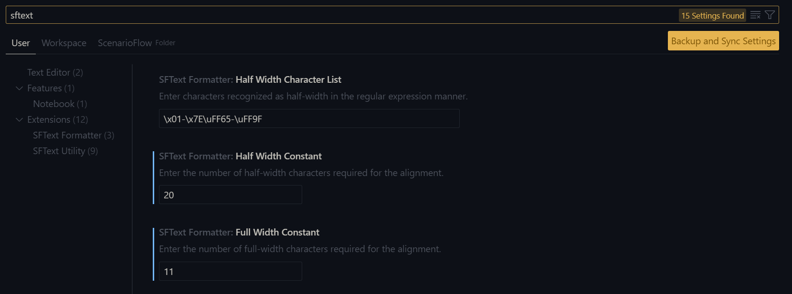
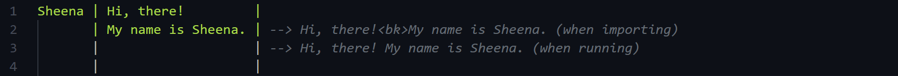
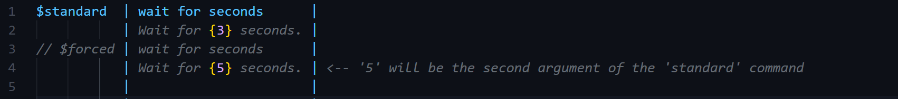
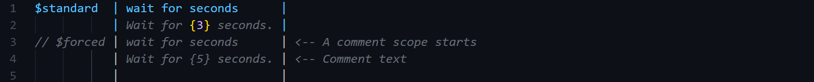
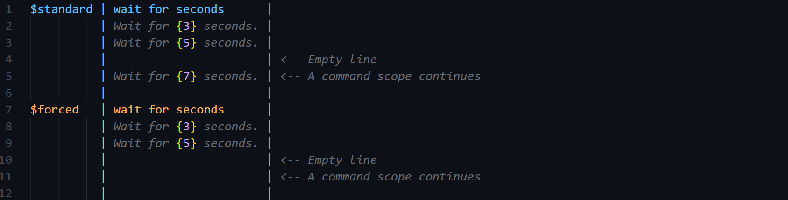
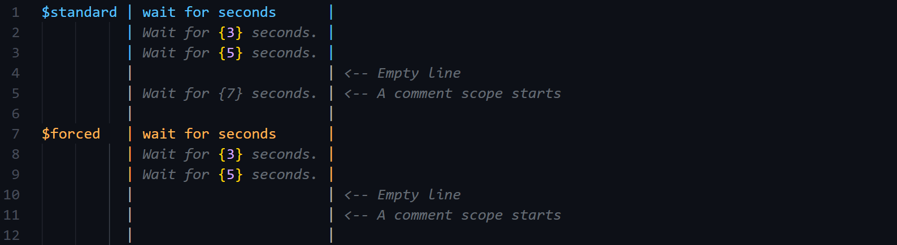

# Version History

## Version 1.2.0

This update includes new features and changes below:

+ Localized SFText: a new scenario script for localization (i.e., making stories in multiple languages)
+ New editing commands in the SFText Utility
+ New settings in the SFText Formatter to use any fonts that users like
+ Little changes in the SFText syntax: the parser checks grammatical errors more strictly
+ Bug fix

Also, the Visual Studio Code extensions for SFText are updated as follows:

+ SFText Syntax: 1.2.0
+ SFText Formatter: 1.1.0
+ SFTExt Utility: 1.1.0

Make sure that you are using the latest versions.

### Localized SFText

[See here for the details](./LocalizedSFText.md)

### New Commands in the SFText Utility

The following new/modified commands are available in SFText editing.

| Command | Shortcut key (windows) | Functionality |
| --- | --- | --- |
| Insert Scope Below | Ctrl+Enter | Insert a new line below the scope |
| Insert Scope Above | Ctrl+Shift+Enter | Insert a new line above the scope |
| Toggle Line Comment | Ctrl+/ | Comment out or uncomment every line in the selection |
| Toggle Scope Comment | Ctrl+Shift+/ | Comment out or uncomment every scope start line in the selection |

In fact, there are other commands newly available. But they are explained in the [Localized SFText page](./LocalizedSFText.md) because they are all related to localized SFText.

### New Settings in the SFText Formatter to Use Any Font You like

We can use any font as we like by specifying appropriate values for the new two setting items in the SFText formatter, `Half Width Constant` and `Full Width Constant`. These settings specify the number of half width characters and the number of full width characters needed to align texts composed of half and full width characters, respectively.



For example, with the default font (i.e., "Consolas, 'Courier New', monospace"), we set the half width constant to 20 and the full width constant 11 because **20 half width characters align with 11 full width characters**.


We may assign different values when using other fonts because the widths of half/full width characters are different depending on the font. For example, for "BIZ UD Gothic" font, we set the half width constant to 2 and the full width constant to 1, which leads to correct alignment.


Note that the SFText formatter doesn't align SFTexts appropriately if specified half/full width constants are inappropriate.

> [!IMPORTANT]
> If your SFText is not aligned by the formatter appropriately even though you are sure that appropriate values are specified for the three settings in the SFText formatter (as shown in the figure above), it may be due to the font you are using itself. It was found that the formatter doesn't work with the default font in some cases and it is the problem caused by the font itself.
> 
> In such a case, you may want to use different fonts to avoid alignment issues.

> [!TIP]
> If you want to use a specific font when writing SFTexts but want to use different fonts when writing other scripts, you can specify the font that is valid only when you edit SFTexts by modifying the settings file as follows:
> 
> ```json
> {
>     "[sftext]": {
>         "editor.fontFamily": "font-you-want-to-use",
>     }
> }
> ```

### Stricter Grammar Checks

Some changes are made to the SFText syntax. You probably don't have to modify existing SFTexts in most cases, but the SFText parser checks gramatical error in SFTexts more strictly.

We will see two examples here.

First, in the previous version, it was allowed to put redundant vertical bars at lines in SFTexts as follows. But in the new version, gramatical errors are notified in this case.

```
$parallel | command name | comment  | | <-- Two redendant vertical bars here
```

Second, in the previous version, a scope could be finished by a empty line and a new comment scope would start. But in the new version, in this case, we have to start a comment scope explicitly by starting the scope declaration part with `//`.

```
$parallel | command name         | 
          | {Arg1}               |
          | Not in comment scope | <-- A comment scope doesn't start from here
//        | In comment scope     | 
```

Again, no drastic changes were made to the syntax, but you may encounter some gramatical error notifications as the result of the stricter grammar checking.

## Version 1.1.0

<details>

<summary>
Click here to see the details
</summary>

Changes in version 1.1.0 are mainly about SFText.

### Line Break Symbol

In version 1.0.0, you had to define a symbol replaced by other characters and you also had to put that symbol everywhere in scripts in order to combine multiple texts with specific characters in a dialogue scope.

For example, if you want to combine texts with a white space:

```cs
// Symbols in a script have to be replaced with other characters in a string decoder or a method that displays a dialogue line

// String decoder
[DecoderMethod]
public string ConvertToString(string input)
{
    return input.Replace("<sp>", " ");
}

// Command that displays a dialogue line
[CommandMethod("display dialogue")]
public UniTask DisplayDialogueAsync(string name, string line, CancellationToken cancellationToken)
{
    line = line.Replace("<sp>", " ");

    // Display a dialogue line
    // ...
}
```


In version 1.1.0, a new symbol "\<bk>", which means "line break", is inserted into between texts in a dialogue scope when the script is imported. So you have to neither define any symbol nor put it in scripts repetitively, but you only have to define how line break symbols in scripts are replaced.

```cs
// Symbols in a script have to be replaced with other characters in a string decoder or a method that displays a dialogue line
// You can use 'SFText.LineBreakSymbol', which is a static and read-only member of the 'SFText' class

// String decoder
[DecoderMethod]
public string ConvertToString(string input)
{
    return input.Replace(SFText.LineBreakSymbol, " ");
}

// Command that displays a dialogue line
[CommandMethod("display dialogue")]
public UniTask DisplayDialogueAsync(string name, string line, CancellationToken cancellationToken)
{
    line = line.Replace(SFText.LineBreakSymbol, " ");

    // Display a dialogue line
    // ...
}
```



### Comment Scope

In version 1.0.0, a comment text beginning with "//" had no effect on other scopes.



In version 1.1.0, a comment text beginning with "//" ends a scope, and a "comment scope" starts from that line. Also, it continues until another scope starts as well as other scopes. You can write comment texts in content parts in a comment scope.



### Empty Line to Break Scope

In version 1.0.0, a scope continued until the next scope started.



In version 1.1.0, a scope ends if you write a empty line as is the case in starting another scope, then a comment scope starts from the next line. Empty line in SFText means a line both of whose scope declaration part and content description part are empty or white spaces.



### Others

+ A bug regarding application build error is fixed
+ Appearance of SFText in Unity Editor is modified

</details>