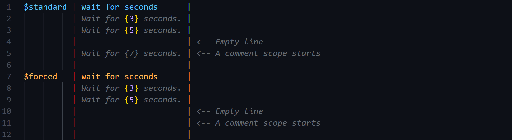

# Version History

## Version 1.1.0

Changes in version 1.1.0 are mainly about SFText.

### Line Break Symbol

In version 1.0.0, you had to define a symbol replaced by other characters and you also had to put that symbol everywhere in scripts in order to combine multiple texts with specific characters in a dialogue scope.

For example, if you want to combine texts with a white space:

```cs
// Symbols in a script have to be replaced with other characters in a string decoder or a method that displays a dialogue line

// String decoder
[DecoderMethod]
public string ConvertToString(string input)
{
    return input.Replace("<sp>", " ");
}

// Command that displays a dialogue line
[CommandMethod("display dialogue")]
public UniTask DisplayDialogueAsync(string name, string line, CancellationToken cancellationToken)
{
    line = line.Replace("<sp>", " ");

    // Display a dialogue line
    // ...
}
```


In version 1.1.0, a new symbol "\<bk>", which means "line break", is inserted into between texts in a dialogue scope when the script is imported. So you have to neither define any symbol nor put it in scripts repetitively, but you only have to define how line break symbols in scripts are replaced.

```cs
// Symbols in a script have to be replaced with other characters in a string decoder or a method that displays a dialogue line
// You can use 'SFText.LineBreakSymbol', which is a static and read-only member of the 'SFText' class

// String decoder
[DecoderMethod]
public string ConvertToString(string input)
{
    return input.Replace(SFText.LineBreakSymbol, " ");
}

// Command that displays a dialogue line
[CommandMethod("display dialogue")]
public UniTask DisplayDialogueAsync(string name, string line, CancellationToken cancellationToken)
{
    line = line.Replace(SFText.LineBreakSymbol, " ");

    // Display a dialogue line
    // ...
}
```


### Comment Scope

In version 1.0.0, a comment text beginning with "//" had no effect on other scopes.


In version 1.1.0, a comment text beginning with "//" ends a scope, and a "comment scope" starts from that line. Also, it continues until another scope starts as well as other scopes. You can write comment texts in content parts in a comment scope.


### Empty Line to Break Scope

In version 1.0.0, a scope continued until the next scope started.


In version 1.1.0, a scope ends if you write a empty line as is the case in starting another scope, then a comment scope starts from the next line. Empty line in SFText means a line both of whose scope declaration part and content description part are empty or white spaces.



### Others

+ A bug regarding application build error is fixed
+ Appearance of SFText in Unity Editor is modified