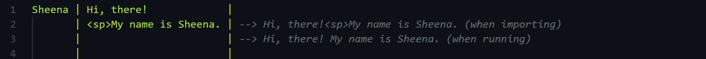

# Version History

## Version 1.1.0

バージョン1.1.0での変更は、主にSFTextに関するものです。

### 改行シンボル

バージョン1.1.0では、会話スコープ中の複数のテキストを特定の文字とともに結合するために、他の文字と置き換えるためのシンボルを定義し、そのシンボルをスクリプトのいたるところに書く必要がありました。

例えば、空白でテキストを結合する場合：

シンボル"\<sp>"を定義し、string型用のデコーダーもしくはセリフを表示する用のコマンド中でそのシンボルを置き換えます。

```cs
// Symbols in a script have to be replaced with other characters in a string decoder or a method that displays a dialogue line

// String decoder
[DecoderMethod]
public string ConvertToString(string input)
{
    return input.Replace("<sp>", " ");
}

// Command that displays a dialogue line
[CommandMethod("display dialogue")]
public UniTask DisplayDialogueAsync(string name, string line, CancellationToken cancellationToken)
{
    line = line.Replace("<sp>", " ");

    // Display a dialogue line
    // ...
}
```



バージョン1.1.0では、スクリプトのインポート時、"line break（改行）"を意味する新たなシンボル"\<bk>"が、会話スコープ中に記述された複数のテキストの間に挿入されます。そのため、シンボルを定義したりそれをスクリプト中に繰り返し入力する必要はなく、シンボルをどのように置き換えるのかを定義するだけで済みます。

シンボルの置き換えについては、SFTextクラスで定義された静的かつ読み込み専用の`SFText.LineBreakSymbol'を参照することができます。

```cs
// Symbols in a script have to be replaced with other characters in a string decoder or a method that displays a dialogue line
// You can use 'SFText.LineBreakSymbol', which is a static and read-only member of the 'SFText' class

// String decoder
[DecoderMethod]
public string ConvertToString(string input)
{
    return input.Replace(SFText.LineBreakSymbol, " ");
}

// Command that displays a dialogue line
[CommandMethod("display dialogue")]
public UniTask DisplayDialogueAsync(string name, string line, CancellationToken cancellationToken)
{
    line = line.Replace(SFText.LineBreakSymbol, " ");

    // Display a dialogue line
    // ...
}
```


### Comment Scope

バージョン1.0.0では、"//"で始まるコメントは他のスコープに影響を与えませんでした。


バージョン1.1.0では、"//"で始まるコメントはスコープを終了させ、その行からは「コメントスコープ」がスタートします。また、それは他のスコープ同様、他のスコープが開始するまで続きます。コメントスコープでは、コンテンツ記述部にコメントを書くことができます。


### Empty Line to Break Scope

バージョン1.1.0では、一つのスコープは次のスコープが始まるまで持続しました。


バージョン1.1.0では、空行を書くと、他のスコープを開始するときと同様、一つのスコープが終了します。そして、次の行からはコメントスコープが開始します。SFTextでの空行とは、そのスコープ宣言部とコンテンツ記述部の両方が空もしくは空白の行を指します。


### その他

+ アプリケーションビルドエラーに関する不具合が修正されます
+ UnityエディターにおけるSFTextの外見が改善されます